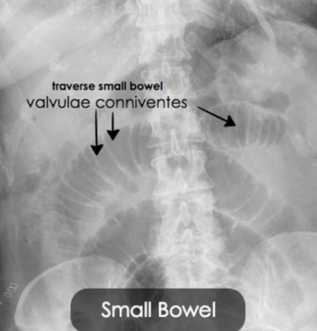
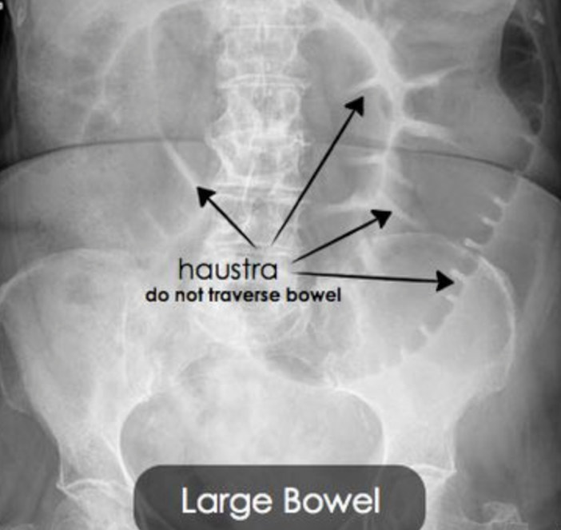
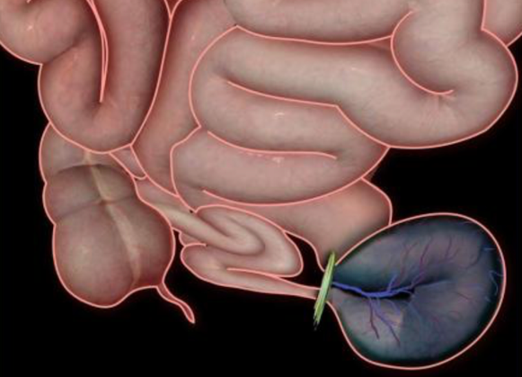

Bowel (Intestinal) Obstruction Types and Notes    body {font-family: 'Open Sans', sans-serif;}

### Bowel (Intestinal) Obstruction Types and Notes

_For more information on bowel obstructions, please refer to the” Coexisting Diseases and Surgery App”_  
  
**Red flag (late and advanced bowel obstruction)**  
Constant pain  
Absent bowel sounds  
Tenderness with rigidity  
Leukocytosis  
Fever and tachycardia  
Shock  
  
**Intestinal obstruction is:**  
Restriction to the normal passage of intestinal contents  
or  
Intestinal contents unable to transit bowel  
or  
Failure of propulsion of intestinal contents  
  
**Types of intestinal obstructions:**  
**1)** Dynamic or mechanical  
**2)** Adynamic or paralytic  
  
**Dynamic or mechanical**  
Peristalsis is present but ineffective against a mechanical obstruction.  
  
**Adynamic or paralytic**  
Mechanical element is absent (2 forms)  
**A)** Absence of peristalsis (paralytic ileus)  
**B)** Non-propulsive form (mesenteric vascular occlusion or pseudo-obstruction  
  
**Types of Onset**  
**Acute:**  
Sudden severe central colicky, central distension, early vomiting and late constipation (usually small bowel obstruction).  
  
**Chronic:  
**Lower abdominal pain with constipation followed by long periods of distension (usually large bowel obstruction).  
  
**Acute superimposed on chronic:**  
Short History of distension and vomiting, longer history of constipation and pain.  
  
**Subacute:**  
Incomplete or intermittent intestinal obstruction  
  
**Anatomic classifications:**  
High or low  
Proximal or distal  
Small or large bowel  
High (proximal) or low (distal) small bowel  
  
**Etiology:**  
Extraluminal (outside the wall)  
Intramural (within the wall)  
Intraluminal (within the lumen)  
  
**Dynamic (mechanical) affecting the intestinal wall:**  
TB  
Crohn’s  
Tumors  
Stricture  
Congenital  
  
**Mechanical within the lumen:**  
Feces  
FB  
Bezoars  
Worms  
Gall stones  
  
**Mechanical Extraluminal:**  
Bands  
Adhesions  
Abscess  
Hernias (incarcerated or strangulated)  
Compression  
  
**Adynamic Intestinal Obstruction:**  
Ischemia  
Peritonitis  
Electrolyte imbalance  
Postoperative ileus  
Drugs  
Retroperitoneal causes  
  
**Most common causes for SBO:**  
Adhesions  
External hernias (cause more than 75% of cases)  
Crohn’s  
TB  
Tumors  
Intussusception  
Congenital  
  
**Most common causes for LBO:**  
Tumors and Volvulus (cause 90% of all cases)  
Diverticulitis (rare)  
Adhesions (very rare)  
  
**Bowel obstructions by age:**

<table border="1" cellspacing="0" cellpadding="4px"><tbody><tr><td width="119" valign="top"><strong>Birth</strong></td><td width="519" valign="top">Jejunal ileal atresia or stenosis, malrotation or volvulus neonatorum Congenital duodenal obstruction (atresia) meconium, duplication of intestine, NEC, Hirschsprung’s disease, imperforate anus</td></tr><tr><td width="119" valign="top"><strong>3 weeks</strong></td><td width="519" valign="top">Pyloric stenosis</td></tr><tr><td width="119" valign="top"><strong>6-9 months</strong></td><td width="519" valign="top">Intussusception</td></tr><tr><td width="119" valign="top"><strong>Teenage</strong></td><td width="519" valign="top">Appendicitis, Meckel’s diverticulitis</td></tr><tr><td width="119" valign="top"><strong>Adult</strong></td><td width="519" valign="top">Adhesions, strangulated hernia, paralytic ileus, stricture, appendicitis, Crohn’s, cancer, tuberculosis.</td></tr><tr><td width="119" valign="top"><strong>Elderly</strong></td><td width="519" valign="top">Malignant obstruction (CA), sigmoid volvulus, fecal impaction, diverticulitis.</td></tr></tbody></table>

  
  
**Above and below a simple obstruction**  
**Above:** Peristalsis increases → intestine dilates → ↓ peristalsis strength → flaccidity and paralysis (protective but late)  
**Below:** Normal peristalsis and absorption → unit becomes empty → contracts and becomes immobile.  
  
**Pathophysiology of bowel obstruction**  
  
**Intestinal distension resulting from the accumulation of:**

<table border="1" cellspacing="0" cellpadding="4px"><tbody><tr><td width="167" valign="top"><strong>Gas</strong></td><td width="222" valign="top"><strong>Fluid</strong></td></tr><tr><td width="167" valign="top">Swallowed</td><td width="222" valign="top">Ingested fluids</td></tr><tr><td width="167" valign="top">Bacterial overgrowth</td><td width="222" valign="top">Saliva</td></tr><tr><td width="167" valign="top">Diffusion from blood</td><td width="222" valign="top">Gastric and intestinal juice</td></tr><tr><td width="167" valign="top">
<strong></strong>
</td><td width="222" valign="top">Bile and Pancreatic secretions</td></tr></tbody></table>

  
  
**Dehydration caused by:**  
Reduced fluid intake  
Reduced absorption (due to over distension)  
Vomiting and sequestration (third spacing from vascular into intestines)  
  
**Systemic effects of obstruction**  
Water and electrolyte loss (causes hypovolemia)  
Toxic material and toxemia (distended bowel become permeable, leads to sepsis)  
Cardiopulmonary dysfunction (distended bowel ↓ diaphragmatic movement, hypovolemia, ↓ SVR, ↑ HR)  
Renal failure  
Shock and death (multiorgan failure)  
  
**Pain:**  
**SBO:** Central and colicky  
**LBO:** Dull and peripheral  
**Strangulation:** Continuous and severe  
**Paralytic ileus:** Absent  
  
**Onset of vomiting varies with type of obstruction**  
**Early vomiting:** High SBO  
**Late vomiting:** Low SBO  
**Delayed or absent:** LBO  
  
**Nature of vomitus:**  
**Clear gastric:** Pyloric obstruction  
**Bilious:** High SBO  
**Feculent** : Low SBO or late colonic  
  
**Constipation:**  
Incomplete  
Complete (obstipation)  
  
**Late manifestations of intestinal obstruction**  
Oliguria  
Dehydration: Dry tongue and skin, sunken eyes, poor venous filling  
Hypovolemic shock  
Respiratory embarrassment  
Peritonism  
  
**Radiologic picture**

<table border="1" cellspacing="0" cellpadding="4px"><tbody><tr><td width="197" valign="top"><strong>SBO</strong></td><td width="198" valign="top"><strong>LBO</strong></td></tr><tr><td width="197" valign="top">Central distension</td><td width="198" valign="top">Peripheral distension “picture frame”</td></tr><tr><td width="197" valign="top">Valvulae connivente (gas)</td><td width="198" valign="top">More gross distension</td></tr><tr><td width="197" valign="top">Ladder-like dilation</td><td width="198" valign="top">Haustral indentation</td></tr><tr><td width="197" valign="top">Diameter &gt; 3 cm</td><td width="198" valign="top">Diameter &gt; 6 cm if Cecum &gt; 9 cm</td></tr><tr><td width="395" colspan="2" valign="top" align="center">3,6,9 rule</td></tr></tbody></table>

  
  
 ** **  
  
**Closed loop obstruction:** Obstruction at 2 points, involves mesentery.  
The bowel is obstructed at two points along its course, thus forming a closed loop.  
These patients have a high risk of bowel ischemia due to venous infarction, which will result in perforation, septic shock and other complications with a high mortality rate.  
Closed loop obstruction is hard to diagnose on CT because it looks like a simple obstruction caused by an adhesion.  
  
  

Intestinal Obstruction Lecture (accessed 05/2020)  
Dr. Faiez Alhmund  
https://www.slideshare.net/FaizHmoud/intestinal-obstruction-lecture