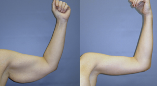

Brachioplasty (Arm Lift)    body {font-family: 'Open Sans', sans-serif;}

### Brachioplasty (Arm Lift)

_Can be with or without liposuction_  
A surgery that reshapes the back part of the upper arm, from arm to elbow.  
This procedure removes the extra skin and tissue from the upper arm.  
  
Arm lift is one of the top four most popular plastic surgery procedures performed following massive weight loss, according to the American Society of Plastic Surgeons.  
Many of the patients who lose 150 or more pounds develop a contour deformity similar to a bat’s wing that extends from the olecranon across the axilla.  
Some patients may only require minimal incisions where the inner, upper arm joins the armpit. This is known as a minimal incision arm lift. A patient may be a candidate for a minimal incision arm lift if they have a small amount of extra skin located near the armpit.  

****

  
**Procedure**  
Depending on the presence of stubborn fatty tissue in the upper arm area, the surgeon may use liposuction as an adjunct procedure to eliminate excess fat.  
  
A long incision length is needed to adequately resect the ptotic skin of the arm and because of the laxity of skin within the axilla and chest-wall region that predisposes to postoperative contour deformities.  
  
Depending on the presence of stubborn fatty tissue in the upper arm area, the surgeon may use liposuction as an adjunct procedure to eliminate excess fat. Tumescent technique may be used to suction out the unwanted fat in a less invasive manner through the incisions.  
  
Excess skin will then be trimmed away, and the incisions will be brought together to create a smoother and firmer arm contour. Finally, the remaining skin will be smoothly re-draped over the new arm contour.  
  
The surgeon will then apply a sterile dressing to cover the incisions and place a compression garment. Temporary drain tubes may be placed beneath the skin in the incision areas for a few days.  
  
**Indications  
**Sagging loose skin on the arms after massive weight loss.  
**  
Pre-op and what to prepare.**  
**Common pre-op instructions for the patient from the surgeon**  
Stop smoking.  
Avoid taking aspirin, anti-inflammatory drugs and herbal supplements as they can increase bleeding.  
  
It is common for the plastic surgeon to prescribe multiple analgesics to limit narcotics.  
Celocoxib (Celebrex®), acetaminophen (Ofirmev®), and gabapentin are common preoperative analgesics.  
  
**Anesthetic:** General/LMA is common, IV sedation less common.  
**Regional:** Not indicated.  
**Induction:** Basic**Muscle Relaxation:** Not required.**Position:** Supine with arms abducted < 90 degrees  
**Duration:** 1-2 hours  
**EBL:** 10-20 ml  
  
**IV Access:** 22 or 20g **,** avoid antecubital because it is too close to surgical site.  
The hand is optimal.  
  
**A-line: N/A  
Age Range:** Adults**Hydration:** Normovolemia  
**Emergence:** Normal**  
  
Risks and possible complications**  
Infection.  
Hematoma.  
Nerve damage.  
Scarring.  
Swelling of the hands.  
Seromas.  

Consumer Guide to Plastic Surgery  
http://www.yourplasticsurgeryguide.com/contouring/arm-lift.htm  
  
Techniques of Cosmetic Surgery; 4/2002; pp 1044-48.  
A Technique of Brachioplasty  
Berish Strauch, M.D., David Greenspun, M.D., Joshua Levine, M.D., and Thomas Baum, P.A.C.