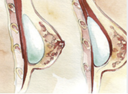

Breast Augmentation    body {font-family: 'Open Sans', sans-serif;}

### Breast Augmentation

Breast augmentation is a cosmetic surgery procedure to increase breast size and enhance breast shape, typically the by placement of silicone or saline breast implants.  
  
In breast augmentation using implants, the surgeon makes an incision, lifts the breast tissue, creates a pocket in the chest/breast area and places an implant in the pocket. The implant will either be inserted underneath the pectoral muscle, which is located between the breast tissue and chest wall or underneath the breast tissue and on top of the pectoral muscle.  

****

  
The incision is then closed with sutures. It is rare, but some surgeons may place temporary drains in the incision prior to closing.  
A postoperative bra and compression bandage will be applied.  
  
**Indications  
**Mammary reconstruction following a mastectomy.  
Breast enlargement for aesthetic reasons.  
The correction of various acquired or congenital defects: dissymmetry, amastia, aplasia, hypomastia, hypoplasia.  
Replacement after removal of an old or defective implant.  
  
**Anesthetic:** General/LMA is the most common. Sometimes ETT if indicated.  
Some plastic surgeons will request muscle relaxation when the plan is to insert the implant to the pectoral muscle.**Regional:** A PECS block would be optimal, but some surgeons fear that it could mask a hematoma.  
**Muscle Relaxation:** Rarely. Confirm with surgeon preoperatively.**Position:** Supine with arms abducted < 90%. Arms will be completely wrapped for stability. Because the head of the OR table will be elevated to the sitting position at various stages of the procedure, adequate slack must be provided in IV lines and arms must be safely secured.  
  
**Duration:** 90 minutes.  
**EBL:** < 40 ml.  
**IV Access:** 20g is acceptable.**A-line:** Not indicated.**Age Range:** Adults**Hydration:** Normovolemic.  
**Emergence:** Deep LMA extubation is common; patients are usually healthy.**  
  
Risks and possible complications**  
Bleeding or hematoma.  
Iatrogenic injury or damage new injury or damage to the tissue or implant as a result of implant surgery.  
Infection, including toxic shock syndrome.  
Necrosis dead skin or tissue around the breast.  
Seroma - the collection of fluid around the breast implant.  
Lymphedema or lymphadenopathy.  
Inflammation or irritation.  
Redness or bruising.  
Capsular contracture - hardening of the breast area around the implant.  
Calcification in breast tissue.  
Chest wall deformity chest wall or underlying rib cage appears deformed.  
Delayed wound healing.  
Extrusion skin breaks down and the implant appears through the skin.  
Nipple or breast changes, including change in or loss of nipple sensation.  
Deflation of the breast implant filler material leaks from the breast implant, often due to a valve leak or a tear or cut in the implant shell.  
Rupture of the breast implant - a tear or hole in the implant’s outer shell.  
Implant displacement or malposition - the implant is not in the correct position in the breast.  
Nipple or breast changes, including change in or loss of nipple sensation.  
Asymmetry - breasts are uneven in appearance in terms of size, shape, or breast level.  
Breast feeding difficulties.  
Breast pain.  
Breast “ptosis”.  
Implant palpability or visibility - implant can be felt through the skin.  
Implant remova l- with or without implant replacement.  
Implant visibility - implant can be seen through the skin.  
Implant wrinkling or rippling.  
Re-operation - additional surgeries.  
Scarring.  
Skin rash.  
Thinning and shrinking of the skin, also called “breast tissue atrophy”.  
Unsatisfactory appearance due to implant style or size.  
  
**Contraindications**  
Pre-existing pathology in the site of implantation.  
Breast cancer in progression.  
General or local infectious condition.  
Pregnancy or breastfeeding in progress.  
History of autoimmune disease.  
Repeated unsuccessful implantation of the same kind of implants.  
Treatment by irradiation, microwave diathermy or steroids in progress.  
Known hypersensitivity to silicone.  
Psychological instability.  
Tissue insufficiency.  
  
**More Notes**  
Silicone-gel filled implants will already be filled with silicone gel when inserted.  
Saline-filled implants is are not pre-filled. The silicone shell will be implanted, and then filled to the desired level with saline.  
  
**Incision Options for Breast Augmentation  
Inframammary:** This involves a short incision made in the crease underneath the breast (most common).  
**Peri-areolar:** The incision is made around the outer edge of the areola.  
**Trans-axillary:** This involves a small incision made within the armpit.  
**Transumbilical:** This technique involves an incision just above the umbilicus  
  
**Cons  
**Breast implants require monitoring.  
Implants will eventually need to be replaced.  
Normal surgical risks are present.  
  
**Silicone gel-filled breast implants  
**Silicone gel-filled breast implants have been under scrutiny for years, but after gathering detailed and meticulous research and data, the FDA has approved them for use in cosmetic breast enhancement surgery, finding no link between silicone gel breast implants and connective tissue disease, breast cancer or reproductive problems.  

Indian Journal of Plastic Surgery, 2008 Oct; 41(Suppl): pp.41–47.  
Breast augmentation  
K. Ramachandran  
  
American Society of Plastic Surgeons  
Breast Augmentation  
https://www.plasticsurgery.org/cosmetic-procedures/breast-augmentation