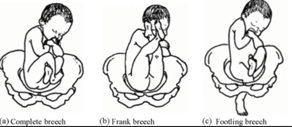
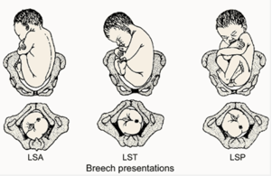

Breech Positions    body {font-family: 'Open Sans', sans-serif;}

### Breech Positions

_Breech position is not good. Many convert to C-sections._

The terminology used for breech presentations are basically the same as for cephalic positions, except the sacrum of the fetus is used as the primary landmark, instead of the head.  
**Sacrum Anterior (SA)** means the fetal sacrum is closest to the mother's symphysis pubis or pubic bone.  
**Left Sacrum Anterior (LSA)** means the fetal sacrum is closest to the mother's symphysis pubis and rotated slightly to the mother's left (clockwise from direct SA).  
  
**Right Sacrum Anterior (RSA)** means the fetal sacrum is closest to the mother's symphysis pubis and rotated slightly to the mother's right (counterclockwise from direct SA).  
  
**Right Sacrum Transverse (RST** ) and Left Sacrum Transverse (LST) indicate a transverse presentation.  
**Right Sacrum Posterior (RSP),** Left Sacrum Posterior (LSP), and Sacrum Posterior (SP) indicate the fetal sacrum is farthest away from the mother’s symphysis pubis.  
  
**Incomplete Breech  
**When one of the baby’s knees is bent and his/her foot and bottom are closest to the birth canal.  
  
**Frank Breech**  
When the baby’s legs are folded flat up to against his/her head (feet to face) and his/her bottom is closest to the birth canal.  
  
**Footling Breech**  
Where on or both legs are presenting.  
  
**Complications of Breech  
**Prolapsed umbilical cord is common in breech deliveries.  
The umbilical cord slips down through the cervix before the baby does.  
The umbilical cord then becomes compressed during contractions, which cuts down on perfusion to the baby. An emergency C-section is usually needed.  
  
**Breech Images Below.**

****

****

Fitzpatrick, M., et al. “Influence of persistent occiput posterior positioning on delivery outcomes.” _Obstetrics & Gynecology_ . 98(6), Dec 2001, pp 1027 – 1031.  
  
Ponkey, S., et al. “Persistent fetal occiput posterior position: obstetric outcomes.” _Obstetrics & Gynecology_ . 101(5), May 2003, pp 915-920.  
  
Scott, P. and Jean Sutton. _Understanding Optimal Foetal Positioning_ .Shermer RH, Raines DA. Positioning during the second stage of labor: moving back to basics. _J Obstet Gynecol Neonatal Nurs_ . 1997 Nov-Dec;26(6):727-34.  
  
Soong B, Barnes M. Maternal position at midwife-attended birth and perineal trauma: is there an association? _Birth_ 2005 September 32(3): 164-169.