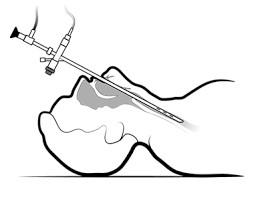

Rigid Bronchoscopy and Foreign Body Notes   

### Rigid Bronchoscopy and Foreign Body Notes

A bronchoscopy using a Rigid Bronchoscope visualizes the trachea and proximal bronchi. It is most commonly used to manage patients who have obstruction of either their trachea or a proximal bronchus. The Rigid’s large long lumen facilitates suctioning and the removal of foreign bodies or debris, or for interventional procedures such as insertion of airway stents.  
Types of graspers and tools can be passed through the Rigid Bronchoscope to carry out a variety of tasks.

Optic forceps (have graspers on the end) can be inserted through the bronchoscope to

retrieve the foreign body. There are even specific graspers for coins and peanuts etc.

95% of aspirated foreign bodies will be lodged in the right mainstem bronchi.

5% will remain in the trachea.  
  
Most foreign bodies in the airway are organic

**Chest x-ray  
**90% of aspirated foreign bodies in children will be visible on plain chest x-ray film. However, some organic materials like peanuts may not show up.  
The child may need a chest x-ray in inspiration and expiration to help the diagnosis.  
**  
Chest x-ray may show:**  
A collapse lung or atelectasis  
Hyperinflation of a lung (air trapping)  
Mediastinal shift  
  
**Possible Symptom  
**\- The diagnosis may be delayed for weeks to months depending on the symptoms  
\- Cough or persistent wheezing  
\- An occasional history of ingestion  
\- Very rarely there is stridor or significant desaturation  
\- Coughing may be absent

**More Notes:  
**Airway foreign body aspiration most commonly occurs in young children and is associated with a high rate of airway distress, morbidity, and mortality. The presenting symptoms of foreign body aspiration range from none to severe airway obstruction, and may often be innocuous and nonspecific. In the absence of a choking or aspiration event, the diagnosis may be delayed for weeks to months and contribute to worsening lung disease.

Radiography and high resolution CT scan may contribute to the eventual diagnosis. Bronchoscopy is used to confirm the diagnosis and retrieve the object.

The safest method of removing an airway foreign body is by utilizing general anesthesia. Communication between anesthesiologist and surgeon is essential for optimal outcome.

The choice between maintenance of spontaneous and controlled ventilation is often based on personal preference and does not appear to affect the outcome of the procedure.

Complications are related to the actual obstruction and to the retrieval of the impacted object.

The localized inflammation and irritation that result from the impacted object can lead to bronchitis, tracheitis, atelectasis, and pneumonia.

Negative pressure pulmonary edema and airway foreign body retrieval: anesthetic considerations.

Adequate time is needed for exhalation through the relatively high resistance bronchoscopist in order to prevent air trapping and the associated barotrauma.

Ventilation must be done in concert with the bronchoscopist. Ventilation when the bronchoscope is open will "ventilate" the room, primarily the bronchoscopist. Ventilation while the telescope is within the bronchoscope will require higher inflating pressures and longer exhalation times since the lumen of the bronchoscope is compromised by the presence the instrument.