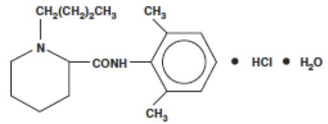

Bupivacaine    body {font-family: 'Open Sans', sans-serif;}

### Bupivacaine (Marcaine, Sensorcaine)

**_Class:_** _Amide local anesthetic, long acting._

In OB, Bupivacaine is the most common local anesthetic we use today.  
  
**It is commonly used for:**  
**Spinals for C-sections:** 0.75% (hyperbaric)  
**Continuous epidural infusion for laboring patients:** 0.0625 or 0.125% (most popular concentration). 0.25 is also an analgesic concentration but not as popular as lower ones above.  
_  
Higher concentrations of Bupivacaine (0.5-0.75) for continuous infusions are usually avoided due to an increased risk of cardiac toxicity._  
  
**Hyperbaric Bupivacaine:** is available at 0.5% and 0.75%  
(8.25% Dextrose is added)  
  
**Epidural Continuous Infusions** 0.0625 and 0.125 is used for epidural analgesia (0.125% most common for infusions)

****

The chemical structure of Bupivacaine is similar to that of lidocaine, except that the amine-containing group is a butylpiperidine.  
  
**Remember the 2 ways you can tell the local anesthetic is an amide?** 2 “I”s in the drug name.  
Note the “NH” next the aromatic ring = amide.  
  
**Epinephrine and Bupivacaine:** Literature states that epinephrine has little to no effect in increasing the duration of Bupivacaine. Epinephrine is still commonly added to Bupivacaine for spinals by many.

table.tableizer-table { font-size: 12px; border: 1px solid #CCC; font-family: Arial, Helvetica, sans-serif; } .tableizer-table td { padding: 4px; margin: 3px; border: 1px solid #CCC; } .tableizer-table th { background-color: #104E8B; color: #FFF; font-weight: bold; }

| Agent | Conc. | Onset | Sensory Block | Motor Block | Plain Solution | 1:200,000 Epinephrine |
| --- | --- | --- | --- | --- | --- | --- |
| Bupivacaine  
(Epidural) | 0.0625-0.125% | Slow | Dense | Minimal | 140  
minutes |   |
| Bupivacaine  
(Epidural) | 0.5-0.75 % | Same | Dense | Mild  
Dense | 165-225  
minutes | 180-240  
minutes |

_With epidurals, we usually do not add epinephrine to a local anesthetic to increase duration because we can just redose it._  
  
**Mechanism of Action:** Like other local anesthetics, it binds to the intracellular portion of sodium channels  
and blocks sodium influx into nerve cells, which prevents depolarization.  
  
**Spinal Doses:  
Onset:** Rapid**Duration:** 2-2.5 hours  
**0.75% Bupivacaine** (7.5mg/mL)(hyperbaric) is common with spinals for a C-sections.  
**  
Common Range of 0.75% Bupivacaine – depending on height:**  
1.2-1.8 mLs which is 9-13.5 mg is common by others  
Smaller dose for short and more for taller patients  
  
**Preservative Free (PF) Morphine (astromorph, duramorph) common dose range for Spinal/C-sections**  
0.1-0.25 mg of astromorph is commonly added Bupivacaine  
  
**Preservative Free (PF) Fentanyl common dose range for Spinal/C-sections  
**10-25 mcg of Fentanyl is commonly added to Bupivacaine  
  
It is common to add (mix) fentanyl and Astromorph with Bupivacaine in a spinal dose for a C-section.  
**Max Dose** 2.5-3mg/kg  
  
**Epidural Doses  
Onset:** 10-20 minutes**Duration:** 2-5 hours  
  
Bupivacaine concentrations used to initiate epidural analgesia ranges from 0.0625% and 0.25%.  
A popular concentration of Bupivacaine is 0.125%.  
0.125%. = 1.25mg/mL, so 5-10 mLs = 6.25-12.5 mg  
8-10 mLs of 0.125% of Bupivacaine and 1-2 mLs Fentanyl is a common loading dose.  
  
**For a vaginal delivery:** the partituent is usually completely comfortable from 2-5cc boluses (10 mLs) of 0.125% Bupivacaine (12.5 mg), followed by a PCEA rate of 10 ml/hour to cover a T10 level. There are many successful cocktails; this is just a common one.  
  
**Failed Vaginal delivery to C-section  
**Bupivacaine is not usually used for C-sections per epidural.  
Instead of using the local anesthetic that has been continuously been infusing (Bupivacaine or Ropivacaine), we usually use 0.2% plain Lidocaine with 2 mL of Fentanyl.  
If the parturient already has a good sensory level from the continuously infused epidural, we commonly only have to administer around **10mLs of lidocaine** in 5 mLs increments. The 5-10 mL of 2% Lidocaine with narcotic will usually be enough to reach a T4-6 level.  
We usually draw up 20mLs of the Lidocaine just in case.  
Many textbooks state that 20 mLs of Lidocaine is the standard dose.  
  
**For a block starting at < 3cm Cervical Dilation  
**For < 3cm cervical dilation, most anesthesia providers dose the patient the same as above. Some providers will be more aggressive since it is early in labor and a long way away from pushing.  
**An Initial Bolus Dose with a Narcotic**  
Two 5-6mL doses (10-12 ml total) with 0.125% of Bupivacaine + 10 mcg of Sufentanil OR 50-100 mcg of Fentanyl in given in two increments 3-4 min apart.  
  
If pain scores are low, start with 10 ml of bupivacaine.  
If the woman is in extreme pain, start with 15 mLs.  
You still want to limit motor block early on. However, some women require more. The key is to stay in the room and give more local until the woman is comfortable.  
  
**Continuous infusion  
**0.0625% or 0.125% Bupivacaine + Sufentanil 0.3-0.4 mc/ml or fentanyl 2 mc/ml at 12-15 ml/h.  
Higher infusion rates provide much better sacral analgesia.  
  
**Biggest disadvantage:** severe cardiotoxicity which may occur with high plasma levels causing a refractory cardiac arrest. The ONE drug we don't want to accidentally give IV.  
  
**Cardiotoxicity** Bupivacaine has a high degree of protein binding and lipid solubility which accumulate in the cardiac conduction system and results in the advent of refractory reentrant arrhythmias.  
Bupivacaine, is four times more potent than lidocaine in blocking nerves and depressing cardiac contractility.  
  
**Plasma Concentrations** 4 mcg/mL blood level of Bupivacaine with result in seizures4-6 mcg/mL is associated with cardiac toxicity.Lidocaine is 20-25 mcg/mL for cardiac toxicity.  
  
**Metabolism - Liver  
**Bupivacaine undergoes dealkylation in the liver to 2, 6-pipecolyxylidide (PPX). After epidural injection, PPX is detected in maternal plasma within 5 minutes.  
  
**Excretion: Renal -** 16% of anesthetic dose is excreted unchanged  
  
**Vasodilating properties:** Yes  
**Protein Bound:** 95%-extensively to AAG and albumin.  
**ED50 for intrathecal motor blockage in a pregnant woman:** only 4.1mg  
(our common intrathecal dose is 9-13.5 mg)  
  
**Volume of Distribution:** 1L/kg  
**pKa:** 8.1 (85% ionized at 7.40 pH)  
  
**More Notes  
**28 times more lipid soluble and 4 times more potent and toxic than Mepivicain.  
  
**Bupivacaine vs Ropivacaine Concerning Cardiac Toxicity  
  
Bupivicaine - Cardiovascular toxicity mediated at the heart:**  
First, bupivacaine exhibits a much stronger binding affinity to resting and inactivated sodium channels than the other local anesthetics. The reversal of binding is much slower.  
  
**Cardiac Toxicity of Ropivacaine is MUCH less than** Bupivacaine.  
**Bupivacaine** “R” isomer can bind strongly to the cardiac Na channels which increases the possibility of cardiac toxicity from an accidental intravascular injection.  
  
**Ropivacaine** “S” isomers do not strongly attach to cardiac Na channels.  
**Example  
**With Ropivacaine, a 20 mg dose in a laboring patient is less than 0.33 mg/kg.  
This is safe and effective dose.  
If 20 mg of Ropivacaine was administered accidentally IV, it would be much safer than Bupivacaine, and depending on the rate of delivery, may NOT cause any cardiac symptoms.  
If an epidural dose was accidentally given intrathecally, it is still an acceptable dose for spinal Ropivacaine. (Anesth Analg 2003;96:1473).  
**Cardiac Toxicity Treatment:** Intralipid Therapy and CPR until enough Bupivacaine becomes unbound to Cardiac Na ChannelsIntralipid binds highly soluble in fat bupivacaine and reduces its amount at sodium receptors.  
  
Because of its toxicity profile, large doses of bupivacaine should be avoided.  
  
Much lower concentrations of Bupivacaine (usually 0.125%) is used in OB for labor epidurals because they have a favorable sensory-motor differential block. The lower concentrations have motor sparing qualities that permits the mom to push during the time of delivery.  
  
These lower concentrations of Bupivacaine reduces the likelihood of systemic toxicity and hypotension.  
  
Bupivacaine at this low concentration has a slow onset.  
  
Opioids are added to the low concentration of bupivacaine to help support anesthesia.

Chestnut, David.(2014) Chestnut’s Obstetric Anesthesia Principles and Practice.  
  
Santos, Alan., Epstein, Jonathan.,(2015) Chaudhuri, Kallol Obstetric Anesthesia ; 2015.  
**  
DrugBAnk**  
http://www.drugbank.ca/drugs/DB00813.  
  
**Pharmacology of local anesthetic agents.  
**Update in Anesthesia 1994; 19-24  
www.world-anaesthesia.org  
  
**Chapter 45. Pharmacology of Local Anesthetics  
**Anesthesiology. 2nd ed. New York: McGraw-Hill; 2012Heavner JE. Longnecker DE, Newman MF, Brown DL, Zapol WM, 2nd ed. New York: McGraw-Hill; 2012.  
  
**Local Anesthetics Clinical Pharmacology**  
Nysora:http://www.nysora.com/regional-anesthesia/foundations-of-ra/3492-local-anesthetics-clinical-pharmacology-and-rational-selection.html  
  
**Local Anesthetics and pH**  
AnesthesiaUK  
http://www.frca.co.uk/article.aspx?articleid=220  
  
**Local Anesthetics Pharmacology  
**AnesthesiaUK  
http://www.frca.co.uk/article.aspx?articleid=100505  
**  
Differences in Cardiotoxicity of Bupivacaine and Ropivacaine Are the Result of Physicochemical and Stereoselective Properties**  
Anesthesiology 6 2002, Vol.96, 1427-1434.  
Bernhard M. Graf, M.D.; Ingo Abraham, M.D.; Nicole Eberbach, M.D.; Gudrun Kunst, M.D.; David F. Stowe, M.D., Ph.D.; Eike Martin, M.D.  
  
**Focused Review: Ropivacaine Versus Bupivacaine For Epidural Labor Analgesia. F1000: Ranked "Changes Clinical Practice  
**Anesth Analg 2010 Aug **111** (2):482-7 Beilin Y, Halpern S