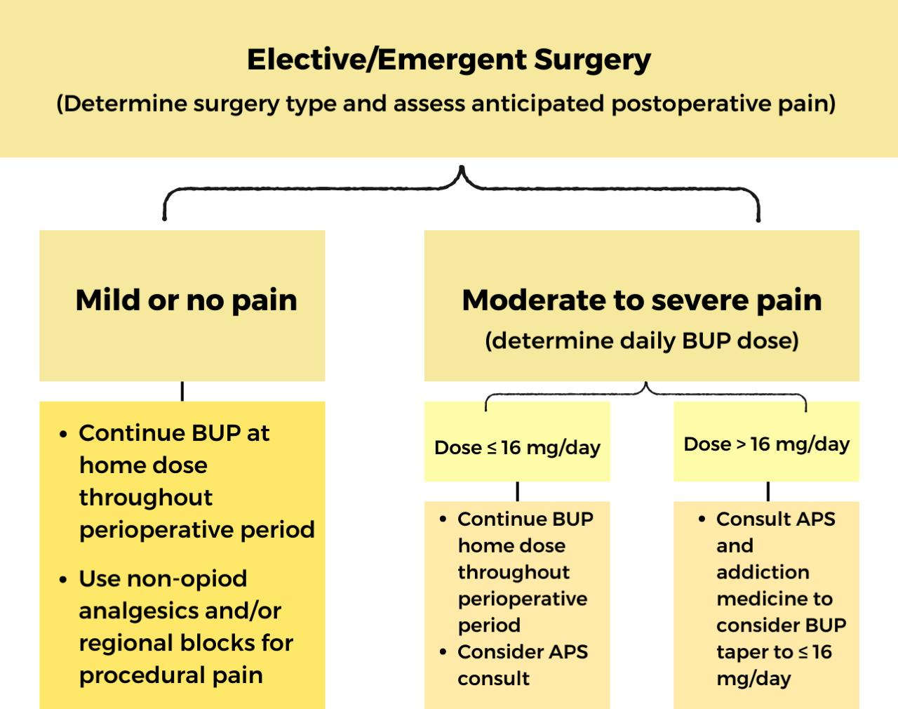

  Buprenorphine Transdermal Patch Anesthesia Concerns and Management section { margin-bottom: 20px; } h3, p { margin: 0px; padding: 0px; } .text-red { color: red; } .text-center { text-align: center; } img { width: 400px; height: auto; } .mb-10px { margin-bottom: 10px; } .div-img { width: 400px; height: auto; } .reference-notes { font-size: 11px; } .no-spacing { margin: 0px; padding: 0px; }

### Buprenorphine Transdermal Patch Anesthesia Concerns and Management

**Buprenorphine:** BUP

There is no consensus on the optimal perioperative management of patients on BUP transdermal patches.

As with other chronic pain patients, use multimodal anesthesia to optimize pain control.

**Discontinuation of BUP is NOT recommended.**

Discontinuation of BUP is associated with increased rates of relapse and illicit opioid use, leading to poorer outcomes.

Dose reduction may aid with optimizing postoperative pain control in patients who are on high-maintenance doses.

**BUP can affect anesthesia in several ways, including:**

**Displacement of other opioids:** BUP is a partial opioid agonist that binds to opioid receptors in the brain, which can displace other opioids used for anesthesia.

**Reduced anesthetic requirements:** BUP can reduce the amount of anesthetic needed for surgery.

**Just like other chronic pain patients, consider the following non-opioid agents:**

Ketamine

Tylenol

Celebrex

gabapentin or pregabalin

Precedex

Refer to _“NonOpioid Agents and Dosing Cheat Sheet”_ within this app for dosing details.

**Buprenorphine prolongs QT interval.**

Consider a pre-op ECG to assess QT interval prolongation.

Caution with any drug known to prolong QT interval.

**Metabolism:**

BUP is N-dealkylated to norbuprenorphine, mainly in the liver by CYP3A4 and, to a lesser extent, by CYP2D6, but also by the gut wall.

_For drug interaction purposes, the inhibitors and inducers of CYP3A metabolism can alter serum concentrations of drugs dependent upon the CYP3A subfamily of liver enzymes, including CYP3A4, for elimination or activation._

CYP: cytochrome P450.

**Caution with CYP3A4 inhibitor** medications because they also prolong QT interval.

**Caution with CYP3A4 inducers** (medications) because they elevate the serum buprenorphine levels.

**Caution with warming blankets:** Excessive heat can increase the drug release from the transdermal patch.

**Duration:** Usually applied to the skin once every 7 days

**Application sites:** Upper outer arms, upper chest, upper back, or the side of the chest.

**ASRA recommendations for anesthesia and BUP:**

**ASRA:** The American Society of Regional Anesthesia and Pain Medicine

\- Consider splitting BUP doses into Q6-8 hours to provide improved analgesia -sublingual or injection (not applicable when transdermal).

\- The patient’s outpatient BUP prescribing provider should be informed of any dose changes and additional prescription opioids upon discharge.

\- Titrate short-acting full-agonist opioids as needed and consider close monitoring.

\- Anticipate opioid tolerance and higher doses of short-acting full-agonist opioids compared to opioid naïve patients.

**Post-op:** Consider IV opioids or a pain control pump (PCA) if the patient is not tolerating oral opioids.

**Perioperative BUP Management Algorithm ASRA**

**APS:** Acute Pain Services

Perioperative Management of Patients on Buprenorphine for Opioid Use Disorder

ASRA Newsletter, Feb, 2023

Breethaa Janani Selvamani, MBBS, MD; Lee Kral, PharmD, BCPS, CPE; and Tejinder S Swaran Singh, MBBS, MD, FRCA

Medline Plus

Accessed 01/2025

https://medlineplus.gov/druginfo/meds/a613042.html

Transdermal buprenorphine – a critical appraisal of its role in pain management\\

Journal Pain Research. 2009 Sep 15;2:117–134.

Guy Hans, Dominique Robert

Some new insights into the effects of opioids in phasic and tonic nociceptive tests.

Pain. 1998;78:79–98.

McCormack K, Prather P, Chapleo C.

The metabolism of phenolic opiates by rat intestine.

Xenobiotica. 1977;7:529–536.

Rance MJ, Shillingford JS.

Perioperative Management of Buprenorphine: Solving the Conundrum

Pain Med. 2018 Nov 30;20(7):1395–1408

Aurora Naa-Afoley Quaye , Yi Zhang

Perioperative Management of Patients on Buprenorphine for Opioid Use Disorder

ASRA Newsletter, Feb, 2023

Breethaa Janani Selvamani, MBBS, MD; Lee Kral, PharmD, BCPS, CPE; and Tejinder S Swaran Singh, MBBS, MD, FRCAhttps://www.asra.com/news-publications/asra-newsletter/newsletter-item/asra-news/2023/02/01/perioperative-management-of-patients-on-buprenorphine-for-opioid-use-disorder

Cytochrome P450 3A (including 3A4) inhibitors and inducers

UpToDate Accessed 01/2025

https://www.uptodate.com/contents/image?imageKey=CARD/76992