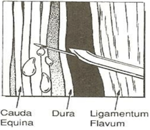
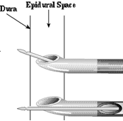
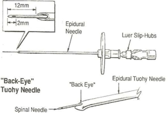

CSE Spinal Needle Notes    body {font-family: 'Open Sans', sans-serif;}

### CSE Spinal Needle Notes

  
CSE:(Combined Spinal Epidural)  

**Spinal Needles for CSE  
**During needle-through-needle CSE, the epidural needle acts as spinal needle introducer as far as the epidural space.  
  
For a CSE, you need to thread a spinal needle through an epidural needle (needle through needle). Then the spinal needle must pass and extend further to reach and penetrate the dura. When the spinal needle penetrates the dural, it will enter the subarachnoid space.

****

****

**Warning:** The uppermost needle in illustration directly above, the one that follows the curve of the Tuouy bevel, presents the danger of puncturing the cord at a level higher than the original insertion. The lower needle, with the back eye, avoids that risk. I once read a case report where the operator did a CSE at a higher insertion level and injured the cord when the spinal needle was blindly passed through the Tuohy and punctured the conus medullaris.  
The 17mm spinal needle is not a huge risk if one stops advancing when the dura is punctured, but the operator must be certain to firmly hold the needles in position while affixing the spinal medication syringe and injecting. The shorter spinal needles are held securely in the hub of the epidural needle. Jim Carroll, CRNA  
  
**What is the distance between the epidural and dura?  
**Studies found that the “epidural to dural” distance is between 3 and 17mm.  
This means that the spinal needle must extend as it exits from the back eye of the CSE Touhy needle at least that much more to enter the subarachnoid space.  
  
**CSE Spinal Needles  
**Most CSE spinal needles are designed to extend past the tip of the Tuohy needle by 12–15 mm and are 30% longer than the conventional spinal needles.  
  
CSE spinal needles that project up to 11 or 13 mm beyond the epidural needle tip will reach the dura 95% of the time.  
  
A longer needle can always be used for the extra thick patients when CSF is not seen.  
  
The 17mm CSE spinal needle seems excessive and might risk neural damage.  
  
Needle orientation does not affect postdural puncture headache rate if a pencil-point needle is used as the needle separates dural fibers  
  
**What is the “Back Eye?”** The back eye is a hole in the distal curve of a CSE Touhy needle where a spinal needle passes through. (See top and bottom image only).

****

**CSE Needles are smaller in diameter  
**When you need to thread a spinal needle through an epidural needle, a narrower spinal needle is required.  
With a CSE, we use a very fine and long needle (28G or smaller) to pass through the double-barreled spinal needle channel. Smaller spinal needles in diameter also reduce the risk of postdural puncture headache.  
  
**Disadvantages of a longer CSE spinal needle**  
**A)** Sometimes increase problems handling the needle  
**B)** Slightly the delay visualizing the CSF  
**C)** Reflux  
**D)** Increase resistance to injection  
**E)** Obstruction If the CSE spinal needle is too long, it could cause paresthesia (sharp neural pain) and may pass all the way through the dural sac and into the anterior epidural space.

CSEN  
The Global Regional Anesthesia Website  
http://www.csen.com/anaesthesia/  
  
Obstetric Analgesia  
http://www.slideshare.net/drudaypratap/obstetric-analgesiasushil  
Kumar and Patel  
  
Herbstman CH, Jaffee JB, Tuman KJ, Newman LM. An _in vivo_ evaluation of four spinal needles used for the combined spinal – epidural technique. _Anesthesia and Analgesia_ 1998; **86:** 520 – 2.  
  
Hoffmann VLH, Vercauteran MP, Buczkowski PW, Vanspringel GLJ. A new combined spinal epidural apparatus: measurement of the distance to the epidural and subarachnoid spaces. _Anesthesia_ 1997; **52:** 350 – 5.  
  
Hollway TE, Telford RJ. Observations on deliberate dural puncture with a Tuohy needle: depth measurements. _Anesthesia_ 1991; **46:** 722 – 4.  
  
Nickalls RWD, Dennison B. A modification of the combined spinal and epidural technique. _Anesthesia_ 1984; **39:** 935 – 6.  
  
Simsa J. Use of 29-gauge spinal needles and a fixation device with combined spinal epidural technique. _Acta Anaesthesiologica Scandinavica_ 1994; **38:** 439 – 44.  
  
Lynch J, Kasper S-M, Strick K, _et al_ . The use of Quincke and Whitacre 27-gauge needles in orthopedic patients: incidence of failed spinal anesthesia and postdural puncture headache. _Anesthesia and Analgesia_ 1994; **79:** 124–8.