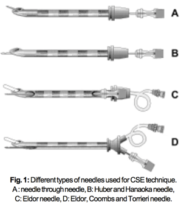

Combined Spinal Epidural-Spinal Needles    body {font-family: 'Open Sans', sans-serif;}

### Combined Spinal Epidural-Spinal Needles

  
CSE:(Combined Spinal Epidural)  

**CSE Spinal Needle Length  
**With a CSE, we insert a spinal needle through and past the epidural needle and into the subarachnoid space.  
A small diameter spinal needle (as compared to a regular spinal needle) may be used since the tough ligamentum flavum has already been penetrated by the Touhy.  
The spinal needle that comes in a common CSE kit is a “LONG” spinal needle-5 inches in length.  
The CSE Touhy is usually only 3.5 inches (CSE kits vary).  
Because the gap between the entrance of the epidural and the dura, the spinal needle needs to be longer and extend past the Touhy needle to enter the subarachnoid space. The “LONG” spinal CSE needles should protrude at least 15 mm beyond the epidural needle tip when inserted to the hub of the epidural needle. This is why the “LONG” spinal needle and a shorter 3.5 inch Touhy are in CSE kits.  
  
**CSE Spinal Needle Diameter  
**A 27g, long (5 inch) spinal needle should ideally be used for CSE, not a 25g, which could confer a greater risk of PDPH (about 1% with the 25g, compared to possibly as low as 0.1% for the 27g.  
However, there are still 25g spinal needles present in kits and commonly used today.  
  
**Pencil Point is preferred over a Quencke Needle  
**A pencil-point needle (Sprotte or Whitacre) should almost always be selected, while all cutting needles, (Quincke), should be avoided for both CSE and straight spinals in parturients, due to the substantially increased risk of PDPH with the cutting needles.  
  
**Double-Barreled Epidural needles - Modified Tuohy  
**Some CSE needles have two hollow barrels: one for passage of the spinal needle and the other for the passage of the epidural catheter. These needles allow the separation of the sites of dural puncture and epidural catheter placement.  
It also has a “back eye” located at the bend of the needle.  
The “back eye” is an orifice for the spinal needle to exit the Touhy.  
After withdrawing the spinal needle an epidural catheter is introduced through the epidural needle. Both cannot be simultaneously present inside the Touhy.  
  
The Touhy needle in a CSE kit is usually 3.5 inches (kits vary)A CSE Tuohy is a modified Touhy needle.  
  
A regular Tuohy that comes in the conventional epidural kit do not have the above features.

****

****

Combined Spinal Epidural Anesthesia Techniques…..A Review  
Indian J Anesthesia.2005;49 (6): 450-458  
  
Chandola, Mohamed, PullaniChestnut, David.(2014) Chestnut’s Obstetric Anesthesia Principles and Practice.  
  
Santos, Alan., Epstein, Jonathan.,(2015) Chaudhuri, Kallol Obstetric Anesthesia ; 2015. **http://ceaccp.oxfordjournals.org/content/7/2/38.full**