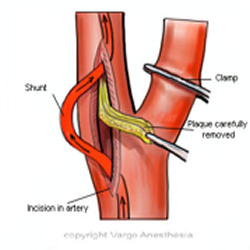

Carotid Endarterectomy (CEA)     body {font-family: 'Open Sans', sans-serif;}

### Carotid Endarterectomy (CEA)

(See **Review of Carotid Endarterectomy)**

Removal of plaque from within the carotid artery  

****

  
**During a CEA, there can be massive BP swings due to carotid wall tension changes from manipulation of the bifurcation or carotid clamping.**  
  
**Pre-op Neuro Assessment:**  
Check strength of bilateral hand grip, pushing /pulling of upper extremities and pushing strength of the feet. Have them stick out their tongue. The results can be compared post extubation for the sign of a stroke. Don’t worry if you forget to do this because it has probably already been assessed.

**CAD Considerations:**  
Usually elderly with PVD and CAD

If these patients have a huge build up of plaque in their carotid arteries, they probably have some in their coronary arteries. Treat them like a CAD patient-avoid tachycardia.

**Anesthetic:** General/ETT, rarely an awake MAC or Cervical Block  
**LTA Kit:** Yes (it may help with emergence)  
**Duration:** 90-150 minutes  
**Position:** Supine with arms tucked  
**EBL:** Depends on the surgeon. There should not be much.  
**IV Access:** 1-2 18G.  2 IVs used to be mandatory.  
Remember the arms will be tucked, so double check the IV patency.  
**A-Line:** Always  
**BP Requirement:** Usually close to the baseline.  ALWAYS ask the surgeon because they all seem to desire different BPs. You want to elevate the BP during clamping for collateral perfusion. When unclamped, you can lower the BP to avoid bleeding. Some surgeons want the systolic 160mmHg when clamped regardless of their baseline.

**Drugs:** 10k units Heparin already drawn up. The surgeon will tell you to give a certain amount before he clamps (around 100u/kg). Let him know when 2 minutes has gone by after giving Heparin.  
**Protamine:** Some surgeons don’t reverse the Heparin.  
**ACTs:** Depends on the surgeon. The faster surgeons may just have a 20 minute clamp time so the surgeon is not concerned with the half-life of heparin. The slower surgeons with much longer clamp times are more likely to want ACTs. Anytime the clamp time reaches 30 minutes, you should ask the surgeon if he wants an ACT.  
**Relaxation:**  Almost always  
**Drips:**Nitroglycerine.   
**Nitroglycerine:** We used to commonly hang a bottle. It seems to have been replaced with small doses of labetalol.  
I have seen many anesthesia providers keep a bottle of NTG in the room and give diluted small doses from a 5cc syringe with sudden jumps in the patient’s BP.

Standard formulary of NTG is 100mcg/mL in the bottle. So, if you take 1mL and dilute it with 4mL of NS in a 5mL syringe, that gives you 20mcg/mL.

**Cardene (****Nicardipine hydrochloride****)** I have also seen some CRNAs use Cardene drip instead of a Nitroglycerine drip and manually titrate (not using an infusion pump).

**Nitroglycerine:** Always, and make sure your drip line is patent after the arm is tucked.

**Position of the head:** Slightly turned away from the surgical side. Foam donut is preferred instead of a regular pillow. A shoulder roll is often used.  
**ETT Position:** Opposite of the side of incision. Using a flex tube extension and removing the elbow piece helps keep the ETT low over the face and out of the surgeon’s field.

**Cerebral monitoring:** Sometimes

**EEG Monitoring:** The EEG tech may ask you just to keep your inhalation agent consistent. Try not to use Etomidate because it will interfere with the EEG for a period of time.  
  
**Emergence:** It’s now usually OK to extubate deep as long as you do not leave the room until the patient is awake enough perform a bilateral hand grip, wiggle their toes and stick out their tongue. This is usually up to the surgeon.  
    
**Avoid HTN with emergence:**  A must! HTN will challenge the new graft and incision. Prepare to treat for temporary HTN with an awake extubation with labetalol. Most surgeons desire you to maintain a systolic around 100mmHg.

**Transporting the patient to the recovery room**: We usually transport the patient connected to a portable monitor to closely observe BP. This is when you may use your diluted nitroglycerine and a flush syringe for any increase in BP while transporting. You can look like a complete idiot delivering the patient with a 200mmHg systolic BP. A graft leak or rupture will be blamed on you.  
  
**Possible Complications**  
Hemorrhage  
Stroke (embolization): Although rare, the catheter may damage the artery or knock loose a piece of the artery wall, which can block blood flow and cause a stroke.  
Restenosis

**Damage to the:**  
Vagus nerve  
Hypoglossal nerve  
Superior laryngeal nerve  
Glossopharyngeal nerve  
Facial Nerve  
Accessory nerve

**Coexisting Diseases and Facts:**  
Ischemic heart disease a major cause of morbidity and mortality

MI develops in 1-2 % of cases  
Pre op cerebral vascular symptoms increase the risk for a post op stroke.

Increase age, increases  the risk of strokes and death.

PVD- a strong predictor of perioperative stroke or death.

Patients with a pre-op history of angina had a mortality of 18% compared to less than 5% with those without symptoms.  
   
**Anatomy Notes:**  
Dissection must be carried out with extreme care not to injure surrounding nerves, most notably the vagus and hypoglossal nerves.

The ansa cervicalis, a branch of the hypoglossal nerve, may have to be divided to facilitate the dissection; this is acceptable.

**Exposure and mobilization**  
The internal jugular vein is visualized, and the carotid sheath is opened along the anterior border of the vein. The internal jugular vein is retracted laterally, and the common facial vein is ligated. Dissection is continued anterior to the CCA (common carotid artery) to keep from injuring the vagus nerve. The vagus nerve usually lies in a posterior lateral position within the carotid sheath but occasionally may spiral anteriorly, particularly in the lower end of the incision.

Attention should be paid to cranial nerves IX (glossopharyngeal nerve), X (vagus nerve), XI (accessory nerve), XII (hypoglossal nerve), the marginal mandibular branch of VII (facial nerve), and the rare nonrecurrent laryngeal nerve that comes directly off the vagus to innervate the vocal cords. This nerve can cross anterior to the carotid artery and can be mistaken for a part of the ansa cervicalis; if it is inadvertently divided, cord paralysis results. A nonrecurrent laryngeal nerve is most often noted on the right side of the neck.

Jaffe, Richard A. _Anesthesiologist's Manual of Surgical Procedures_., 2012.

Kalbande, Manohar B. _Vascular Surgery Made Easy_. 2013.

Macksey, Lynn Fitzgerald. _Surgical Procedures and Anesthetic Implications: A Handbook for Nurse_

_Anesthesia Practice_. Sudbury, MA: Jones & Bartlett Learning, 2012.

Moore, Wesley S., M.D. _Vascular and Endovascular Surgery: A Comprehensive Review Expert Consult:_2013