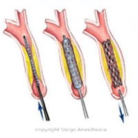

Carotid Stent or Angioplasty     body {font-family: 'Open Sans', sans-serif;}

### Carotid Stent or Angioplasty

Carotid angioplasty and stenting is an alternative to the traditional Carotid Endarterectomy (CEA)

****

**For Stenting**  
A stent is placed inside the carotid artery at the site of the blockage and provides support to keep the artery open.

Many of these patients have PVD, DM, HTN and are smokers. These patients can be sensitive to BP changes. 

Most of the time the surgeon uses a femoral artery approach. A long catheter is threaded through the sheath, and is guided through the aorta to the carotid artery (under fluoroscopy) until it reaches the point of balloon inflation and stent insertion. The surgeon will warn you when the catheter is near the carotid bulb (sinus). At this point we usually give some atropine (0.5mg) to prevent asystole from the catheter irritating the baroreceptors.  
If the patient has a pacer, you are lucky. Most pacers activate when the HR drops to 60 bpm. In this case you may just need a little Neosynephrine to treat a drop in BP.

The surgeon can also use a brachial approach.  
  
**Anesthetic:** Usually MAC with ETCO2 monitor.  
General/ETT –Sometimes.  
For MAC-versed is usually not given.  A little Propofol prior to local groin injection is usually OK. I have heard of some CRNAs using a Precedex infusion. The surgeon may want to immediately check the patient’s neural status, so it administering versed is not an optimal sedation drug.  
**Position:** Supine with arms tucked.  
**A-line:** Yes, they may use a femoral line.  
**Meds:** Have atropine already drawn up and ready to inject with flush syringe.

**Heparinize:** Yes

Have a Nitro and Neosynephrine drip ready.

**Pulse-Ox:** On the opposite side of operative carotid.  
**EKG Cable and leads:** Keep them out of the flouro field.  
**IV Access:** usually 18G.  
Have intubation equipment and emergency meds readily available.  
**Duration:** 1-3 hours  
  
**Possible Complications:**  
**Stroke or ministroke or TIA**

A stroke can also occur if plaques in your artery are dislodged when the catheters are being threaded through the blood vessels. This is why we don’t give them versed.  
**Blood clots  
Bleeding:** Where the catheter was inserted.  
It is common for these patients to be taking take aspirin and/or Plavix (clopidogrel) for 3 to 5 days before the procedure and for 4 to 6 weeks after the procedure.

**Asystole and hypotension**: This is very common without the pre-administration of atropine from a baroreceptor reflex. You will be told when to adminster the atropine.  
  
**Indications:**

A new blockage (restenosis) after having an endarterectomy or angioplasty.

Artery blockage of 50 percent or more and a history of stroke ministroke (transient ischemic attack) or loss of vision in one eye (amaurosis fugax).

Artery blockage of 80 percent or more and no symptoms.

Conditions such as severe heart or lung disease, prior neck operations neck tumor radiation or kidney failure.

Narrowing of arteries that are difficult to access with surgery.

**More Notes:**  
In 2004, the carotid stenting procedure was approved by the FDA. 

  
**For angioplasty:**  
A balloon catheter is guided to the area of the blockage or narrowing. When the balloon is inflated, the fatty plaque or blockage is compressed against the artery walls to improve blood flow.

A direct puncture of the Carotid artery approach is rare and requires a general/ETT with the head turned to the opposite direction.

Jaffe, Richard A. _Anesthesiologist's Manual of Surgical Procedures_., 2012.

Johnson, Shannon, and George Krucik, M.D. "Varicose Vein Stripping." _Healthline_(2012).

Kalbande, Manohar B. _Vascular Surgery Made Easy_. 2013.

Macksey, Lynn Fitzgerald. _Surgical Procedures and Anesthetic Implications: A Handbook for Nurse_

_Anesthesia Practice_. Sudbury, MA: Jones & Bartlett Learning, 2012.

Moore, Wesley S., M.D. _Vascular and Endovascular Surgery: A Comprehensive Review Expert Consult:_2013