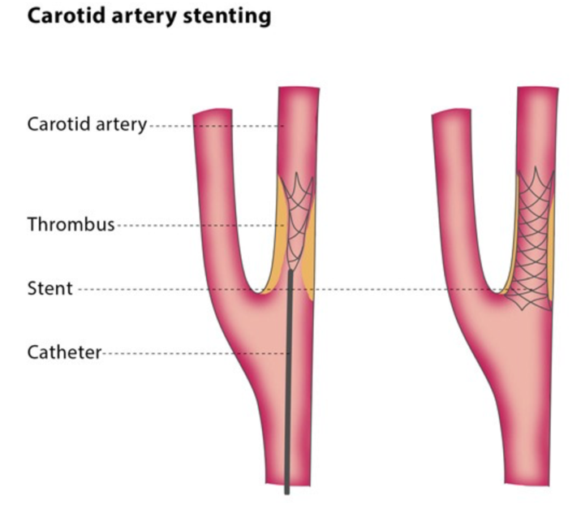

Carotid Arteriogram or Angiogram and possible Stent Insertion    body {font-family: 'Open Sans', sans-serif;}

### Carotid Arteriogram or Angiogram and possible Stent Insertion

**Carotid angioplasty or stenting** is a minimally invasive procedure to widen narrowed carotid arteries, improving blood flow to the brain and reducing stroke risk.   

****

  
**Anesthesia:** Usually a light MAC.  
\- This is not a painful procedure, and the endovascular doctor may want the patient responsive enough to take deep breaths on command.  
\- A Dexmedetomidine infusion is common.  
\- Aways check with the surgeon on the desired depth of sedation.  
\- More MAC anesthesia details below.  
  
**Procedure:**  
\- A thin, flexible catheter is inserted into a blood vessel in the groin or arm.  
\- A long catheter is threaded through the sheath and is guided through the aorta and threaded up to the carotid artery (under fluoroscopy).  
\- A contrast dye is injected into the catheter, which allows the arteries to be visualized under fluoroscopy.  
\- The images are taken as the dye flows through the carotid arteries, revealing any blockages or narrowing.   
\- The images are analyzed to identify any issues in the carotid arteries, which may lead to further treatment options like angioplasty (ballooning) and/or stenting.   
  
**Possible severe bradycardia or asystole:  
**\- Always have atropine in hands reach.  
\- The endovascular doctor may warn you when the catheter is near the carotid bulb (sinus).  
\- At this point we usually administer atropine (0.4mg) prophylactically to prevent asystole from the catheter irritating the carotid baroreceptors.  
\- If the patient has a pacer, this is not an issue.  
\- Most pacers activate when the HR drops to 60 bpm.  
\- In this case you may just need a little phenylephrine to treat a drop in BP.  
  
**Pre-op:**  
Many of these patients have CAD, PVD, DM, HTN and are smokers.  
These patients can be sensitive to BP changes.   
  
**Check for contrast (iodinated) allergies:  
**\- Patients with an established contrast allergy (either to iodinated contrast or Gadolinium-containing contrast) may require a prophylactic premedication regimen to help reduce the likelihood and severity of an allergic reaction.\- Most contrast allergies are anaphylactoid rather than anaphylactic.**Note:** Shellfish allergies are not related to iodinated contrast; the allergen is the shellfish tropomyosin and not the contrast.\- Physicians routinely do not routinely withhold contrast administration in such patients.  
Preop allergic prophylaxis for patients allergic to IV contrast (H1 and H2 antagonists)  
25 mg of Diphenhydramine (Benadryl)  
20 mg of Famotidine (Pepcid)  
100 mf of Solu-Cortef (Hydrocortisone)  
  
**Pre-op:  
Note:** Informing the patients that they will need to follow commands for taking deep breaths and it is not a painful procedure may be appreciated by the patient.  
  
**Procedure pain:** Very little, mostly from the initial local injection in the groin (catheter insertion site).  
Many patients complain more about back pain or lying flat than the procedure itself.  
  
**Anesthesia:  
Duration:** It depends on what the doctor finds - 30 minutes to hours.**Positioning:** Supine with arms tucked.\- Ask the patient if they are comfortable lying supine, as some patients have limitations due to a history of neck or back pain.\- Pain relief may be required.**Heparin Available:** Yes (usually one small dose for short cases)  
**Blood Loss:** 10-80 mLs.  
**IV Access:** 20G is acceptable.  
\- If there is just one IV, ensure it runs well when that arm is tucked.  
\- The surgeon will not be happy if you stop the procedure and untuck the patient's arm to start a new IV.  
**Fentanyl:**  
\- Fentanyl (low-dose narcotics) may be beneficial because many patients become uncomfortable on the table and complain of back pain.  
\- This is not a procedure for a squirmy patient.  
**Anesthetic:**  
\- Light MAC and able to follow commands.  
\- The surgeon usually wants the patient awake enough to follow commands.  
\- Deep sedation is sometimes associated with involuntary jerky movements.  
\- At the end of expiration (from a deep breath upon command), the patient is usually motionless and it is a good time for the endovascular surgeon to inject the dye.  
  
**A sample of possible cocktails for light MAC:** For patient-responsiveness  
\- 50-100 mcg of fentanyl and 30 mg bolus of propofol just prior to local injection.  
\- 0.4 mcg/kg/hour of precedex and titrate to effect.  
\- 50-100 mcg of fentanyl followed by a very low dose a continuous propofol or precedex infusion.  
\- Low dose propofol infusion and titrate to effect (25 -50 mcg/kg/hr).  
\- 4 mcg boluses of precedex as needed and 50 -100 mcg of fentanyl prior to local injection.  
  
**Pulse Ox:** Consider a disposable finger sensor or tape the nondisposable sensor to the patient's finger.  
The patient's arms are tucked, and it is difficult to access and correct the pulse-ox sensor if the patient gets fidgety and the sensor becomes displaced.  
  
**Possible Complications:  
****Groin hematoma  
Damage to the carotid artery**  
**Stroke or ministroke or TIA**  
A stroke can also occur if plaques in your artery are dislodged when the catheters are being threaded through the blood vessels. This is why we don’t give them versed.**  
Blood clots******Bleeding:****  Where the catheter was inserted.  
**Asystole and hypotension/hypertension:** This is very common without the pre-administration of atropine from a baroreceptor reflex.  
Some doctors will inform you when to administer the atropine.  
  
**Indications:**\- A new blockage (restenosis) after having an endarterectomy or angioplasty.\- Artery blockage of 50% or more and a history of stroke ministroke (transient ischemic attack) or loss of vision in one eye (amaurosis fugax).\- Artery blockage of 80 percent or more and no symptoms. **  
**More Notes:****  
In 2004, the carotid stenting procedure was approved by the FDA.  
  
**For angioplasty:**  
A balloon catheter is guided to the area of the blockage or narrowing.  
When the balloon is inflated, the fatty plaque or blockage is compressed against the artery walls to improve blood flow.  
A direct puncture of the Carotid artery approach is rare and requires a general/ETT with the head turned to the opposite direction.  

Jaffe, Richard A.  _Anesthesiologist's Manual of Surgical Procedures_ ., 2012.  
  
Johnson, Shannon, and George Krucik, M.D. "Varicose Vein Stripping."  _Healthline_ (2012).6  
  
Kalbande, Manohar B.  _Vascular Surgery Made Easy_ . 2013.  
  
Macksey, Lynn Fitzgerald.  _Surgical Procedures and Anesthetic Implications: A Handbook for Nurse  
_  
_Anesthesia Practice_ . Sudbury, MA: Jones & Bartlett Learning, 2012.  
  
Moore, Wesley S., M.D.  _Vascular and Endovascular Surgery: A Comprehensive Review Expert Consult:_ 2013