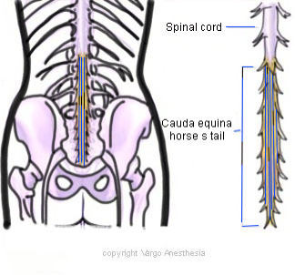
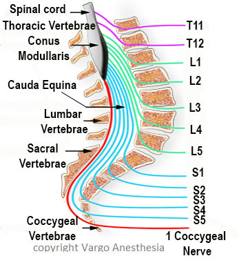

Cauda Equina (Latin for horse’s tail)    body {font-family: 'Open Sans', sans-serif;}

### Cauda Equina (Latin for horse’s tail)

**For Cauda Equina Syndrome-see “Complications of Neuraxial Anesthesia”**  
  
This is a bundle of spinal nerves and spinal nerve roots, consisting of the L2-L5 nerve pairs, S1-S5 nerve pairs, and the coccygeal nerve. They all arise from the lumbar enlargement and the conus medullaris of the spinal cord.  
  
The cauda equina runs through the lumbar cistern (subarachnoid space) within the vertebral canal below L1. It comprises the roots of the all the spinal nerves below L1.  
  
The structures of the cauda equina are like strands of spaghetti surrounded by the CSF. The floating nerve rootlets usually float away from the spinal needle. Spinals must involve the area of the Cauda Equina (below L1). Puncture of the spinal cord itself may cause disastrous consequences.  

****

  

****

  

Chestnut, David.(2014) Chestnut’s Obstetric Anesthesia Principles and Practice.  
  
Santos, Alan., Epstein, Jonathan.,(2015) Chaudhuri, Kallol Obstetric Anesthesia ; 2015.**Gray's Anatomy for Students** By Richard Drake, A. Wayne Vogl, Adam W. M. Mitchell