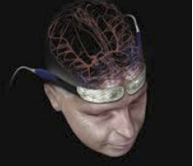

Cerebral Oximetry    body {font-family: 'Open Sans', sans-serif;}

### Cerebral Oximetry

Cerebral oximeters are noninvasive and determine regional hemoglobin oxygen saturation (rSO2) in the frontal lobes by using specially designed probes.  
These probes comprise adhesive pads containing light-emitting diodes (LED) or laser light sources which emit photons in the NIR spectrum capable of tissue penetration of several centimeters through the cranial bone to the underlying cerebral tissue.  
Cerebral oximetry differs from pulse oximetry in that tissue sampling represents primarily (70 - 75%) venous, and less (20 - 25%) arterial blood.  

****

**  
Clinical applications:  
**Cerebral oximetry has been shown to reduce major organ dysfunction following cardiac surgery.  
Used during deep hypothermic circulatory arrest.  
Also used during carotid endarterectomy: after cross-clamping of the internal carotid artery.  
  
**Pediatrics:  
**Premature neonates have impaired cerebral autoregulation and are at risk of intraventricular hemorrhage and periventricular leukomalacia.  
Changes in cerebral oxygen values as detected by cerebral oximeters provide an indirect measure of alterations in cerebral blood flow. Continuous cerebral oxygenation monitoring may enable the early detection and prevention of periventricular leukomalacia and intraventricular hemorrhage.  
  
**Cerebral oximetry values:**  
Baseline of cerebral oximetry pre-induction values should be obtained before anesthesia induction.  
Normal values range from 60% - 80%.  
Lower values of 55 - 60% are not considered abnormal in some cardiac patients.  
A reduction in cerebral oximetry values of more than 12% from a baseline preoperative value has been identified as a reliable, sensitive, and specific threshold for detection of brain ischemia.  
  
During anesthesia, an absolute rSO2 value less than 50% or a greater than 20% drop from individual baseline rSO2 is commonly considered as an intervention trigger.  
During cardiac surgery, the incidence of desaturation in cerebral oximetry is high, especially in pediatric patients and in aortic surgery.  
  

Cerebral oximetry in cardiac anesthesia  
Journal of Thoracic Disease,. 2014 March 6(. Suppl 1): S60-S69  
  
George Vretzakis, Stauroula Georgopoulou, Konstantinos Stamoulis, Georgia Stamatiou, Paul Zarogoulidis, Nikolaos Katsikogianis,Ioanna Kougioumtzi,Nikolaos Machairiotis, Theodora Tsiouda, Andreas Mpakas, Thomas Beleveslis, Alexander Koletas, Stavros N. Siminelakis, and Konstantinos Zarogoulidis .  
  
Cerebral Oximetry Monitoring to Maintain Normal Cerebral Oxygen Saturation during High-risk Cardiac Surgery: A Randomized Controlled Feasibility Trial  
Anesthesiology Perioperative Medicine. April 2016  
Alain Deschamps, Ph.D., M.D.; Richard Hall, M.D.; Hilary Grocott, M.D.; C. David Mazer, M.D.; Peter T. Choi, M.D.; et al  
  
Cerebral oximetry in cardiac anesthesia  
Thoracic Disease; 6 (suppl. 1) 2014  
Vretzakis G, Geogopoulou S, Stamoulis K et al.  
  
Cerebral oxygenation monitoring. A strategy to detect IHV and PVL.  
Newborn Infant Nursing Reviews. 2011;11. 153-9.  
Elser H, Holditch-Davis, Brandon D