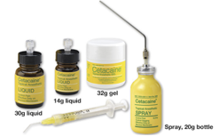

Cetacaine Spray (Cetylite)    body {font-family: 'Open Sans', sans-serif;}

### Cetacaine Spray (Cetylite) – topical anesthetic

(a combination of 14% benzocaine, 2% tetracaine and 2% butambin)  
**Esters** (benzocaine and tetracaine)  

********

**Cetacaine formulations** **– for mucous membranes**  
**Liquid** **–** popular for laser debridment therapy  
**Aerosol spray** **–** suppressing gag reflex  
**Gel** **–** popular for pre-injection  
  
**Anesthesia: Cetacaine spray indications:** to blunt the patient's sympathetic or gagging response to endoscopic procedures in the ear, nose, mouth, pharynx, larynx, trachea, bronchi, esophagus and for awake intubation.  
  
**Cetacaine aerosol spray:**  
**Dose:** Application of spray for ≤1 second delivers approximately 200mg (200mg/second)  
Never exceed spray time longer than 2 seconds.  
**Onset:** 30 seconds  
**Duration:** 30 to 60 minutes **Cetacaine liquid with cotton applicator  
**Not popular in anesthesia  
Cotton applicator should not be held in position for an extended for a long period of time  
because local reactions to benzoate topical anesthetics are related to the length of time of application.  
  
**Cetacaine gel:  
Dose:** Apply ~1/2 inch x 3/16 inch  
Each 200 mg dose of Cetacaine (spray residue, liquid or gel) contains 28 mg of benzocaine, 4 mg of butamben and 4 mg of tetracaine HCl.  
Dispense and apply 200 mg of gel (a bead approximately 1/4 to 1/2 inches long) by gently depressing the pump.  
Application of gel in excess of 400 mg is contraindicated. Spread thinly and evenly over the desired area using a cotton swab.  
  
**Indications:**  
Suppressing the gag reflex  
Controlling pain and easing discomfort during dental and medical procedures  
  
**_Metabolism:_** ultimately be metabolized (primarily by plasma cholinesterases) to inert metabolites which are excreted in the urine.  
  
**Cetacaine contraindications  
**Cetacaine is not suitable and should never be used for injection.  
Do not use on the eyes.  
To avoid excessive systemic absorption, should not be applied to large areas of denuded or inflamed tissue. Should not be administered to patients who are hypersensitive to any of its ingredients or to patients known to have cholinesterase deficiencies.  
Tolerance may vary with the status of the patient.  
Should not be used under dentures or cotton rolls, as retention of the active ingredients under a denture or cotton roll could possibly cause an escharotic effect.  
  
Routine precaution for the use of any topical anesthetic should be observed when using Cetacaine.  
benzocaine ↔ sodium nitrite  
  
Sodium nitrite can cause a condition called methemoglobinemia that reduces the oxygen-carrying capacity of the blood to different organs, and combining the medication with benzocaine topical may increase the risk.  

Cetacaine Catalog  
Cetacaine Topical Anesthetic   
_dailymed.nlm.nih.gov_  
  
Oral Science, “Cetacaine". _www.oralscience.com_  
  
Drugs.com  
Cetacaine Topical Anesthetic - FDA prescribing information, side effects and uses" https://www.drugs.com/pro/cetacaine-topical-anesthetic.html  
  
A Guidance on the Use of Topical Anesthetics for Naso/Oropharyngeal and Laryngotracheal Procedures.  
VHA Pharmacy Benefits Management Strategic Healthcare Group and the Medical Advisory Panel and the National Center for Patient Safety  
  
Topical Analgesic and Anesthetic Agents Drug Class Review  
**Review prepared by:** Melissa Archer, PharmD, Clinical Pharmacist Jonathan Newbold, PharmD Candidate 2014 Carin Steinvoort, PharmD, Clinical Pharmacist Bryan Larson, PharmD, BCPS, Clinical Pharmacist Gary Oderda, PharmD, MPH, Professor  
University of Utah College of Pharmacy  
Copyright © 2013 by University of Utah College of Pharmacy Salt Lake City, Utah.