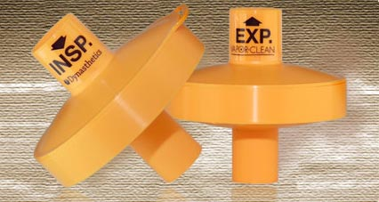

Charcoal Filters    body {font-family: 'Open Sans', sans-serif;}

## Charcoal Filters

_Edited by Dan Lovinaria, DNP, MS, MBA, APRN, CRNA_

Short story: Flush the anesthesia machine for 90 seconds and apply both charcoal filters. The anesthesia machine is now considered “MH” safe with less then 5 ppm of the volatile trigger agents delivered from the ventilator.

Vapor Clean Filters by Dynasthetics  
http://www.dynasthetics.com/Vapor-Clean/index.html

****

<table border="1" cellpadding="0" cellspacing="0"><tbody><tr><td valign="top">
<b>Anesthesia Machine</b>
</td><td valign="top">
<b>Inhalation Agent</b>
</td><td valign="top">
<b>Published washout time (minutes)</b>
</td><td valign="top">
<b>Vapor-Clean Filters washout time</b>
</td></tr><tr><td valign="top">
Ohmeda Aestiva
</td><td valign="top">
Isoflurane
</td><td valign="top">
54
</td><td valign="top">
Less than 1 minute
</td></tr><tr><td valign="top">
Ohmeda Aestiva
</td><td valign="top">
Sevoflurane
</td><td valign="top">
48
</td><td valign="top">
Less than 1 minute
</td></tr><tr><td valign="top">
Ohmeda Aestiva
</td><td valign="top">
Desflurane
</td><td valign="top">
27
</td><td valign="top">
Less than 1 minute
</td></tr><tr><td valign="top">
Draeger Apollo
</td><td valign="top">
Isoflurane
</td><td valign="top">
84
</td><td valign="top">
Less than 1.5 minutes
</td></tr><tr><td valign="top">
Draeger Apollo
</td><td valign="top">
Sevoflurane
</td><td valign="top">
46
</td><td valign="top">
Less than 1 minute
</td></tr><tr><td valign="top">
Draeger Apollo
</td><td valign="top">
Desflurane
</td><td valign="top">
53
</td><td valign="top">
Less than 1 minute
</td></tr><tr><td valign="top">
Draeger Primus
</td><td valign="top">
Isoflurane
</td><td valign="top">
64
</td><td valign="top"></td></tr><tr><td valign="top">
Ohmeda Aestiva
</td><td valign="top">
Sevoflurane
</td><td valign="top">
55
</td><td valign="top">
Less than 1 minute
</td></tr><tr><td valign="top">
Draeger Fabius
</td><td valign="top">
Sevoflurane
</td><td valign="top">
104
</td><td valign="top"></td></tr><tr><td valign="top">
GE Avance
</td><td valign="top">
Sevoflurane
</td><td valign="top">
61
</td><td valign="top"></td></tr><tr><td valign="top">
Maquet Flow-i
</td><td valign="top">
Sevoflurane
</td><td valign="top">
48 minutes
</td><td valign="top"></td></tr><tr><td valign="top">
GE Aisys
</td><td valign="top">
Sevoflurane
</td><td valign="top">
55 minutes
</td><td valign="top"></td></tr></tbody></table>

**Published washout time (time to inspired agent less than 5 parts per million)**

_Many institution protocols only require a washout of 20 minutes despite the published findings above._  
  
Malignant Hyperthermia Association of the United States

http://www.mhaus.org