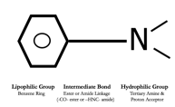
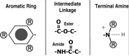
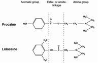
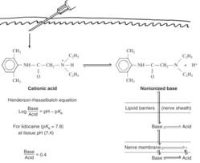

Local Anesthetic Chemical Structure and Notes    body {font-family: 'Open Sans', sans-serif;}

### Local Anesthetic Chemical Structure and Notes

**All local anesthetics consist of 3 parts:**  
**Aromatic ring-lipophilic:** determines lipid solubility (on left).  
**Intermediate chain-type:** ester or amide link (middle).  
**Terminal Amine-hydrophobic:** “on-off” – may become ionized or unionized.  
  
The terminal amine determines nerve membrane diffusion and Na Channel affinity.

****

****

****

**Aromatic Ring (boring end of the local anesthetic) usually unsaturated benzene ring-Lipophilic.  
**The aromatic ring portion determines lipid solubility. When you hear how lipid soluble a local anesthetic is, it is referring to the aromatic ring. Lipid solubility can be increased by adding aliphatic substitutions. The more lipid soluble, the more potent.  
  
**Intermediate Chain** The intermediate chain is the middle hydrocarbon chain that is connected to the aromatic ring by either an ester (C=O) or (O-C-O) or an amide (NH) or (-HNC-) link. The ester link (C=O) is unstable and easily broken.  
Local anesthetics are either an “ester” or amide” determined by the intermediate linkage. If you see an “NH” connected to the aromatic ring, it is an “amide” local anesthetic. The ester (C=O) can be displayed differently depending how the chemical structure is presented. It is easier to determine if it is an amide by looking for the “NH” attached to the aromatic ring. If not an amide then it is an ester. The length of the intermediate chain impacts lipid solubility. The longer the chain, the more lipid soluble the local anesthetic.  
  
**Terminal Amine (Amine group): Quaternary (ionized) or Tertiary?  
**This is the part of the local anesthetic where all the action is. The terminal amine may exist in a tertiary form (3 bonds) that is “lipid soluble” (lipophilic) or as a quaternary form (4 bonds) that is positively charged (cation) and renders the molecule water soluble (hydrophilic).  
To keep things simple, we will start just using the two terms **“ionized”** and “ **nonionized** .”  
**ionized** \= not lipid soluble and will not diffuse through a lipid membrane.  
**nonionized** \= lipid soluble and will easily diffuse a lipid membrane.  
  
**Local anesthetics are weak bases when not mixed in a solution** Local anesthetics alone are weak bases and not stable in solution, so they are manufactured as hydrochloride salts resulting in acidic solutions with pH range of 4-7. This will create a solution that has a greater proportion in the ionized form.  
  
**What is the state of a local anesthetic in a glass vial = greater proportion ionized.** Local anesthetics exist as a weak base. Local anesthetics in solution exist in equilibrium between basic uncharged (non-ionized) form (B), which is lipid soluble and a charged (ionized) form (BH+), which is water soluble.  
  
**Remember Cell Biology** Hydrophilic = Lipophobic - not soluble with lipids  
Hydrophobic = Lipophilic-soluble in lipids - (lipid membranes)  
Nonionized = Lipid soluble  
Ionized = Not lipid soluble

****

You notice the Henderson-Hasselbalch equation is used above? An ionized (cationic) molecule can be converted to a nonionized molecule by the transfer of a proton and vise versa.  
  
The shift can be left or right. In this case, we will need a right shift (give away a proton) to become nonionized (lipid soluble) for the local anesthetic to diffuse through a lipid membrane. The two molecules above will equilibrate when they both equilibrate.  
  
_(Note: equilibration will not mean a 50/50 relationship. It will equilibrate based on pKA and pH. Please refer to your lidocaine chart. At a pH of 7.4 (i.e. tissue) it will be 25% non-ionized and 75% ionized. So it may be a varying ratio due to the individual local anesthetics pKA and pH)._

IFNA / International Federation of Nurse AnesthetistsDeveloping Countries Regional Anesthesia Lecture Series Daniel D. Moos CRNA, Ed.D. U.S.A.  
  
**Essentials of Local Anesthetic Pharmacology  
**Anesth Progv.53(3); Fall 2006Daniel E Becker, and Kenneth L Reed  
  
“Local Anesthetic Pharmacology” Anesthesiology Review , 3 rd Ed. pp285-287  
Ronald J. Faust