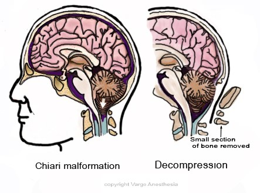

Chiari Malformation Anesthesia   

### Chiari Malformation Anesthesia

(Cranial-Cervical Decompression)

**_Edited by Anna Stone, CRNA_**

As simply as possible, this cranio-cervical decompression or Suboccipital Craniotomy is an operation involving the back of the head and top of the neck where the neurosurgeon creates extra room for the bottom part of the brainstem and the top part of the spinal cord to restore CSF flow.

**Painful procedure?** Yes, and it’s a good idea to frontload your narcotics at the start of the case. We don’t want a decreased RR at the end of the case associated with the narcotics. Surgery is at the brainstem (medulla), and any decreased respiratory breathing could be surgically related. Once the patient is breathing at the end of the case, titrate the narcotics to the patient’s respiratory rate and comfort.

**Indications:** Chiari Malformations (CMs)

Also known as Arnold-Chiari malformation. CMs consist of 4 syndromes thusly numbered as I, II, III, and IV.

**Treatment:** A cranial cervical decompression, which consists of a craniectomy, laminectomy, and/or a duraplasty.

**Craniectomy:** The removal of part of the base of the skull to enlarge the foramen magnum, which is the passageway between the skull and spine, to make more room for the flow of CSF.

**Laminectomy:** This may also be done. It is the removal of the arch of one or more vertebra, also to open up the posterior fossa space and decrease crowding in the hindbrain area.

**Duraplasty:** This is also sometimes done, where the dura is opened and replaced with a patch, allowing for extra space for the flow of fluids. During the duraplasty, ask the surgeon if he wants the patient flat. This decreases the CSF leakage and the patient is a less likely candidate for a post-op headache.

**Anesthetic:** General/ETT. Some of us use an armored ETT since the head may be chin to chest and prone to kinking. Double tape the ETT since the patient will be prone.  
**Tegaderm:** I always place tegaderm over the ETT tape.  
**Muscle Relaxation:** Ask the surgeon. Where I work, the surgeons DO NOT want the patient relaxed unless it is short acting for intubation. For younger kids, we tend to intubate without any relaxant at all.  
**Narcotics:**

**Remifentanil drip:** 0.2mcg/kg/min and titrate to effect. Yes, no movement is imperative. Not really needed if you are permitted muscle relaxation.  
I also use:

**Dilaudid** at 0.01mg/kg dosing and titrate to spontaneous RR on emergence.  
**Morphine** 0.1mg/kg dosing and also titrate on emergence.

**Sevoflurane:** Yes, keep the patient deep.

**Duraplasty:** If the surgeon is doing a duraplasty, make sure you hydrate the patient well to help prevent PONV.

Decadron 0.1mg/kg  
Zofran 0.15mg/kg

**Neuromonitoring:** Some literature states yes, but this is extremely rare. I have not seen neuromonitoring used.

**Position:** Usually prone with arms tucked to the side. Rarely in sitting position despite some literature out there promoting the sitting position.  
Padding is key! We stick 2x2s and towels under BP cables, IV tubing, etc., anything that could possibly leave a mark.

**Mayfield Pins:** Yes, for teenagers/older kids, so their eyes and nose are free of pressure. Have some extra Propofol available and give a small bolus just prior to the pins being tightened. This part is very stimulating.

**Operating microscope: Yes.**

**A-line:** Maybe 25% of cases. Usually discuss with surgeon and look at child’s history.

**IV Access:** Always 2 IVs.

**Hydration: 4:2:1** (below is just a common reference)Albumin dose for mild hypotension: 10cc/kg is recommended (<10kg wt)  
Albumin-more effective with its oncotic pull than crystalloids (<10kg wt)  
Crystalloid Bolus dose for mild hypotension: 5-10cc/kg (<10kg wt)  
Crystalloid Bolus dose for mild hypotension: 20cc/kg (>10kg wt)  
Crystalloid Bolus (emergency) for severe hypotension (20-50cc)

**Replacement of Insensible Fluid Loss (reference)**  
Minimally invasive (inguinal, laparoscopic) 0-2 cc/kg/hr  
Mildly invasive (ureteral reimplantation) 2-4 cc/kg/hr  
Moderately invasive (simple bowel cases) 4-8 cc/kg/hr  
Significantly invasive (NEC) >10 cc/kg/hr  
**3rd Spacing:** 10mL/kg/h is standard for 3rd space fluid loss  
with an open belly case.

**EBV (reference)  
Premature:** 90-100cc/kg**Newborn:** 80-90cc/kg**3mo-1 year:** 70-80cc/kg**1-4 years:** 70cc/kg  
**Adult:** 55-60cc/kg

**Duration:** 1.5-3 hours

**EBL** : 25-200 mLs.

**Type and Cross: Yes,** but we do not routinely have blood in room. We send for it if we need it.

**Possible Complications:**

Head Bleed or a blot clot (<1:100)

Stroke (<1:100)

Wound infection (<1:100)

CSF leak through the wound (1-2:100). This can result in an infection in the CSF (bacterial meningitis).

Pseudomeningocoele (1:100). This is where a large bulge develops underneath the skin in the region of the surgical wound, containing CSF.

**Quick Basic Drug References  
****Propofol:** 2.5-3.5mg/kg IV  
**Succinylcholine:** <1 year: 3.0mg/kg  
\>1 year: 1.0-2.0mg/kg  
IM: 4-6mg/kg  
**Rocuronium:** <1 year: 0.25-0.5mg/kg  
1 year: 0.5-1.2mg/kg  
\>1 year: 0.5-1.3mg/kg  
**Vecuronium:** <1 year :0.05-0.1mg/kg  
\>1 year: 0.1mg/kg  
**Neostigmine:** 0.05-0.07mg/kg  
**Robinul:** 0.01mg/kg  
**Fentanyl:** 1-2mcg/kg  
**Morphine:** 0.05-0.15 mg/kg/dose IV q2-4h prn**Ofirmev:** \>2 years: 15mg/kg  
**Not FDA approved for < 2 years, but many still administer at 15mg/kg  
Toradol:** \>2 years: 0.5mg/kg  
**Precedex** (Emergence)**:** Slow push 0.5mcg/kg  
**Zofran:** 100mcg/kg (max 4mg)  
**Decadron:** 0.2-0.5mg/kg  
**Ancef:** 25mg/kg Q6h  
**Ampicillin:** 25-100mg/kg (max per day 100-400mg/kg)  
**Gentamycin:** 2-2.5 mg/kg/dose q8h (Max dose 80 mg)  
**Ceftriaxone (rocephin):** 50-75mg/kg  
**Clindamycin (cleocin):** 15-25mg/kg  
**Invanz** (ertapenem): (3 month -12 years): 15mg/kg  
**Vancomycin:** 10mg/kg slow IV

Fessler, Richard Glenn, and Laligam N. Sekhar, MD,FACS. _Atlas of  
Neurosurgical Techniques: Brain_ . New York: Thieme Medical, 2006.

  
Goetz, Christopher G. "Etiological Categories of Neurological Disease." _Textbook  
of Clinical Neurology_ . 3rd ed. Philadelphia: Saunders Elsevier, 2007.

Jaffe, Richard A. _Anesthesiologist's Manual of Surgical Procedures_. N.p.: n.p.,  
2012.

Macksey, Lynn Fitzgerald. _Surgical Procedures and Anesthetic Implications: A  
Handbook for Nurse Anesthesia Practice_ . Sudbury, MA: Jones & Bartlett  
Learning, 2012.

Newfield, Philippa, and James E. Cottrell. _Handbook of Neuroanesthesia_.  
Philadelphia: Lippincott Williams & Wilkins, 2007.

Takebayashi, Shigeo, Izumi Torimoto, and Kiyotaka Imoto.  
_Transcatheter Coil Embolization of Visceral Arterial Aneurysms_ . New York:  
Nova Biomedical, 2009.

Tubbs, R. Shane, and W. Jerry Oakes. _The Chiari Malformations_. N.p.: n.p., 2013.

Warner, David S., MD. "Anesthesia for Craniotomy." _ASA Refresher Courses in_

_Anesthesiology_ 40.1 (2012): 156-66. IARS (International Anesthesia  
Research).