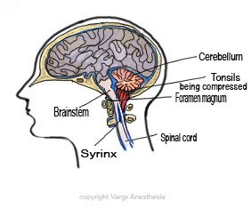

Airway Anatomical Differences vs Adults   

### Chiari Malformation Review

**Chiari Malformation** is defined by a volumetrically small posterior cranial fossa, the compartment in the back of the skull, which leads to overcrowding of the cerebellum and brainstem. This causes a blockage of the flow of CSF through the foramen magnum, making it difficult for the fluid to flow around the brain and in and out of the skull. In many cases, the cerebellar tonsils are pushed downward through the foramen magnum.

  
These malformations frequently occur in combination with other pathological entities such as myelomeningocele, hydrocephalus, and/or hydrosyringomyelia.

Arnold-Chiari malformations may not cause any problems. Some people, however, can have significant symptoms such as ‘Valsalva’ headaches. In others, an Arnold-Chiari malformation is associated with the development of a spinal cord syrinx.

**  
What is a syrinx?**  
A syrinx is an abnormal fluid-filled cavity within the spinal cord. The condition is also known as syringomyelia. A spinal cord syrinx is often progressive and over time it enlarges and affects more of the spinal cord, causing more and more symptoms. A syrinx can cause irreversible damage to the spinal cord. It can affect the use of the hands, cause disturbing discomfort trunk and limbs, and result in difficulty walking.

**Types of Chiari** **Malformations**

**Type I Chiari:** The cerebellar tonsils are herniated through the foramen magnum. The herniated tissue presses against the brainstem and blocks the normal flow of CSF. Symptoms range from mild to severe.

**Type II:** This results from a normal-sized cerebellum developing in an abnormally small posterior fossa with a low tentorial attachment. This type is a complex deformity of the calvarium, dura, and hindbrain, and it is almost always associated with a myelomeningocele.

**Type III:** There is a defect in the back of the head or neck through which the cerebellum and/or brainstem is herniated.  
  

**Type IV:** These patients usually do not survive past infancy. Severe malformations.

**Associated conditions:**  
Hydrocephalus  
Syringomyelia  
Scoliosis  
Myelodysplasia  
  
**Anatomical Structures at Risk:**

Cranial nerves III, IV, V, VI, VII, VIII, IX, X, XI, and XII.

Brainstem and somatosensory pathways.

Spinal cord.

Fessler, Richard Glenn, and Laligam N. Sekhar, MD,FACS. _Atlas of Neurosurgical Techniques: Brain_. New York: Thieme Medical, 2006.

Goetz, Christopher G. "Etiological Categories of Neurological Disease." _Textbook of Clinical Neurology_. 3rd ed. Philadelphia: Saunders Elsevier, 2007.

Jaffe, Richard A. _Anesthesiologist's Manual of Surgical Procedures_. N.p.: n.p., 2012.  
  

Macksey, Lynn Fitzgerald. _Surgical Procedures and Anesthetic Implications: A Handbook for Nurse Anesthesia Practice_. Sudbury, MA: Jones & Bartlett Learning, 2012.

Newfield, Philippa, and James E. Cottrell. _Handbook of Neuroanesthesia_. Philadelphia: Lippincott Williams & Wilkins, 2007.

Takebayashi, Shigeo, Izumi Torimoto, and Kiyotaka Imoto. _Transcatheter Coil Embolization of Visceral  
Arterial Aneurysms_ . New York: Nova Biomedical, 2009.  
  
Tubbs, R. Shane, and W. Jerry Oakes. _The Chiari Malformations_. N.p.: n.p., 2013.

Warner, David S., MD. "Anesthesia for Craniotomy." _ASA Refresher Courses in  
Anesthesiology_ 40.1 (2012): 156-66. IARS (International Anesthesia Research  
Society).  
  
**http://www.ninds.nih.gov/disorders/chiari/detail\_chiari.htm**