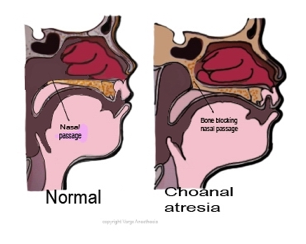

Choanal Atresia Review   

### Choanal Atresia Review

  
_Peter J Schupp, CRNA, Charlotte, NC_

 **Background  
**Choanal Atresia (CA) is a congenital birth defect that interferes with normal nasal breathing. This can be a life threatening condition, as newborns are obligate nose breathers. Complete nasal obstruction in a newborn may cause death from asphyxia. The congenital obstruction of the nasal passage due to presence of a membrane or boney tissue obstructing airflow through the nostrils. (this fits better up here so you can describe what the obstruction is, before describing the consequences).

During attempted inspiration, the tongue is pulled to the palate, and obstruction of the oral airway results. Vigorous respiratory efforts produce marked chest retraction. Increased cyanosis and death may occur if appropriate treatments are not available; however, if the infant cries and takes a breath through the mouth, the airway obstruction is momentarily relieved. Once, the crying stops, the mouth closes, and the cycle of obstruction is repeated.

This obstruction fails to rupture on about the 38th day of fetal development. For an unknown reason, this complex developmental process in the midline of the face is disrupted, interrupting the normal process of formation of the nasal passages. The only time newborns breathe through their mouths is when they are crying. Babies with bilateral choanal atresia (both nostrils affected) will have severe respiratory distress (trouble breathing) in the newborn period with cyclical cyanosis (periods of their skin turning grey/blue due to lack of oxygen). This is because with crying they will be able to exchange air by mouth-breathing. However, when they close their mouths to suck they will not be able to breathe. If only one nasal passage is obstructed this condition might not be detected for months or years.

**Incidence :** 1-in-7000 live births  
Females > males

**Associated Syndromes/anomalies  
**Chromosomal anomalies are found in 6% of infants with choanal atresia and 5% of babies have syndromes with multiple defects. Nearly half of all babies will have associated palate and nasal wall malformations. However, CA usually occurs in the absence of any other anomalies (problems with other parts of the body) or syndromes. However, there are syndromes associated with choanal atresia for which every patient should be evaluated. This is especially true for those with bilateral (both sides) choanal atresia, as other congenital anomalies are more common in those affected bilaterally.  
  
The most common syndrome associated with choanal atresia is **CHARGE Syndrome**.  
About 60% of patients with CHARGE syndrome have bilateral choanal atresia. This particular syndrome is genetic, inherited in a dominant pattern.  
  
**CHARGE syndrome typically involves:  
**\- Eye conditions (i.e. coloboma of the iris, choroid, and/or microphthalmia)  
\- Heart defect (atrial septal defect, ASD or endocardial cushion defect)  
\- Choanal atresia  
\- Delayed growth and development  
\- Genital conditions (such as cryptorchidism, microphallus, and/or hydronephrosis)  
\- Ear defects  
  
One of the patient’s parents is usually affected, although the parent can be more or less affected, meaning that the symptoms or features may be more or less noticeable.  
Genetic mutations can also be sporadic (not inherited, but spontaneous), and they can be mosaic (affecting some of the patient’s cells and not others). In this case, neither of the patient’s parents would have the mutation or be affected. Mutations in the CHD7 gene should be tested and are identified in 75% of patients with CHARGE. The remaining 25% of patients may have a mutation in another gene or no genetic mutation. Microdeletion of 5q11.2 has also been associated with choanal atresia.

Choanal atresia is often associated with Treacher Collins syndrome, and Tessier syndrome.

**SIGNS AND SYMPTOMS OF UNILATERAL CHOANAL ATRESIA**  
When unilateral, the right side is affected more often than the left. If the atresia (narrowing or complete blockage) is only on one side, sometimes it is identified at birth but it can go unnoticed for a few years. Most commonly, children will have chronic thick drainage from one side of the nose.

**SIGNS AND SYMPTOMS OF BILATERAL CHOANAL ATRESIA**  
If the atresia is present on both sides, it is much more likely that the newborn infant will have symptoms with significant difficulty breathing and feeding. Patients may have noisy breathing, turn blue while sleeping or feeding, and aspirate milk. When the patient awakens, coughs or cries the mouth will open again, allowing air to move through to the lungs, and symptoms will often temporarily resolve. Feeding slowly can allow the baby to breathe between swallows. However, a feeding tube is often placed from the oral cavity into the stomach to make sure that the patient safely receives adequate feeds.

**Diagnosing  
**To test a baby for the presence of choanal atresia, a thin plastic tube will be gently inserted into the nasal passage. In normal babies it will pass through readily into the back of the throat. Once the airway is secured, further testing such as CT and/or MRI will confirm the diagnosis

**Surgical Correction/Treatment**  
**INITIAL TREATMENT OF BILATERAL CHOANAL ATRESIA**  
Bilateral choanal atresia can be a life-threatening situation. In an emergency, an oral airway or short tube along the top of the tongue can be placed so that the airway stays open. Patients will often require an intubation (a breathing tube from the mouth to the airway below) or tracheostomy (a tube bringing air directly from an opening made in the neck down to the airway below).

One of the first signs in the delivery room or neonatal intensive care unit (NICU) that a patient may have a bilateral choanal atresia is the inability to pass a small catheter (tube) down either side of the nose into the stomach. Similarly, a small flexible endoscope may also be passed into the nose at the patient’s bedside to examine the inside of the nose and confirm the anatomy. Once an airway is established and the patient is stable, a CT scan (computed tomography) and possibly an MRI (magnetic resonance imaging) may be obtained to confirm the choanal atresia or identify other reasons for the patient’s symptoms.

**SURGERY TO REPAIR OR OPEN THE CHOANA**  
The choanal atresia can be repaired or opened with a surgical procedure. 70 to 90% of choanal atresia involves bone and the soft tissue covering the bone. Only in a small portion of cases is the narrowing composed of only soft tissue and no bone. There are multiple techniques that can be used during surgery, but most often an endoscopic approach is used nasally. With an endoscopic approach there are no incisions on the face or the palate. The procedure is done through the nostrils. The bone and soft tissue that is obstructing the opening is taken down until it is open to the nasopharynx.  
  
An “open” approach can be used in which an incision is made into the palate from the oral cavity to access the narrowing in the nose. After the atresia is opened, the palate is then closed. In either case, endoscopic or open, a temporary stent may or may not be placed to keep the newly created choana open. It is possible that the opening may begin to close, with or without a stent. More than one surgery is often necessary to try to keep the nasal airway open. Mitomycin may be used during surgery to reduce postoperative scarring. However, a suitable airway is attainable in the vast majority of patients.

Once the atresia is repaired and well-healed, patients who required a tracheotomy can usually have the tracheotomy removed as long as there are no other problems for which the tracheotomy would be necessary. The timing of removal of the tracheotomy will vary by patient.

**References** :  
http://www.health.state.mn.us/divs/cfh/topic/diseasesconds/choanalatresia.cfm