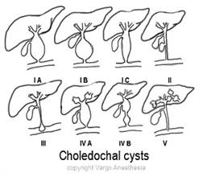
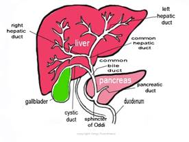
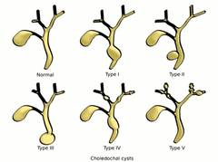

Choledochal Cyst Review   

### Choledochal Cyst Review

A choledochal cyst is basically a congenital dilation (out pouching) anamoly of the biliary tree. They can be extrahepatic (below the liver) or intrahepatic (up in the liver).  
The etiology of choledochal cysts is still unclear. A common theory is that the pancreatic duct and the common bile duct meet outside the ampulla of Vater forming a long common channel (pancreaticobiliary duct junction).

So this large common channel draining pancreatic and bile duct causes the mixing of pancreatic and biliary juices leading to complications.  
**  
Choledochal Cyst Complications**

Secondary stone formation  
Cholangitis  
Bile duct wall destruction and distal stenosis

Scarring  
Cyst formation (out pouching)  
Spontaneous rupture  
Cirrhosis  
Portal hypertension may occur due to portal vein compression.

Malignancy-when long term

Amylase and/or lipase can be found in the bile. Sometimes bile may reflux up to the pancreas and cause pancreatitis.

**Incidence**

1:100,000-150,000  
Greater prevalence in East Asia

60% are diagnosed before the age of 10 years

Female to Male ratio: 4:1

**Radiographic Diagnosis (imaging the biliary tree)  
**ERCP  
Percutaneous transhepatic cholangiography (PTC)  
CT  
MRI  
Ultrasound  

 

**Normal Anatomy (above)**

Choledochal cysts are commonly classified I-V. They have subtypes in which some may not even be pathologically related.

**Type I:** Cystic or fusiform (like an aneurysm). Accounts for 80-90% and  
can be present and diagnosed in utero per prenatal ultrasound.  
**Ia** **:** Dilatation of the ENTIRE extrahepatic bile duct

**Ib** **:** Dilatation of a focal area of the extrahepatic bile duct

**Ic** **:** Dilatation of the common bile duct portion of extrahepatic bile duct

**Type II:** Diverticulum of the common bile duct -2%  
**Type III** :Choledochocele (dilation) of the terminal bile duct within the  
duodenal wall -1.4%–4.5%  
**Type IV** :Multiple extrahepatic and intrahepatic out pouching cysts.  
Next most common-15%–35%

**IVa** **:** Cysts involving both intra and extrahepatic ducts

**IVb** **:** Multiple dilatations/cysts of extra hepatic ducts only

**Type V** : Intrahepatic duct cyst (single or multiple-Caroli’s diseas) -20%.

**The common triad of clinical features (in 19-60%)  
**Abdominal pain  
Jaundice  
Abdominal Mass

**Clinical features of choledochal cysts in infants**

Abdominal pain-usually from hyperamylasemia from pancreatitis or diffusion of pancreatic amylase from the cyst.  
Obstructive Jaundice  
The Type I (which is present in utero) can be detected via prenatal ultrasound.

Jaundice and acholic stools: In early infancy, may prompt workup for biliary atresia.

Palpable mass in the right upper quadrant of the abdomen, with hepatomegaly.

When an infant has become jaundiced and biliary atresia has not been ruled out, surgery should be performed ASAP. With a mild case, surgery can be held off until three months of age. However, a surgical delay increases the risk of developing liver fibrosis, cholangitis or cyst perforation.

**Clinical features of choledochal cysts in older children and adults are variable.**

Intermittent biliary obstruction with palpable right upper quadrant mass, and jaundice.

Recurrent bouts of pancreatitis with colicky abdominal pain (elevated amylase and lipase lead to the proper diagnostic workup)

**Clinical features of choledochal cysts in adults**

20% will have a triad of abdominal pain, jaundice, and a palpable right upper quadrant abdominal mass.

Abdominal pain is the most common symptom.

Vague epigastric or right upper quadrant pain; can develop jaundice or cholangitis.

One or more severe complications (eg, hepatic abscesses, cirrhosis, portal hypertension, recurrent pancreatitis, cholelithiasis)

**Lab Work  
**There are no lab results specific for the diagnosis of a choledochal cyst. However, some results may be used to narrow the differential diagnosis.

**CBC with differential:** Elevated WBC with elevated neutrophils and  
immature neutrophils in the presence of  
cholangitis.  
  
**Liver function studies** : Elevated hepatocellular enzyme and alkaline  
phosphatase ALP) levels are nonspecific for  
choledochal cysts.

**Serum amylase and lipase levels** : Both may be elevated in the presence  
of pancreatitis, biliary obstruction and  
cholangitis

**Serum chemistry levels:** Results may be abnormal vomiting  
(hypochloremic, hypokalemic metabolic alkalosis).

**Choledochal cysts are associated with many different developmental anomalies:**

Colonic atresia  
Duodenal atresia  
Imperforate anus  
Pancreatic arteriovenous malformation  
Multiseptate gallbladder  
OMENS plus syndrome  
Ventricular septal defect  
Aortic hypoplasia  
Pancreatic divisum  
Pancreatic aplasia  
Focal nodular hyperplasia  
Congenital absence of the portal vein  
Heterotopic pancreatic tissue and familial adenomatous polyposis

Can J Surg. 2009 Oct; 52(5): 434–440.  
**Choledochal cysts**  
Part 1 of 3: Classification and pathogenesis  
Janakie Singham , MD, Eric M. Yoshida, MD, and Charles H. Scudamore, MD  
Sgro M, Rossetti S, Barozzino T, Toi A, Langer J, Harris PC, et al. Caroli's disease: prenatal diagnosis, postnatal outcome and genetic analysis. _Ultrasound Obstet Gynecol_. Jan 2004;23(1):73-6.  
Ahn SM, Jun JY, Lee WJ, Oh JT, Han SJ, Choi SH, et al. Laparoscopic total intracorporeal correction of choledochal cyst in pediatric population. _J Laparoendosc Adv Surg Tech A_. Oct 2009;19(5):683-6.  
Singham J, Yoshida EM, Scudamore CH. Choledochal cysts: part 1 of 3: classification and pathogenesis. _Can J Surg_. Oct 2009;52(5):434-40.  
Miyano T, Yamataka A. Choledochal cysts. _Curr Opin Pediatr_. Jun 1997;9(3):283-8.  
Nagi B, Kochhar R, Bhasin D, Singh K. Endoscopic retrograde cholangiopancreatography in the evaluation of anomalous junction of the pancreaticobiliary duct and related disorders. _Abdom Imaging_. Nov-Dec 2003;28(6):847-52.  
Shimotakahara A, Yamataka A, Yanai T, Kobayashi H, Okazaki T, Lane GJ, et al. Roux-en-Y hepaticojejunostomy or hepaticoduodenostomy for biliary reconstruction during the surgical treatment of choledochal cyst: which is better?. _Pediatr Surg Int_. Jan 2005;5-7.:21(1).  
Jang JY, Kim SW, Han HS, Yoon YS, Han SS, Park YH. Totally laparoscopic management of choledochal cysts using a four-hole method. _Surg Endosc_. Nov 2006;20(11):1762-5.  
Lee SC, Kim HY, Jung SE, Park KW, Kim WK. Is excision of a choledochal cyst in the neonatal period necessary?. _J Pediatr Surg_. Dec 2006;41(12):1984-6.  
Hewitt PM, Krige JE, Bornman PC, Terblanche J. Choledochal cysts in adults. _Br J Surg_. Mar 1995;82(3):382-5.  
Rose JB, Bilderback P, Raphaeli T, et al. Use the duodenum, it's right there: a retrospective cohort study comparing biliary reconstruction using either the jejunum or the duodenum. _JAMA Surg_. Jul 24 2013;  
http://emedicine.medscape.com/article/172099-overview  
**Choledochal Cyst  
**Michael AJ Sawyer, MD; Chief Editor: BS Anand, MD, Tarak H Patel, MD, Thomas F Murphy, MD, Fernando V Ona, MD