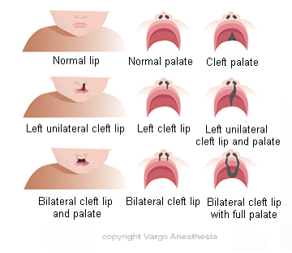

## Cleft Lip and Palate (CLP) Review

**_By Beth Selbee CRNA and Peter J Schupp CRNA  
_**  
Cleft Lip and Palate (CLP) remains one of the most common congenital anomalies despite advances in medical technology and nutrition. Depending on the reference source, the occurrence of CLP varies from 1 in 500 to 1000 live births in the United States; countries such as Latin America and Asia have a higher frequency, while lower frequencies of CLP occur in Israel, South Africa, and southern Europe.

They occur less frequently in African Americans. Males are affected more often than females and 13% present with other birth defects. Cleft lips can be reliably diagnosed during routine ultrasounds during the 16th to 20th week. Clefts of the palate may be detected on ultrasound, but can only be excluded by examination of the palate at birth. Both occur as a result of defects in the palatal growth and fusion during the first trimester.  
  
**The categories of Cleft Palate are grouped under how much of the palate is involved:**  
Complete or incomplete  
Unilateral or bilateral (nostrils) are affected and the cleft extends into the nasal cavity.  
  
**Incomplete cleft**  
The hard palate is not fused, but the soft palate and posterior pharyngeal structures are often intact.  
  
**Complete cleft  
**The hard and soft palates are divided and the uvula is often not present. In addition to the cleft palate, the lip may or may not be affected; if there is involvement with the lip, the same descriptors apply.

****

**Type of Abnormality in Babies Born with Cleft Lip and/or Palate  
**Unilateral Cleft Lip 25%  
Unilateral Cleft Lip and Palate 25%  
Bilateral Cleft Lip and Palate 10%  
Cleft Palate Alone 40%

There is an increased prevalence of congenital heart disease in the facial cleft population. Clefts may be isolated, familial, a part of a syndrome, or have contributing environmental factors.

Syndromes are associated with cleft palate more than with cleft lip. Most of the time cleft lip and/or cleft palate is isolated. There are over 400 syndromes that may involve a cleft.

**Common Syndromes Associated with Cleft Lip and Palate**  

\- Pierre Robin Sequence  
\- Stickler Syndrome  
\- Van der Woude Syndrome  
\- Velocardiofacial Syndrome  
\- Oculoauriculo-vertebral Spectrum/Goldenhar Syndrome  
\- Hemifacial Microsomia - Treacher Collins Syndrome - Klippel-Feil Syndrome - Down Syndrome

**Genetics  
**The etiology of CLP is due to multiple factors and the interplay of these factors is poorly understood. To date, several genes and their chromosomal loci have been identified; these include: MSX1 on chromosome 4p16.1, TBX22 on Xq12-21, genes on chromosome 14p and 1q have also been implicated in the development of CLP. Current research has identified other genes associated with the development of CLP. Additionally, individuals with a CLP are at increased risk of having children affected with CLP.

**Environmental Factors  
**A growing list of environmental agents has been associated with the formation of CLP. The formation of the lip and palate occur during gestational weeks 7-9 and up to week 16. During this time exposure to tobacco smoke and alcohol may increase the risk of clefting. Also, exposure to teratogens, such as organic solvents and agricultural chemical may increase risk; viral infections, diabetes mellitus, and pharmacological agents (notably anticonvulsants and anti-depressants) have been charged with increasing the risk of developing CLP.

**Nutritional Factors**  
Nutritional deficiencies have been associated with clefting of the lip and or palate. Vitamin deficiencies, whether due to poor uptake in the GI system or absence from the diet altogether, are thought to be involved in preventing closure of the lip and/or palate. Some of the most frequent vitamin deficiencies involve vitamins in the B complex, D, and CoQ10.

After a child is born with a cleft, the surgeon may offer the option for nonsurgical treatments during the pre operative period to help approximate, or bring together, the cleft and provide some elasticity in the skin tissue, which helps minimize the “stretched” appearance post operatively. These options do not replace surgical correction; they only augment the corrective process.  
  
**Options:** Nasoalveolar Mold (NAM) and elastic DynaCleft tape  
**  
Nasoalveolar Mold (NAM)**  
The NAM device resembles an orthodontic retainer which is held in place by surgical tape (often steri-strips) and is worn 24 hours a day. This device doesn’t interfere with feeding or breathing, and in severe cases of CLP may actually ease both. This device is typically worn for the first six months of life as the “hard” palate still consists of cartilage and remains pliable. Often, the biggest hindrances to this treatment are the physical appearance of the affected individual while using the device; also this device requires a weekly adjustment by the pediatric orthodontist, so for some parents travel and loss of income are potential pitfalls.  
**  
DynaCleft elastic tape**  
This treatment can be used for either unilateral or bilateral clefts. Essentially, the tape anchors on either side of the cleft lip with a clear “stretchy” band over the cleft. The elastic portion does the work of “pulling” together the cleft. This option allows the parents a trade off: the tape can be purchased from a member of the surgical team or online, the size of the package allows for easy shipping, and it can be applied and adjusted at home by parents. However, the adjustments often occur at a slower pace requiring an extended period of time for use prior to surgical correction. Again, the cost of this device may be prohibitive, as a pack of seven strips (to last one week) can cost upwards of $35 depending on where they are purchased.

**Surgical Correction  
**Surgical intervention with the goal of improving appearance and restoring function is usually at 3 months of age for the cleft lip and around 9-11 months for the cleft palate. This gives ample time for physiological and anatomic maturation and other congenital anomalies to present. However, depending on the surgeon’s preferences, patient feeding tolerance, parental input and the use of pre-operative treatment adjuncts, correction of the Cleft Lip and Palate may occur in one or two stages. In a one-stage correction, the cleft lip and palate are repaired during the same surgery. This method of correction is increasing proportionally to the use of NAMs and DynaCleft tape. The timing of this surgery occurs between 9-12 months of age to facilitate feeding and help normalize speech development. In contrast, as stated above, a two-stage correction repairs the cleft lip at age 3-6 months to assist feeding. At months 10-18 the palate is repaired to minimize speech impairment.

There are a variety of surgical methods to repair a cleft palate. They all include a hard palate procedure and a soft palate (velar) procedure. Closure of a cleft palate may result in insufficient tissue of the soft palate (velopharangeal insufficiency) that causes hypernasal speech, nasal emission and nasal turbulence. A posterior pharyngeal flap will resolve the issue.  
  

**Palatoplasty:** Is performed to obtain VP competence (velopharyngeal) and normal speech. They are usually done before 12 months of age.

**Pharyngoplasty:** Performed to treat VP sphincter that allows appropriate escape of nasal air during speech. These procedures are only performed as secondary speech procedures after the failure of a palatoplasy.

Reference:  
Houck, Hach’e and Sun; Handbook of Pediatric Aesthesia; 2015  
http://www.cleftsmile.org/what-are-cleft-lip-and-palate/ (NAM)  
http://www.cleftsmile.org/nasoalveolar-molding-nam/ (genetics)  
http://www.cleftsmile.org/novel-genes-identified/ (DynaCleft tape) and personal experience  
http://www.pro-motionmedical.eu/news/dynacleft.html