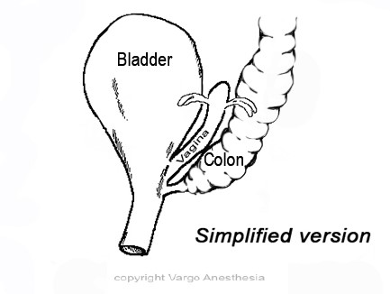
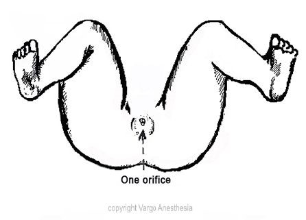

Cloacal Malformation Review   

### Cloacal Malformation Review

**(Persistent Cloaca)**  

The cloacal malformation is a when the urinary tract, vagina and rectum come together to form a single common channel that opens on the perineum. The common channel is called a cloaca. This is naturally seen in birds and reptiles.  
A cloaca may look simple from the outside, but they are very complex with many variations internally. They all need thoroughly identified before a pediatric surgeon and urologist collaborate for the repair.

 

**Gender:** exclusively in girls

**Incidence** : 1:20,000  
**Cause of Defect:** Unknown

Most often diagnosed during the newborn examination when discovering

Only a single perineal opening as oppose to the normal 3.

Sometimes it is diagnosed in utero.

**Surgical Goal**  
Achieve bowel control  
Achieve urinary control  
Hope for normal sexual function.  
  
All 3 goals are usually achieved. However, sometimes none, 1, or 2 of the goals are achieved.

Prognosis also include other issues, including the quality of the sacrum, spine, sphincter muscles, and the length of the common channel.

Most of the time patients are able to normal lives with full bowel and bladder continence.

Unfortunately, even with successful repair, some of these kids will still require bladder catheterization and remain prone to UTIs. These specific patients will need to be followed b will be followed

The management of cloacal malformations requires experienced pediatric general surgeons and pediatric urologists.

Initially, the goals are to identify associated abnormalities, to provide drainage of the urinary tract and to divert the bowel using a colostomy.

Antibiotic prophylaxis (low dose once a day antibiotic) is given to prevent urinary tract infections.

Imaging studies important in the newborn period include: ultrasonography of the kidneys, bladder and other pelvic organs (renal bladder, pelvic ultrasound), plain films of the spine and sacrum, and spine ultrasound.

A commonly associated genitourinary abnormality occurring in 50 percent of cases is hydrometrocolpos which is a fluid collection within the bladder and uterus that may press on the base of the bladder neck leading to obstruction of the bladder. Often there is dilation of the kidney drainage system (hydronephrosis), and vesicoureteral reflux (regurgitation of urine form the bladder to the kidneys) may be present.

Spine and sacral are abnormalities are common and include hemivertebra (incomplete development of one side of a vertebra) and incomplete development of the sacrum.

The purpose of spinal ultrasound or spine MRI is to detect a tethered cord. This problem is present in 40 percent of children with cloacal malformations refers to an abnormal position of the spinal cord within the bony spinal column. When such problems are detected pediatric neurosurgeons and orthopedists are consulted.

While the initial goal is to stabilize the child and relieve blockages in the urinary and intestinal tract, the long-range goals are directed at restoring anatomy and function.

Great variation exists in anatomy and corrective efforts must be individualized.

Further imaging and endoscopy (using a lighted telescope to view internal structures) are necessary before repairs are performed in order to define the type of repair that is appropriate.

Anorectovaginourethoplasty is the name given to simultaneous and comprehensive repair of urethra, vagina and rectum bringing each to a separate opening on the perineum. This operation may be done through a midline incision in the perineum if the confluence is relatively close to the surface or may require both abdominal and perineum approaches for a high confluence. .

Repair in patients with a common channel shorter than 3 cm is reproducible and feasible for most pediatric surgeons.

In patients with a common channel longer than 3 cm, the repair should be performed at a specialized center by a surgeon experienced in managing urologic anomalies who is able to perform complex vaginal reconstructions.

If the common channel is shorter than 3 cm, the posterior sagittal approach can be used to repair the defect without an abdominal approach.

First, the rectum is mobilized. The vagina and urinary tract are then mobilized together (total urogenital mobilization), with the goal that both of these structures reach the perineum.

For patients with a common channel longer than 3 cm, a laparotomy is usually required. Often, the vagina and urinary tract must be separated to gain length, and the urethra must then be reconstructed. The surgeon must be prepared to open the bladder and to put stents in the ureters, if necessary. Complex vaginal mobilizations are often required, and vaginal replacement (with colon or small intestine) is frequently necessary.

Total urogenital mobilization is a technique that allows mobilization of the urethra and vagina as one structure. This is possible in patients with the more benign types of cloacae. If total urogenital mobilization does not adequately lengthen the vagina, the vagina and urethra must be separated, which is a technically challenging maneuver. Vaginourethral fistulae are more likely after this plane is dissected.

The pull-through of the rectum is similar to that performed in other anorectal malformations. As with repair of imperforate anus, the rectum is placed within the limits of the sphincter mechanism, which is determined with an electrical stimulator.

The main surgical challenge involves the repair of the vagina, the urethra, and the associated urologic defects.

A large vagina can be an advantage during the definitive repair because the surgeon can more easily mobilize it and has more alternatives for vaginal repair. If the vagina required decompression in the newborn period, the pull-through may be tethered to the abdominal wall and the vaginostomy must be taken down at the time of the definitive repair.

Approximately 50% of patients have various degrees of vaginal or uterine septation. These can be totally or partially repaired during the main operation. The precise gynecologic anatomy must be ascertained during either the main repair or the colostomy closure (if a laparotomy was not required during the main repair). An obstructed Müllerian structure can lead to problems due to retrograde menstruation.

Future problems, such as amenorrhea in patients with atretic uteri, hydrometrocolpos, and retrograde menses, can be predicted with complete definition of the gynecologic anatomy. Presentations of pelvic pain or amenorrhea in teenagers should prompt the suspicion of anomalous gynecologic structures (see the images below).

http://www.choa.org/Child-Health-Glossary/C/CL/Cloacal-Malformation

http://www.nationwidechildrens.org/cloacal-malformations?\_vsrefdom=colorectal&gclid=CjwKEAjwg7yqBRCu5NmlgMm6i08SJADDEudZLiW9c0uh8kNHNY3KdsFYeY0php6IgSwqkKOeyhp1zBoCyPjw\_wcB