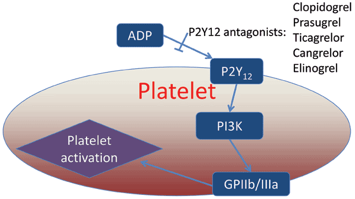

Clopidogrel (Plavix, Duoplavin)    body {font-family: 'Open Sans', sans-serif;}

### Clopidogrel (Plavix, Duoplavin)

Plavix belongs to the 2nd most commonly used class of **“antiplatelet”** medication.  
ADP antagonists and considered a P2Y12 Receptor antagonist.  
**Selective irreversible platelet P2Y12 receptor inhibition  
**_Patients who take clopidogrel will also likely take ASA concurrently._  
  
**Clopidogrel is a thienopyridine drug**  
The thienopyridine drugs, ticlopidine and clopidogrel, inhibit the ADP-dependent pathway of platelet aggregation.  
  
**Indications:  
****For patients with recent:**  
Ischemic stroke  
Transient ischemic attack (TIA)  
Myocardial infarction  
Established coronary artery disease  
Peripheral arterial disease  
  
Unstable angina or acute myocardial infarction  
NSTEMI (non-ST-elevation myocardial infarction)  
  
**P2Y12** protein is found mainly but not exclusively on the surface of platelets, and is an important regulator in blood clotting.  
  
**Clopidogrel is an inactive prodrug**  
Plavix requires hepatic bioactivation via several cytochrome P450 enzymes, including CYP2C19. The active metabolite is what irreversibly inhibits the platelet ADP receptor, P2Y12 that inhibits platelet aggregation.  
  
**Review:** ADP interacts with a family of ADP receptors found on platelets (P2Y1, P2Y12, and P2X1), which l eads to platelet activation. P2Y1 receptors initiate platelet aggregation and shape change as a result of interactions with ADP.  
  
Activated platelets release ADP which binds to platelet receptors (P2Y12), causing activation of intracellular glycoprotein IIb/IIIA complex which triggers platelet adherence and aggregation.  
  
**Mechanism of Action**  
Clopidogrel (Plavix **)** is considered an antiplatelet because its “active metabolite” binds and antagonizes the ADP mediated receptor- P2Y12 on platelets. By antagonizing the ADP mediated receptor P2Y12, this will result in a decreased expression of the glycoprotein IIb/IIIb receptors on the surface of the activated platelets and inhibits platelet adhesion because fibrin cannot bind to surface of platelets for aggregation-making the platelet ‘slippery.’  
  
The reduction in aggregation, or making the platelet ‘slippery,’ is nearly the same effect that occurs with ASA, only through a different mechanism.  

****

  
**Other P2Y12 antagonists (also considered antiplatelet)  
**Prasugrel  
Ticagrelor  
Cangrelor  
Elinogrel  
**Monitor:** ADP antagonist are considered reliable and not routinely monitored, unlike heparin and warfarin. There is no therapeutic drug monitoring widely available for P2Y12 antagonists, in contrast with warfarin (INR) and heparin (aPTT).  
  
**Any test that measures platelet functionality can be used.**  
Verify-Now P2Y12 \[PRU Test\])  
PRP Aggregation  
P2Y12 Assay  
Whole blood aggregation  
TEGs-unreliable  
  
There are also tests to identify patient’s CYP2C19 genotype.  
**  
Clopidogrel and Stents  
Drug Eluting Stents (DES) and Bare Metal Stents  
**Clopidogrel gained popularity after stent implantation.  
During this time, the metal of the stent is exposed, and to prevent platelets from sticking to the metal and inevitably causing a clot occlusion, the clopidogrel/ASA regimen was used.  
  
**Drug Eluting Stents (DES):** Remain on Plavix 1 year and 81 mg of ASA for life.**Bare Metal Stents:** Plavix for 1 month and 81 mg of ASA for life.  
  
**Coming off Plavix before Surgery  
**Ideally, the patient should be off clopidogrel for 7 days prior to surgery, which can lead to complicated decisions on patients who cannot wait that long for their surgery.  
  
**Duration:**  
Plavix is considered a IRREVERSABLE platelet P2Y12 antogonist.  
Meaning the antiplatelet properties will remain for the entire life-span of the platelet.  
Inhibition takes 7-10 days to resolve as new platelets are generated.  
  
**Platelets:** The general lifespan is about 8-10 days (literature varies). An average of 10 11 platelets are produced daily in a healthy adult.  
**Metabolism:** hepatic, 15% undergoes metabolic activation (dependent on CYP2C19),  
remainder of 85% is inactivated by esterases.  
**Excretion:** urine (50%), feces (46%)  
**Elimination T1/2:** 6 hours (30 min for active metabolite)  
  
**Clopidogrel** **PO  
**A 75 mg tablet of clopidogrel can achieve effect within 2 hours; however, to achieve a quicker therapeutic dose, 300 to 600 mg of clopidogrel will be given as a bolus.  
  
**More Notes**  
**Plavix may not work as well in people who:**  
Have certain genetic factors that affect how the body breaks down Plavix (see below).  
When a patient is also on Prilosec or Nexium.  
**  
Genetics**  
The effectiveness of Plavix is dependent on its activation to an active metabolite by the cytochrome P450 (CYP) system, principally CYP2C19.  
Plavix forms less of that metabolite and has a smaller effect on platelet function in patients who are CYP2C19 poor metabolizers.  
Tests are available to identify a patient's CYP2C19 genotype; these tests can be used as an aid in determining therapeutic strategy.  
  
**Prilosec and Nexium:  
**Omeprazole (Prilosec) & esomeprazole (Nexium) significantly reduce the antiplatelet activity of Plavix.  
  
**Antidote:** None  
**Minor bleeding:** desmopressin 0.3 mcg/kg x 1  
1 unit of platelets if > 40% inhibited.  
  
**Clopidogrel (Plavix) and Neuraxial/Regional Blocks**

table.tableizer-table { font-size: 12px; border: 1px solid #CCC; font-family: Arial, Helvetica, sans-serif; } .tableizer-table td { padding: 4px; margin: 3px; border: 1px solid #CCC; } .tableizer-table th { background-color: #104E8B; color: #FFF; font-weight: bold; }

| Minimal Time between  
last dose and  
neuraxial procedure | Can it be given with  
epidural catheter in place? | Restart after  
neuraxial procedure | Restart after  
catheter removal |
| --- | --- | --- | --- |
| 5-7 days | Yes, indwelling catheters  
may be maintained for 1-2 days  
as long as there was  
NO loading dose. | Immediately, if it is >24  
hours post-op and there  
was no loading dose. | Immediately  
  
6 hours, if there was a loading dose. |

**Restart medication after procedure:** ASRA 7 days.  
**Remove catheter after administration:** ASRA - no recommendations.  
_If regional anesthesia is desired before completing suggested waiting time, then normalization of platelet function should be demonstrated._  

Guidelines for Neuraxial Anesthesia and Anticoagulation  
Developed by Anticoagulation Task Force and Anesthesia Development Team. P&T Approved February 2014. Last update July 2015.  
**https://kr.ihc.com/ext/Dcmnt?ncid=520499512&tfrm=default**  
  
ANTICOAGULANTS: THE GUIDE TO REVERSAL  
OHSU Hospital and Clinics Department of Pharmacy Services Pharmacy and Therapeutics Committee October 2011.  
  
**Neurosurg Focus 34 (5):** E6, 2013 ©AANS, 2013  
The role of anticoagulants, antiplatelet agents, and their reversal strategies in the management of intracerebral hemorrhage  
_Division of Neurosurgery, Department of Surgery, East Carolina University Brody School of Medicine, Greenville, North Carolina; and Department of Neurosurgery, Virginia Commonwealth University School of Medicine, Richmond, Virginia_  
  
Regional Guidelines by the American Association of Regional Anesthesia (ASRA)  
ASRA.com  
  
Anticoagulation 3rd Edition  
_Regional Anesthesia and Pain Medicine_ :  
January/February 2010 - Volume 35 - Issue 1 - pp 64-101  
doi: 10.1097/AAP.0b013e3181c15c70  
Asra Practice Advisory  
  
Rxlist.com  
http://www.rxlist.com/plavix-drug/clinical-pharmacology.htm  
  
British Journal of Anaesthesia 111 (S1): i96–i113 (2013) doi:10.1093/bja/aet401  
http://bja.oxfordjournals.org/content/111/suppl\_1/i96.full.pdf+html  
  
Regional anaesthesia in the patient receiving antithrombotic and antiplatelet therapy  
http://bja.oxfordjournals.org/content/107/suppl\_1/i96.full#ref-4  
T.T. Horlocker  
Department of Anesthesiology, Mayo Clinic, Rochester, MN 55905, USA  
  
Horlocker TT, Wedel DJ, Benzon H, et al. Regional anesthesia in the anticoagulated patient: defining the risks (the second ASRA Consensus Conference on Neuraxial Anesthesia and Anticoagulation). Reg Anesth Pain Med 2003;28:172-97