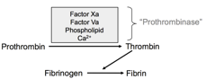

Clotting Factor Notes    body {font-family: 'Open Sans', sans-serif;}

### Clotting Factor Notes  
13 clotting factors - but really only 12 (see Factor VI)

**Factor I (Fibrinogen)  
**It is converted to fibrin (factor Ia) by thrombin (factor IIa).  
Fibrin forms a mesh around the wound ultimately leading to blood clot (fibrin clot).  
Fibrinogen can form bridges between platelets, by binding to their GpIIb/IIIa surface membrane proteins; however, its major function is as the precursor to fibrin.  
  
**Pathway:** Both intrinsic and extrinsic (common pathway).  
**Active form:** Fibrin subunit  
**Source:** Liver  
**Function:** Clot formation **–** fibrin  
  
**To activate - needs the combination of:**  
Calcium (factor IV)  
Proconvertin (factor VII)  
Anti-hemophiliac factor (AHF)  
Christmas factor (factor VIIII)  
**  
Associated genetic disorders with Factor I (Fibrinogen)**  
Afibrinogenemia (complete lack of fibrinogen)  
Hypofibrinogenemia (reduced levels of fibrinogen)  
Hyperfibrinogenemia (dysfunctional fibrinogen)  
Familial renal amyloiddosis  
These individuals suffer from thromboembolism.  
_The gene for factor I is located on the fourth chromosome._  
  
**Factor II (Prothrombin)  
Other names:** Stable factor and Serum Prothrombin Conversion Accelerator (SPCA)  
  
**Prothrombin is converted into thrombin** by a factor Xa (prothrombinase).  
When converted to thrombin, it is activated and now called **Factor IIa.**  
**Thrombin** then acts to transform fibrinogen into fibrin, which, in combination with platelets from the blood, forms a fibrin **clot.**  
  
**Pathway:** Extrinsic  
**Source:** Liver  
One of the Vitamin K dependent clotting factors affected by warfarin.  
**Half-life:** 42-60 hours.  
**Associated genetic disorders:** Prothrombin G20210A and thrombophilia.  
  
**Factor IIa** is thrombin (activated).  
Factor IIa ) activates I, V, X, VII, VIII, XI, XIII, protein C and platelets.  
Thrombin along with thrombomodulin present on endothelial cell surfaces forms a complex that converts protein C to activated protein C (APC).  
Individuals with prothrombin deficiency have hemorrhagic diatheses.  
Patients may also suffer from dysprothrombinemia or hypoprothrombinemia.  
Female patients may suffer from menorrhagia  
_The gene for thrombin is located on the eleventh chromosome (11p11-q12)._  
  
**Factor III** (tissue factor, TF)  
**Other names:** platelet tissue factor, tissue thromboplastin, CD142).  
  
Co-factor of factor VIIa.  
It is found on the outside of blood vessels and is not exposed to the bloodstream.  
It initiates the extrinsic pathway at the site of injury.  
It functions as a high-affinity receptor for factor VII.  
It acts as a cofactor in the factor VIIa-catalyzed activation of factor X to FXa.  
Factor III is released by damaged tissues, reacting with prothrombin (Factor II), which, together with calcium (Factor IV), forms thrombin, which converts fibrinogen into fibrin (Factor I).  
It is the cell surface receptor for the serine protease factor VIIa.  
  
**Pathway: Extrinsic**  
**Role:** Generates a thrombin burst (large release)  
Together with FVIIa (activated factor VII), TF forms the extrinsic pathway of coagulation.  
The complex of TF with factor VIIa catalyzes the conversion of the inactive factor X into FXa (activated factor X).  
_The gene for tissue factor is located on the first chromosome._  
  
**Damaged Blood Vessel - TF (Factor III) and Extrinsic Pathway  
**Damage to a blood vessel, FVII leaves the circulation and comes into contact with tissue factor (TF) expressed on tissue-factor-bearing cells (stromal fibroblasts and leukocytes), forming an activated complex (TF-FVIIa).  
TF-FVIIa then activates FIX and FX (factor IX and X)  
FVII is itself activated by thrombin, FXIa, FXII and FXa.  
The activation of FX (to form FXa) by TF **–** FVIIa is almost immediately inhibited by tissue factor pathway inhibitor (TFPI).  
FXa and its co-factor FVa form the prothrombinase complex, which activates (converts) prothrombin to thrombin.  
Thrombin then activates other components of the coagulation cascade, including FV and FVIII (which forms a complex with FIX), and activates and releases FVIII by being bound to vWF.  
FVIIIa is the co-factor of FIXa, and together they form the "tenase" complex, which activates FX; and the cycle continues. ("Tenase" is a contraction of "ten" and the suffix "-ase" used for enzymes.)  
  
**Factor IV (Calcium)**  
Required for coagulation factors to bind to phospholipids (formally known as factor IV)  
It is both intrinsic and extrinsic (common pathway).  
  
**Source:** Bone, GI tract from food consumption.  
Clotting factors II, VII, IX, and X require calcium ion to work enzymatically.  
  
**Factor V (proaccelerin, labile factor)  
**It is enzymatically inactive and acts as a cofactor FXa.  
When factor V is activated (FVa) it is a co-factor of factor Xa with which it forms prothrombinase complex, which enhances the activation of prothrombin to thrombin.  

****

**Note:** Factor Xa requires the presence of calcium ions and an appropriate phospholipid (PL) membrane surface to enhance the activation of prothrombin to thrombin.  
  
**Pathway:** It is both intrinsic and extrinsic (common pathway).  
Deficiency leads to predisposition for hemorrhage.  
Some mutations (most notably factor V Leiden) predispose for thrombosis may lead to myocardial infarction and deep vein thrombosis.  
**Source:** Liver  
Deficiency will prolong PT, PTT and INR  
**Associated genetic disorders  
**Activated protein C reisistance  
_The gene for factor V is located on the first chromosome (1q21-q25)._  
**  
Factor VI (accelerin)  
**Discovered to be activated Factor V  
No longer considered to have a clotting function  
Originally called accelerin.  
  
**Factor VII** (proconvertin or serum prothrombin conversion accelerator (SPCA) / stable factor)  
Activates factors IX and X: It initiates coagulation by activating factors IX and X simultaneously with tissue factor in the extrinsic pathway.  
**Source:** Liver  
Vitamin K dependent.  
**Pathway:** Extrinsic  
**Half-life:** 4-6 hours.  
_Has the shortest half-life and is depleted first - within 2 days with a vitamin K deficiency or liver disease._  
However, Factor VII is in the extrinsic pathway and inhibition does NOT provide effective anticoagulation despite causing early INR elevation (Managing Anticoagulated Patients in the Hospital. P134)  
Other vitamin K dependent factors take 3-10 days to be depleted. (Hematology and Practice, p.268)  
  
**Activated by:** Factor III (tissue factor).  
Acting with factor III to activate factor X which works with other factors to convert prothrombin into thrombin.  
Deficiency, either hereditary or acquired (vitamin k deficiency).  
Deficiency may lead to epistaxis, menorrhagia, hematomas, hemarthrosis, digestive tract or cerebral hemorrhages.  
Deficiency prolongs PT but NOT PTT.  
_The gene for factor VII is located on the thirteenth chromosome (13q34-qter)._  
  
**Factor VIII** (antihemophilic factor-AHF)  
(anti-hemoplytic factor or globulin (AHG) or antihemophilic factor A).  
Activates Factor X.  
When activated (factor VIIIa), is a cofactor with factor IXa to activate factor X to FXa.  
Factor VIIIa and cofactor IXa require presence of Ca and phospholipids to activate factor X  
Factor VIII circulates in the bloodstream in an inactive form, bound to von Willebrand factor, until an injury that damages blood vessels occurs. In response to injury, factor VIII is activated and separates from von Willebrand factor.  
**Source:** Liver  
**Pathway:** Intrinsic  
**Activated by:** Thrombin  
**Actions:** Acts as a cofactor with Factor IX and calcium to activate Factor X.  
**Deficiency:** Hemophilia A (classic hemophilia)  
Mutations in the factor VIII gene results in hemophilia.  
Hemophilia A is an X-linked recessive coagulation disorder.  
It is the most common type of hemophilia.  
Patients suffer from clinical manifestations in their early childhood; spontaneous and traumatic bleeds continue throughout their life – hemarthrosis, circumcisional bleeds, hematomas and intracranial bleeds.  
  
_The gene for factor VIII is located on the long arm of X chromosome (Xq28)._  
  
**Factor IX (Christmas factor)  
Also called:** Platelet thromboplastin component (PTC); antihemophilic factor B.  
It activates factor X with the help of factor VIIIa in the intrinsic pathway in the presence of Ca.  
**Pathway:** Intrinsic  
Vitamin K dependent.  
**Source:** Liver  
**Half-life:** 21-30 hours.  
Hemarthrosis, circumcisional bleeds, hematomas and intracranial bleeds with deficiency  
Although the clinical symptoms of hemophilia A and B are similar, hemophilia B is less severe than hemophilia A.  
High antigen or activity levels of factor IX are associated with an increased risk of thromboembolism.  
_The gene for factor IX is located on the X chromosome (Xq27.1-q27.2)._  
  
**Factor X** (Stuart-Prower-factor; prothrombinase)  
Activates factor II (prothrombin) to factor IIa and with the help of factor V (cofactor), it forms prothrombinase complex.  
Prothrombinase catalyzes the conversion of prothrombin (Factor II), which is inactive, to active thrombin (Factor IIa).  
Vitamin K dependent.  
**Pathway:** Both intrinsic and extrinsic (common pathway).  
**Half-life:** 40–45 hours.  
**Activated by:** Factors VIIa, VIIIa and IXa.  
**Factor Xa is inactivated by:** protein Z-dependent protease inhibitor (ZPI).  
The affinity for factor Xa is increased 1,000-fold by the presence of protein Z, while it does not require protein Z for inactivation of factor XI.  
Defects in protein Z lead to increased factor Xa activity and a propensity for thrombosis.  
**Pathway:** It is both intrinsic and extrinsic. It is the first member of the _final common pathway_ or _thrombin pathway._  
  
Its deficiency may cause bleeding diatheses and hemorrhages. Patients commonly suffer from epitaxis, gastrointestinal bleeds and hemarthrosis.  
_The gene for factor XI is located on the distal end on the long arm of fourth chromosome (4q35)._  
  
**Factor XI** (plasmathromboplastin antecedent-PTA, antihemophilic factor C)  
Activates factor IX.  
Deficiency results in hemophilia C.  
**Source:** Liver  
**Pathway:** Intrinsic  
**Half-life:** 52 hours  
**Activated into XIa by:** XIIa (Hageman factor), thrombin (IIa) XIIIa (fibrin-stabilizing factor) and FXIa itself; due to its activation by FXIIa.  
**Inhibitor of Factor XI:** protein Z  
Factor XI is a member of the "contact pathway" (which includes HMWK, prekallikrein, factor XII, factor XI, and factor IX).  
  
**Deficiency of factor XI:** hemophilia C (rare).  
Mainly occurs in Ashkenazi Jews and is believed to affect approximately 8% of that population.  
Less commonly, hemophilia C can be found in Jews of Iraqi ancestry and in Israeli Arabs.  
The condition has been described in other populations at around 1% of cases.  
It is an autosomal recessive disorder.  
There is little spontaneous bleeding, but surgical procedures may cause excessive blood loss, and prophylaxis is required.  
  
**Factor XII  
**Deficiency prolongs PTT and PTT.  
Infrequent bleeding with deficiency. Old literature states thrombotic episodes **–** DVTs, but link has never been proven.  
Factor XII deficiency was first described in the medical literature in 1955 by doctors Oscar Ratnoff and Jane Colopy in a patient named John Hageman. The disorder is sometimes known as Hageman factor deficiency or Hageman trait.  
Factor XII deficiency is inherited as an autosomal recessive disorder.  
Factor XII deficiency affects persons of Asian descent more often than individuals of other ethnicities  
**Incident of disorder:** 1 in 1 million.  
**Pathway:** Intrinsic  
  
**Factor XIII**  
Deficiency  
**Pathway:** It is both intrinsic and extrinsic (common pathway).  
  
  

Proteins involved in Blood Coagulation  
ClotBase-Knowledge on Blood Coagulation  
http://www.clotbase.bicnirrh.res.in/flow\_ln.php  
  
Pallister CJ, Watson MS (2010). _Haematology_ . Scion Publishing. pp. 336–347.  
  
Medical Physiology-Principals of Clinical Medicine, 2013  
By Rodney A. Rhoades, David R. Bell  
  
Managing Anticoagulated Patients in the Hospital; The Inpatient Anticoagulation Service, 2007  
By Michael Guldeth  
  
Hematology and Practice 2 nd Ed  
By Betty Ciesla, 2012  
  
Clotting Factors List – Names, Numbers and Actions (Functions)  
http://www.healthhype.com/clotting-factors-list-names-numbers-and-actions-functions.html  
  
coagulation factors  
http://medical-dictionary.thefreedictionary.com/coagulation+factors  
  
https://en.wikipedia.org/wiki/Coagulation#Coagulation\_factors\_2  
  
**http://www.healthhype.com/clotting-factors-list-names-numbers-and-actions-functions.html**  
  
Stormorken H (February 2003).  
"The discovery of factor V: a tricky clotting factor".  
_Journal of Thrombosis and Haemostasis_ . **1** (2): 206–13.  
  
Factor XII Deficiency  
NORD (National Organization for Rare Disorders  
https://rarediseases.org/rare-diseases/factor-xii-deficiency/  
  
Toole JJ, Knopf JL, Wozney JM, Sultzman LA, Buecker JL, Pittman DD, Kaufman RJ, Brown E, Shoemaker C, Orr EC (1984).  
"Molecular cloning of a cDNA encoding human antihaemophilic factor".  
_Nature_ . **312** (5992): 342–7.  
  
Antonarakis SE (July 1995).  
"Molecular genetics of coagulation factor VIII gene and hemophilia A".  
_Thrombosis and Haemostasis_ . **74** (1): 322–8.  
  
Kaushansky K, Lichtman M, Beutler E, Kipps T, Prchal J, Seligsohn U. (2010; edition 8)  
_Williams Hematology_ . McGraw-Hill.  
  
Leytus SP, Foster DC, Kurachi K, Davie EW (September 1986).  
"Gene for human factor X: a blood coagulation factor whose gene organization is essentially identical with that of factor IX and protein C".  
_Biochemistry_ . **25** (18): 5098–102  
  
Cooper DN, Millar DS, Wacey A, Pemberton S, Tuddenham EG (July 1997).  
"Inherited factor X deficiency: molecular genetics and pathophysiology".  
_Thrombosis and Haemostasis_ . **78** (1): 161–72.  
  
Walsh PN (Jul 2001).   
"Roles of platelets and factor XI in the initiation of blood coagulation by thrombin".  
_Thrombosis and Haemostasis_ . **86** (1): 75–82.  
  
Wu W, Sinha D, Shikov S, Yip CK, Walz T, Billings PC, Lear JD, Walsh PN (Jul 2008).   
"Factor XI homodimer structure is essential for normal proteolytic activation by factor XIIa, thrombin, and factor XIa".  
_The Journal of Biological Chemistry_ . **283** (27): 18655–64.  
  
Bolton-Maggs PH (Jun 1996).  
"Factor XI deficiency".  
_Baillière's Clinical Haematology_ . **9** (2): 355–68.