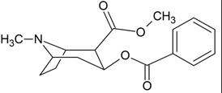

Cocaine    body {font-family: 'Open Sans', sans-serif;}

### Cocaine

**Cocaine** (benzoylmethylecgonine) **(Colloquially referred to as coke)**  
**Ester-** type local anesthetic  
**Fast onset:** 1-2 minutes  
**pKa:** 8.6  
  
Only natural occurring local anesthetic.  
  
Only local anesthetic that causes intense vasoconstriction. This is why it is  
restricted to topical anesthesia for ear, nose and throat procedures.  
Intense vasoconstriction reduces bleeding in the surgical field.  
  
Concentrations > 4% increase potential for systemic toxic reactions.  
  
Cocaine is a powerfully addictive stimulant drug made from the leaves of the coca plant. Cocaine has a short half-life of about 0.8 to 0.2 hours. However, the half-life of benzoylecgonine, the main cocaine metabolite is 6 hours.  
  
Local anesthetic indicated for the introduction of local (topical) anesthesia of accessible mucous membranes of the oral, laryngeal and nasal cavities.  
  
A central nervous system (CNS) depressant due to decreased uptake of norepinephrine, serotonin and dopamine.  
4% cocaine is used for sinus surgery.  

**Concentrations:** table.tableizer-table { font-size: 12px; border: 1px solid #CCC; font-family: Arial, Helvetica, sans-serif; } .tableizer-table td { padding: 4px; margin: 3px; border: 1px solid #CCC; } .tableizer-table th { background-color: #104E8B; color: #FFF; font-weight: bold; }

| Route | Concentration (%) | Max doses |
| --- | --- | --- |
| Topical | 2-12 | 1.5 mg/kg or 200 mg (literature varies) |

Pocket Anesthesia ; 3 rd ed. 2017. Pp 2D-22. R. Urman, J. Ehrenfeld

**Dose:**  
Nasal-1-2 ml to each nostril (1-10%)  
  
Apply 1-4% solution TOPICALLY with cotton applicators or as a spray to mucous membranes.  
1.5 mg/kg should be sufficient.  
  
More pronounced effects with 10% solution with increased risk of toxic reactions.  
Despite some literature, concentrations > 4% are not recommended.  
  
**Mechanism of action:** Like other local anesthetics, it binds to the intracellular portion of sodium channels and blocks sodium influx into nerve cells, which prevents depolarization.  

****

  
Small doses of topical cocaine slow the heart rate, but after moderate doses, the rate is increased due to central sympathetic stimulation.  
**  
Physiological Effects:**  
Dilated Pupils  
Dry Mouth  
Hippus (spasmodic or rhythmic contraction of the pupil of the eye)  
Increased body temperature  
Tachycardia  
  
**Adverse Effects:  
**Hypertension  
Tachycardia  
Arrhythmias  
Coronary Ischemia  
Stroke  
Cerebral and Pulmonary Edema  
Seizures  
Sloughing of Nasal Mucosa  
  
**Adverse reactions:** Due to high plasma levels as a result of excessive and rapid absorption of the drug. Reactions are systemic in  nature and involve the central nervous system and/or the cardiovascular system.  
A small number of reactions may result from hypersensitivity, idiosyncrasy or diminished tolerance on the part of the patient.  
  
**Treatment for acute cocaine poisoning (from topical)**  
Valium or Versed IV or a short acting barbiturate  
Topical cocaine is eliminated fairly rapidly.  
  
**Contraindications:**  
Intraocular or IV  
Patients taking MAO inhibitors - possible fatal drug interactions  
  
**MAO Inhibitors:  
**IsocarboxazidLinezolidMoclobemide  
Methylene Blue  
Phenelzine  
Procarbazine  
Rasagiline  
Selegiline  
Tranylcypromine  
  
Most MAO inhibitors should also not be taken for two weeks before treatment with this medication.  
  
**Drugs that may increase seizure activity when combined with cocaine:**  
Isoniazid (INH)  
Phenothiazines (e.g., thioridazine)  
Theophylline  
Tricyclic Antidepressants - amitriptyline  
  
**Metabolism and metabolites**  
Cocaine is the ONLY ester-type local anesthetic that is NOT rapidly hydrolyzed in the plasma by the enzyme pseudocholinesterase.  
Cocaine is rapidly absorbed, metabolized by the liver and blood enzymes with approximately one percent of the dose excreted in the urine unchanged.  
  
**Metabolites**  
The metabolite **benzoylecgonine** is present in the highest concentration and represented approximately 39%, 30% and 16%, of the administered dose by the intravenous, intranasal, and smoked routes, respectively.  
  
Combined amounts of **ecgonine methyl ester** and **six minor metabolites below:**  
norcocaine  
benzoylnorecgonine  
m-hydroxycocaine  
p-hydroxycocaine  
m-hydroxybenzoylecgonine  
p-hydroxybenzoylecgonine  
  
Because many of these metabolites exhibit pharmacologic activity, their presence in urine may indicate that they play complex biologic roles in the overall activity of cocaine.  
  
**Lab detection  
Urine:**  
Very low concentrations may be detected during the initial few hours, however, benzoylecgonine persists in urine at detectable concentrations from 2-4 days. Chronic, heavy use of cocaine can result in detectable amounts for up to 10 days following a binge use.  
  
**Saliva**  
Elimination of cocaine has a half-life of 2 hours, while some cases have reported cocaine concentrations in the saliva even after 19 hours.  
  
**Sweat**  
Peak level of cocaine concentrations in sweat is at 4.5 to 24 hours.  
Your sweat can be tested with a skin patch, but this is not a common test. Results can vary based on where the patch is placed.  
  
**Blood**  
Blood holds cocaine for 12 hours and benzoylecgonine for 48 hours.  
  
**Hair  
**Hair testing can detect cocaine for months after use. It is a complicated process, however, and may not always be accurate. Results can vary based on where the hair sample is taken.  
  
**Patient habitus**  
Thinner patients are less likely to accumulate cocaine metabolites.  
Cocaine metabolites tend to accumulate in the fatty tissues of the body.  
This stored drug is resistant to excretion.  
It is slowly released into the blood stream to continuously to produce a certain level of drug in the blood.  
  
**More Notes  
Other routes for cocaine:  
**Oral  
Intranasal  
Intravenous  
Inhalation  
“snorting” – occurs when the cocaine powder is inhaled through the nose. There, cocaine is absorbed through the nasal mucosa into the bloodstream.  
  
1860 - Albert Niemann isolated crystals from the coco shrub and called it cocaine.  
He noticed it reversibly numbed his tongue.  
  
Cocaine is a naturally occurring compound indigenous to the Andes mountains, West Indies, and Java.  
  
It was the first anesthetic to be discovered and is the only naturally occurring local anesthetic; all others are synthetically derived.  
  
First introduced into Europe in the 1800s following its isolation from coca beans.  
  
Sigmund Freud used cocaine on his patients and became addicted through self-experimentation.  
  
Procaine, the first synthetic derivative of cocaine, was developed in 1904.  
  
Lofgren later developed lidocaine, the most widely used cocaine derivative, during World War II in 1943.  
  
**Hepatic**  
Cocaine is metabolized to benzoylecgonine and ecgonine methyl ester, which are both excreted in the urine. In the presence of alcohol, a further active metabolite, cocaethylene is formed, and is more toxic then cocaine itself.  
  
Entry of cocaine into the brain may be especially rapid following application to the nasal mucosa, particularly if the medication is applied as a fine-mist spray.  
  
Cocaine has two major pharmacological actions; one is a local anesthetic, and the other is an indirect acting sympathomimetic having many of the properties of an amphetamine.  
  
The drug is either in the salt/powder form (cocaine HCL) which can be administered by snorting or intravenous injection or in the free base "crack" form which is smoked.  

_Nurse Anesthesia ;_ 5 th ed; 2014. Pp 620, J. Nagelhout, Sass Elisha, Karen Plaus  
  
Anesthesiology Core Review, Part One: Basic Exam; B, Freeman and J, Berger, CH.57, pp165, 2014  
  
Pocket Anesthesia ; 3 rd ed. 2017. Pp 2D-22. R. Urman, J. Ehrenfeld  
  
Ther Drug Monit. 1998 Oct;20(5):556-60.  
**Cocaine metabolism and urinary excretion after different routes of administration.**  
Cone EJ 1 , Tsadik A , Oyler J , Darwin WD .  
  
**Cocaine Screen  
University of Rochester Medical Center  
https://www.urmc.rochester.edu/encyclopedia/content.aspx?contenttypeid=167&contentid=cocaine\_screen  
  
Rxlist.com  
http://www.rxlist.com/cocaine-drug.htm  
  
**