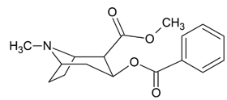

Cocaine Pharmacology    body {font-family: 'Open Sans', sans-serif;}

### Cocaine Pharmacology

**Street name:** Crack, blow  
Cocaine (Benzoylmethylecgonine) is isolated from the leaves of the coca plant (Erythroxylon coca).

****

**Cocaine has two major pharmacological actions:**  
A local anesthetic (Na channel blocker)  
An indirect-acting sympathomimetic that has many of the properties of amphetamine.  
**  
Medical/surgical use:**  
Used as a topical anesthetic for the mucus membranes of the oral, laryngeal, and nasal cavities.  
Limits bleeding by vasoconstriction.  
  
**Recreational use:** Increases alertness, feelings of well-being, euphoria, energy, sociability and sexuality.  
  
**Local anesthetic type:** Ester  
**pKA:** 8.6**  
  
Mechanism of action:  
Local anesthesia:**\- Like other local anesthetics, it binds to the intracellular portion of sodium channels and slows or blocks sodium influx into nerve cells, preventing depolarization.  
\- It also blocks monoamine (dopamine, norepinephrine, and serotonin) reuptake transporters at the presynaptic space with equal affinity.  
\- This results in the accumulation and excess of transmitters at the postsynaptic cleft resulting in enhanced and prolonged sympathetic effects.  
**\- Note** that Cocaine results only in the accumulation of but NOT an increased release of catecholamines.  
  
**The accumulation of transmitters:**  
Dopamine  
Serotonin  
Norepinephrine  
  
**Excess serotonin results in:  
**Euphoria  
Alertness  
Out of body experience  
Confidence  
  
**Excess dopamine:** Addictive qualities  
**Excess norepinephrine:** Results on the feelings of energy, cardiac effects.  
**Cocaine increases glutamate and aspartate in the brain.**  
Glutamate and aspartate are excitatory neurons in the brain, particularly in the nucleus accumbens.  
Glutamate is the main excitatory neurotransmitter of the central nervous system.  
Aspartate has similar actions but is not well understood.  
  
**Dose-related effects:  
1-3 mg/kg:** Safe local anesthetic dose  
**20-30 mg:** Usual recreational dose when a line of cocaine is snorted  
**\> 1 g:** Potentially lethal  
**Concentrations > 4%:** Increase potential for systemic toxic reactions.  
4% cocaine is used for sinus surgery.  
  

**Concentrations: Cocaine** table.tableizer-table { font-size: 12px; border: 1px solid #CCC; font-family: Arial, Helvetica, sans-serif; } .tableizer-table td { padding: 4px; margin: 3px; border: 1px solid #CCC; } .tableizer-table th { background-color: #104E8B; color: #FFF; font-weight: bold; }

| Route | Concentration (%) | Max dose |
| --- | --- | --- |
| Topical | 2-12 | 1.5 mg/kg or 200 mg (literature varies) |

Pocket Anesthesia ; 3rd ed. 2017. Pp 2D-22. R. Urman, J. Ehrenfeld  
  
**Dose:**  
\- Nasal: 1-2 ml to each nostril (1-10%)  
\- Apply 1-4% solution TOPICALLY with cotton applicators or as a spray to mucous membranes. 1.5 mg/kg should be sufficient.  
 10% solution produces more pronounced effects and increases the risk of toxic reactions.  
\- Despite some literature, concentrations > 4% are not recommended.  
**Possible routes of administration:**  
Oral  
Nasal (snorting)  
Gastrointestinal  
Rectal  
Vaginal mucosa  
Intravenous  
Pulmonary alveoli following inhalation  
**Onset** (into cerebral circulation):

**Kinetics of cocaine:** table.tableizer-table { font-size: 12px; border: 1px solid #CCC; font-family: Arial, Helvetica, sans-serif; } .tableizer-table td { padding: 4px; margin: 3px; border: 1px solid #CCC; } .tableizer-table th { background-color: #104E8B; color: #FFF; font-weight: bold; }

| Route | Onset | Peak action | Duration |
| --- | --- | --- | --- |
| Intravenous | < 1 minute (seconds) | 3-5 mins | 30-60 mins |
| Nasal | 1-5 minutes | 20-30 mins | 60-120 mins |
| Smoking | < 1 minute (seconds) | 3-5 mins | 30-60 mins |
| GI | 30-60 minutes | 60-90 mins | Unknown |

**High and rush:  
Snorting:** Euphoria; only produces a high**Smoking and injecting cocaine:** Produces a rush and then a high  
  
**Bioavailability:**  
**Smoked:** 70%  
**Intranasal (snorting):** 20 - 60%  
Less bioavailability with intranasal application due to local vasoconstriction slowing absorption.  
  
**Volume of distribution:** Highly lipid-soluble with VD = 2.7 L/kg  
**Protein bound:** 90%  
**Metabolism:** Rapid, by liver and plasma cholinesterase to water-soluble metabolites.  
**Half-life:** 30 - 90 minutes  
  
**Elimination:**  
\- Less than 5% of the drug appears unchanged in the urine.  
\- Metabolites may persist in the blood and urine for up to 36 hours.  
\- Benzoylecgonine is the primary metabolite used in drug testing since its concentration in urine is 50 to 100 times greater than that of cocaine.  
  
**Cocaine metabolism:** Rapid, followed by urinary excretion of metabolites, proved to be the primary route of elimination in all cases.\- Metabolites pose no cocaine-like stimulating effects and have a long half-life, persisting in the urine long enough to produce a prolonged positive urine test.  
\- Unlike the case with consuming alcohol, urine tests for cocaine are poor markers of acute intoxication.  
**Two main metabolites:  
\- Ecgonine methyl ester and benzoylecgonine:** They account for greater than 80% of the inactive metabolites.  
**\- Norcocaine:** Active; accounts for 10% of the toxic metabolites.  
  
**Other cocaine metabolites:**  
m-hydroxycocaine  
p-hydroxycocaine  
m-hydroxybenzoylecgonine  
p-hydroxybenzoylecgonine  
  
**After the last use cocaine or its metabolites persist:**  
**Peak plasma levels:** About 60 minutes after nasal or oral intake.  
**Blood or saliva:** Up to 2 days  
Only a small percentage (1–5%) of cocaine ingested is cleared unmetabolized in urine, where it may be detected for three to six hours after use.  
  
**Saliva:**  
Elimination of cocaine has a half-life of 2 hours, while some cases have reported cocaine concentrations in the saliva even after 19 hours.  
  
**Sweat:**  
\- Peak level of cocaine concentrations in perspiration is 4.5 to 24 hours.  
\- Sweat can be tested with a skin patch, but this is not a standard test.  
\- Results can vary based on where the patch is placed.  
  
**Hair:**\- Hair testing can detect cocaine for months after use.  
\- Results can vary depending on the site from which hair is sampled.  
  
**\- Urine drug test for cocaine:** Urine tests for cocaine are poor markers of acute intoxication but may reflect surreptitious cocaine abuse in the past.\- Deficient concentrations may be detected during the initial few hours after absorption.**Urine (drug screen):** Up to 7 days (usually three days)  
**Chronic abuser urine test:** 16 days  
**Hair test:** For months  
  
**Cocaine and alcohol:** Cocaethylene metabolite  
When cocaine is taken with alcohol, it produces a highly toxic metabolite - cocaethylene or ethyl cocaine.  
It can account for up to 17 percent of the metabolites and is more toxic than cocaine.  
Cocaethylene can increase the duration of action up to 13 hours depending on the route of administration.  
It also has similar vasoconstrictive, cardiotoxic, dysrhythmogenic and neurotoxic effects.  
Cocaethylene is as potent as cocaine at inhibiting dopamine reuptake.  
  

2014 AHA/ACC Guideline for the Management of Patients with Non-ST-Elevation Acute Coronary Syndromes: a report of the American College of Cardiology/American Heart Association Task Force on Practice Guidelines.  
_Journal of the American College of Cardiology_ _._ 2014 Dec 23. 64 (24):e139-228.  
\[Guideline\] Amsterdam EA, Wenger NK, Brindis RG, Casey DE Jr, Ganiats TG, et al.  
Guidelines for Chest Pain and Myocardial Infarction: One Size Does Not Fit All  
View the summary for Management of Cocaine-Associated Chest Pain and Myocardial Infarction  
American Heart Association (accessed 03/2022)  
Robert S. Hoffman, MD  
https://tinyurl.com/2apwxdj2  
  
Methoide  
Methamphetamine and other illicit drug education  
University of Arizona (accessed 03/2022)  
https://methoide.fcm.arizona.edu/infocenter/index.cfm?stid=170  
  
Cocaine: Acute Intoxication  
UpToDate (accessed 03/2022)  
Lewis S Nelson, MD **and** Oladapo Odujebe, MD  
How Long Does Cocaine Stay in Your System?  
American Addiction Centers (accessed 03/2022)  
Dan Wagener, M.A.  
https://americanaddictioncenters.org/cocaine-treatment/how-long-in-system  
  
Cocaine Abuse  
Annals of Internal Medicine 1993 Aug 1;119(3):226-35.  
Warner EA.  
Cocaine disposition in humans after intravenous injection, nasal insufflation (snorting), or smoking.  
Drug Metabolism and Disposition 1989; 17:153.  
Jeffcoat AR, Perez-Reyes M, Hill JM, et al.  
  
The pharmacology of cocaethylene in humans following cocaine and ethanol administration.  
Drug and Alcohol Dependence 2003; 72:169.  
Harris DS, Everhart ET, Mendelson J, Jones RT.  
  
Goldfrank's Toxicologic Emergencies, 11th edition, p.1124.  
Nelson LS, Howland MA, Lewin NA, Smith SW, Goldfrank LS, Hoffman RS (Eds), McGraw Hill, New York, NY 2019.  
Smollin CG, Hoffman RS. Cocaine.  
  
Cocaine increases extraneuronal levels of aspartate and glutamate in the nucleus accumbens.  
Brain Research 1995; 683:264.  
Smith JA, Mo Q, Guo H, et al.  
  
Pharmacokinetics of Cocaine: Considerations When Assessing Cocaine Use by Urinalysis  
ArchivesDrugAbuse.gov (accessed 03/3033)|  
Reese T. Joneshttps://archives.drugabuse.gov/sites/default/files/221-234\_Jones.pdf  
  
Cocaine  
DrugBank (accessed 03/2022)  
https://go.drugbank.com/drugs/DB00907