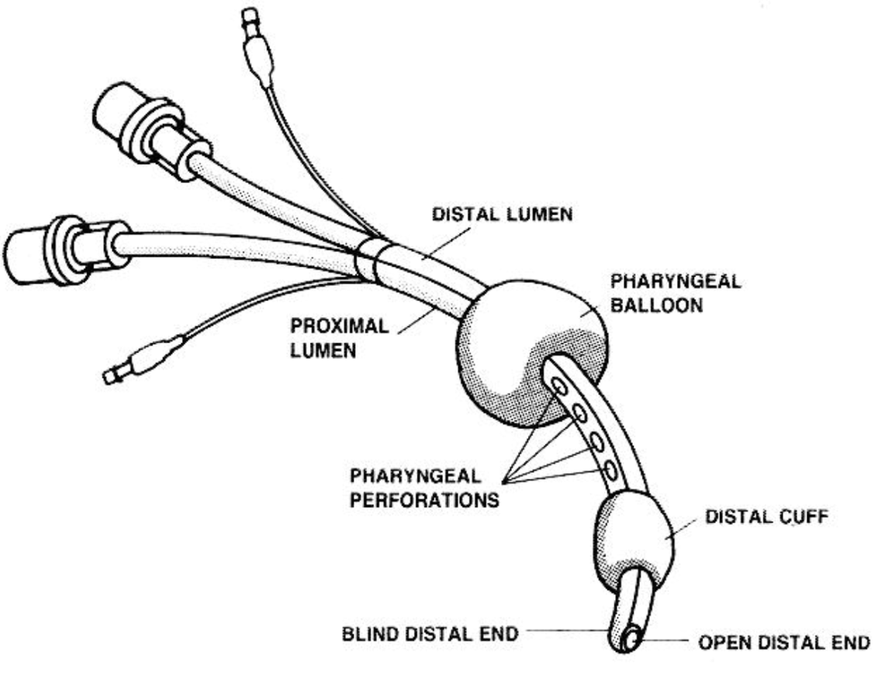
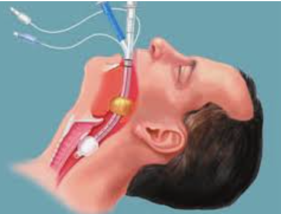

Combitube    body {font-family: 'Open Sans', sans-serif;}

### Combitube

Considered a blind insertion airway device (BIAD).  
Introduced in 1987  
  
\- It can be used in patients whose cervical spine has been immobilized with a rigid cervical collar, though placement may be more difficult.  
\- Utilized in the pre-hospital and emergency setting.

****

****

\- Also known as the **esophageal tracheal airway** or **esophageal tracheal double-lumen airway that has two cuffs.  
**\- It is supplied with two syringes, which are already primed right out of the box to the correct inflation volume for each cuff of 12 ml and 85 ml, respectively.\- The Combitube allows for ventilation to proceed regardless of esophageal or tracheal placement.

****

**Description and use:**  
\- It consists of a cuffed, double-lumen tube that is inserted through the patient's mouth to secure an airway and enable ventilation.  
\- When inserted, the distal tube (tube two, clear) should enter the esophagus, where the cuff is inflated, and ventilation is provided through the proximal tube (tube one, blue), which opens at the level of the larynx.  
\- In the rare instance where the distal tube intubates the trachea, ventilation can be provided through the distal tube.  
\- Inflation of the cuff in the esophagus allows a level of protection against aspiration of gastric content similar to that found in the laryngeal mask.  
  
**Possible indications:**  
\- For rapid intubation of difficult airway  
\- Appropriate for prehospital, surgical, and emergency use  
\- Designed to establish a nonsurgical patent airway when placed into either the trachea or the esophagus  
\- It can be used in patients whose cervical spine has been immobilized with a rigid cervical collar, though placement may be more difficult.  
\- Unique double-lumen design allows for rapid airway establishment through either esophageal or tracheal placement  
\- Blind placement eliminates the need for a laryngoscope  
\- Pharyngeal balloon holds the device firmly in place and helps prevent the escape of gas through the nose or mouth  
\- Full-length lumen allows for suctioning of gastric contents with no interruption of ventilation in the event the Mallinckrodt Esophageal Tracheal Airway is placed in the esophagus  
\- Esophageal cuff inflates to seal the esophagus, so gas does not enter the stomach and gastric contents are not aspirated  
\- It is designed to provide an airway to facilitate the mechanical ventilation of a patient in respiratory distress.  
  
**Preparation:**  
Little preparation is needed beyond testing both cuffs for leaks.  
The pilot balloon of the distal cuff is white and is marked with the number 2.  
Test the distal cuff by inflating it with 15 ml of air.  
The pilot balloon of the proximal cuff is blue and is marked with the number 1.  
Test the proximal cuff by inflating it with 85 ml of air.  
  
**Sizes:** 41 Fr and 37 Fr.  
41 Fr: For patients > 5ft (152 cm)  
37 Fr: for patients < 5ft (152 cm)  
Some medical providers have reported satisfactory results using the 37 Fr on taller patients.  
  
**Redesigned Combitube now allows:**  
Fiberoptic access  
Tracheal suctioning  
Tube exchange over a guide wire  
  
**Oral Intubation: A Step-by-Step Guide:**\- The Combitube can be inserted blindly.  
\- However, using a laryngoscope has been reported to facilitate placement by creating a greater space in the hypopharynx.  
\- Induce the patient as if for regular intubation.  
\- The patient’s head position can be neutral.  
\- When direct laryngoscopy is attempted, and the vocal cords can be visualized,  
\- The Combitube should be placed in the trachea and used as a regular endotracheal tube.  
Inflate the distal cuff with just enough air until no leak is present.  
Check for bilateral breath sounds over the lungs and confirm endotracheal placement on the capnogram.  
Connect the breathing circuit to the white connector.  
  
\- If the Combitube is placed blindly, the left hand should elevate the chin while the right-hand maneuvers the Combitube.  
\- Alternatively, more space can be created in the hypopharynx by using a laryngoscope with the left hand.  
\- The Combitube should be inserted to such a depth that the upper incisors are between the two black guidelines on the external surface of the tube  
\- Inflate the distal cuff with 12 ml.  
\- Ventilate through the white connector and listen for gurgling sounds over the epigastrium or breath sounds over the lungs.  
\- If breath sounds are heard over the lungs, the Combitube has been placed in the trachea and can be used as a regular ETT as described above after confirmation on the capnogram.  
\- If gurgling sounds are heard over the epigastrium, the Combitube is located in the esophagus.  
Inflate the proximal cuff with just enough air until no leak is present or a subjective sensation of increased resistance to cuff inflation is encountered.  
This is usually achieved by inflating with 50-75 ml of air.  
This is less than the 85 ml recommended by the manufacturer but has been found to cause less upper airway trauma.  
Ventilate through the blue connector listen for breath sounds over the lungs and confirm ventilation on the capnogram.  
  
**Troubleshooting Tips:**  
**Unable to ventilate patient through blue connector:**  
\- Make sure the Combitube is not, perchance, in the trachea.  
\- Attempt to ventilate through the connector; if breath sounds are heard over the lungs, then the Combitube has been placed in the trachea instead of the esophagus.  
\- Deflate the large proximal pharyngeal cuff and use the Combitube as a regular ETT.  
  
**Unable to ventilate patient through either connector:**  
\- Confirm that the Combitube has been placed in the esophagus by listening for epigastric gurgling sounds while trying to ventilate the patient.  
\- Then withdraw the Combitube 2-3 cm at a time while ventilating until breath sounds are heard over the lungs.  
\- The most common cause of this inability to ventilate is excessive insertion depth of the Combitube (relative to the patient).  
\- This will obstruct the glottic opening by the large proximal pharyngeal cuff.  
  
**Contraindications of Combitube:**  
For patients smaller than four feet, Combitube  
  
**Note:** 37 F SA (= small adult) may be used in patients between four and six feet.  
\- Intact gag reflexes, irrespective of their level of consciousness  
\- Known esophageal pathology  
\- Patients who have ingested a caustic substance  
\- Obstruction of the upper airways, e.g., foreign bodies, tumors, etc.  
  
**Possible complications:  
**Aspiration  
Esophagus perforation  
9th and 12th Cranial nerve dysfunction  

Combitube Intubation  
The virtual airway device  
Intubation Technique and tutorial (accessed2/224  
https://vam.anest.ufl.edu/airwaydevice/combitube/index.html  
  
International Liaison Committee on Resuscitation/European Resuscitation Council Guidelines 2000 for cardiopulmonary resuscitation and emergency cardiovascular care—Part 6, Section 3: adjuncts for oxygenation, ventilation, and airway control   
_Resuscitation_ , 46 (2000), pp. 115–125  
  
Combitube rescue for cesarean delivery followed by ninth and twelfth cranial nerve dysfunction  
Canadian Journal of Anesthesia Volume 55, Issue 1 , pp 779-784, published 2008  
Jorge E. Zamora and Tarit K. Saha,  
  
"The incidence of gastroesophageal reflux and tracheal aspiration detected with pH electrodes is similar with the Laryngeal Mask Airway and Esophageal Tracheal Combitube — a pilot study"  
Canadian Journal of Anesthesia March 2004, Volume 51, Issue 3, pp 243-249  
Carin A. Hagberg, Tigran N. Vartazarian, Jacques E. Chelly,  Andranik Ovassapian ,  
  
" Retrospective study of complications associated with the Combitube "  
Canadian Journal of Anesthesia June 2005, Volume 52, Issue 1 Supplement, p A125  
Marie-Claude Vézina , Pierre C. Nicole , Claude A. Trépanier , Martin R. Lessard,