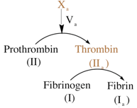
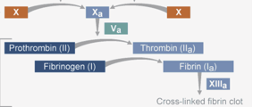
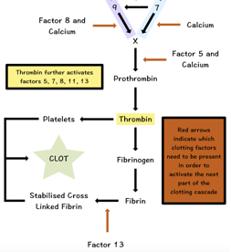

Common Pathway    body {font-family: 'Open Sans', sans-serif;}

### Common Pathway

The intrinsic and extrinsic pathways converge at factor X, which is the starting point of the common pathway. The common pathway involves factors I, II, V and X.  
  
Factor X is activated by either the intrinsic, extrinsic or both pathways.  
Activated factor X (Factor Xa), along with its cofactor (factor V), tissue phospholipids, platelet phospholipids and calcium forms the “prothrombinase complex” which converts prothrombin to thrombin.  

****

**Note:** Prothrombin (Factor II) is NOT active. When prothrombin becomes activated, it is now thrombin (Factor IIa).  
  
Fibrinogen (Factor I) is NOT active. When fibrinogen becomes activated, It is now Fibrin (factor 1a).  

****

  
Thrombin further cleaves circulating fibrinogen to insoluble fibrin and activates factor XIII, which covalently crosslinks fibrin polymers incorporated in the platelet plug. This creates a fibrin network which stabilizes the clot and forms a definitive secondary hemostatic plug.  

****

  
  

****

  
**Amplification**  
Many times the amount of thrombin generated is not sufficient, therefore numerous positive feedback loops are present that bind thrombin with platelets.  
Thrombin that is initially generated can further activate factor V and factor VIII, which serve as cofactors in prothrombinase complex and accelerates the activation of Factor II by Factor Xa and of Factor Xa by Factor IXa, respectively.  

Hematology Made Easy, 2013, pp. 62  
By Erhabor, Adias  
  
Guyton and Hall Medical Physiology; 2013.  
  
Overview of the coagulation system  
Indian J Anesth. 2014 Sep-Oct; 58(5): 515–523.  
Sanjeev Palta, Richa Saroa, and Anshu Palta