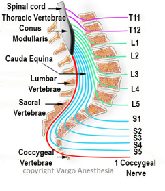

Conus Medullaris    body {font-family: 'Open Sans', sans-serif;}

### Conus Medullaris

The  **conus medullaris**  (Latin for "medullary cone")  
  
It is the tapered, distal end (bottom) of the spinal cord. It usually occurs near lumbar vertebral levels as high as the T12 and as low as the L2 vertebra in an adult.  
It ends at L3 in an infant  
  
**Filum terminale  
**There is also a strand of connective tissue called the filum terminale, which joins the end of the cord (the conus medullaris) to the dorsal surface of the first vertebra of the coccyx.  

****

  
One MRI study demonstrated the mean Conus Medullaris position was the lower third of L1.  
After the spinal cord tapers out, the spinal nerves continue to branch out diagonally, forming the  **cauda equina.  
**In the adult, it is generally safe to place a spinal needle below L2, unless there is a known anatomical variation.  
  
Needle trauma to the cauda equina is unlikely.  
  
Individual nerves of the cauda equina are in a fluid environment and not likely to be pierced by a needle.  
  
Misidentification of L4 using Tuffier’s line (intercristal line – an imaginary line drawn across the lower back at the level of the iliac crests) may sometimes cause iatrogenic trauma to the conus medullaris during lumbar punctures. Therefore, the correct position of these anatomic landmarks is important to execute this procedure safely.  
  
**_NOTE:_** _Some authorities caution that Tuffier’s line is not a reliable landmark identifying L4 based on radiographic findings in large samples of patients._

****

  

Spine (Phila Pa 1976).  1998 Jul 1;23(13):1452-6.  
**The variation of position of the conus medullaris in an adult population. A magnetic resonance imaging study.  
**Saifuddin A 1 , Burnett SJ, White