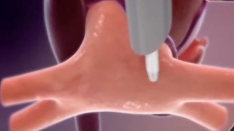
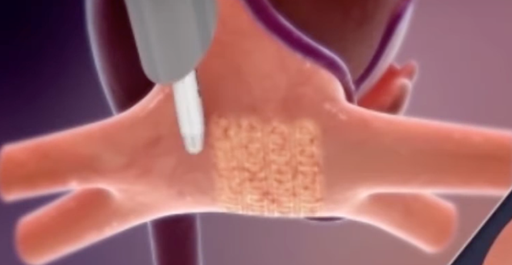
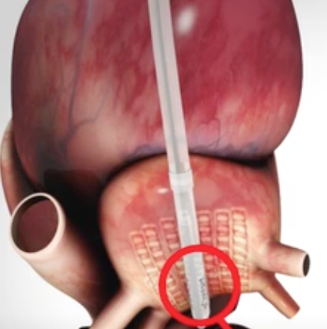

Convergent (or convergence) Procedure    body {font-family: 'Open Sans', sans-serif;}

### Convergent (or convergence) Procedure

**Convergent procedure is also known as:**    
\- Subxiphoid minimally invasive epicardial ablation  
\- Convergent or Hybrid Procedure for Atrial Fibrillation  
\- Left-Thoracoscopic Convergent Ablation for Atrial fibrillation  
\- Hybrid Convergence of Epicardial and Endocardial Ablation   
\- The convergent procedure is a minimally invasive heart surgery to perform an epicardial left atrial ablation to treat persistent atrial fibrillation  
\- This procedure is performed by both a cardiothoracic surgeon and an electrophysiologist.  
  
**Note:** The Convergent procedure was initially designed to combine the strengths of surgical epicardial and percutaneous endocardial ablation in a single procedure.  
Today, the traditional percutaneous atrial ablation (endocardial) is usually performed a few days before the convergence procedure.  
  
**Advantages of Convergent procedure:  
**The posterior atrial wall ablation is performed under direct pericardioscopic vision with the energy source directed from the epicardium inwards toward the heart and away from the esophagus, thus reducing the risk of esophageal thermal injury.  
\- Pericardioscopic access provides optimal access to the posterior left atrium and posterior pulmonary vein antrums.  
  
**Some surgeons combine the Convergent procedure with LAA Ligation or Clipping.  
**Refer to _“Left Atrial Appendage (LAA) Ligation or Clipping”_  
The LAA clipping or ligation may prevent future clot formation in the left atrium.  
  
**Epicardial vs Endocardial Left Atrial Ablation:**  
**\- Endocardial ablation** is the traditional percutaneous atrial ablation performed in the EP lab via threading a catheter from the femoral vein to the heart and ablating “inside” the left atrium.  
\- **Epicardial ablation** is performed thoracoscopically (subxiphoid) in a cardiac operating room by an EP cardiologist and cardiac surgeon.  
\- The epicardial area of the posterior left atrium is ablated.  
\- Combining the two procedures above has a higher success rate than the traditional endocardial ablation alone.  
  
**Indications:**  
\- Patients with persistent atrial fibrillation who have not responded to other treatments, including medication and traditional endocardial ablation.  
  
**Procedure:**\- The patient is supine.  
\- A transesophageal echocardiography probe is inserted to rule out intracardiac thrombus formation.  
\- The surgeon starts by inserting a scope on the left side under the xiphoid and sternum towards the heart.

****

  
\- A pericardial window is created (opened) by the surgeon to access the heart.  
\- The scope is advanced and manipulated to expose the back of the left atrium, and the four pulmonary veins that meet the left atrium can be reached.  
\- When optimally positioned, the EP cardiologist ablates the posterior atrium where the pulmonary veins enter.  
  
**Note:** The pulmonary vein harbors most of the abnormal electrical activity that causes A-fib.

****

  
**Ablation** is a procedure that uses heat or cold energy to create tiny scars on the heart to block abnormal electrical signals that cause A-fib and hopefully restore normal heartbeat.  
\- Electrical activity cannot pass through a scar.

****

****

\- Drains are inserted.**  
  
Extra notes:**  
**Advantages of the epicardial approach:**  
The procedure is a closed-chest procure  
beating-heart procedure  
Minimal invasiveness.  
No cardiopulmonary bypass  
Poor lung function is not a contraindication for this procedure.  
A shorter hospital stay, minimal discomfort, and faster recovery.  
  

Left-thoracoscopic convergent ablation for atrial fibrillation  
Multimedia of Cardio-Thoracic Surgery  
Accessed 12/2023  
https://mmcts.org/tutorial/1617  
  
Convergent Procedure  
Cardiothoracic and Vascular Surgeons  
Accessed 12/2023  
http://tinyurl.com/2efzcty4  
  
The Convergent Atrial Fibrillation Ablation Procedure: Evolution of a Multidisciplinary Approach to Atrial Fibrillation Management  
Arrhythmia and Electrophysiology Review, 2020 Aug; 9(2): 88–96.  
Karan Wats, Andy Kiser, Kevin Makati, Nitesh Sood, David DeLurgio, Yisachar Greenberg, and Felix Yang  
Hybrid Convergent Procedure for the Treatment of Persistent and Long-Standing Persistent Atrial Fibrillation  
Circulation **:** Arrhythmia and Electrophysiology; Vol. 13,  
David B. DeLurgio, Karl J. Crossen, Jaswinder Gill, Christopher Blauth, Saumil R. Oza, Anthony R. Magnano, Mark A. Mostovych, Michael E. Halkos, David R. Tschopp, Faraz Kerendi, Tyler L. Taigen, Christian C. Shults, Manish H. Shah, Anil B. Rajendra, Jose Osorio,  
Jonathan S. Silver, Bruce G. Hook, David M. Gilligan and Hugh Calkins  
  
Closed chest convergent epicardial-endocardial ablation of non-paroxysmal atrial fibrillation – a case series and literature review.  
Arrythmia and Electrophysiology Reiewv 2013; 2: 65-8.  
Thosani AJ, Gerczuk P, Liu E, et al.  
  
European experience of the convergent atrial fibrillation procedure: multicenter outcomes in consecutive patients.  
Journal of _Thoracic_ and _Cardiovascular Surger_ 2014; 147: 1411-6.  
Geršak B, Zembala MO, Müller D, et al.  
  
Hybrid epicardial-endocardial ablation using a pericardioscopic technique for the treatment of atrial fibrillation.  
_Heart Rhythm_ 2013; 10: 22-8.  
Gehi AK, Mounsey JP, Pursell I, et al.