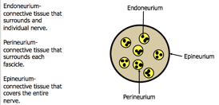

Cross Section of the Nerve    body {font-family: 'Open Sans', sans-serif;}

### Cross Section of the Nerve

****

The peripheral nervous system refers to parts of the nervous system outside the brain and spinal cord.  
It includes the cranial nerves, spinal nerves and their roots and branches, peripheral nerves, and neuromuscular junctions.  
In the peripheral nervous system, bundles of nerve fibers or axons conduct information to and from the central nervous system.  
Each nerve is a cable like structure containing bundles of axons.  
These nerve bundles contain nerve fibers A, B and C-Fibers.  
  
Within an individual nerve, each axon is surrounded by a layer of connective tissue called the **endoneurium.**  
The axons are bundled together into groups called **fascicles** .  
Each fascicle is wrapped in a layer of connective tissue called the **perineurium** .  
Finally, the entire nerve is wrapped in a layer of connective tissue called the **epineurium.  
**In addition, there are neighboring blood vessels.

****

When injecting a local anesthetic, we avoid injecting directly into the nerves to minimize the possibility of causing neural injury. Our goal is to inject a local anesthetic in the connective tissue as close to the nerve as possible.  
  
In OB, a spinal is much closer to the nerve roots than an epidural.  
  
In order for the block to develop completely, the local anesthetic must penetrate barriers such as the epineurium and it must diffuse to the center of the nerve bundles if complete block is to be achieved.  
  
Local anesthetic also diffuses into the neighboring blood vessels. You can notice the multiple blood vessels around the nerve bundles. The local anesthetic will also enter the blood vessels which decreases the amount of local anesthetic available for neural blockade.  
  
By vasoconstriction of the neighboring blood vessels, we minimize the amount of local anesthetic absorption and prolong the block. This is why we sometimes add epinephrine to local anesthetics.

Chestnut, David.(2014) Chestnut’s Obstetric Anesthesia Principles and Practice.  
Structure of a Nerve  
https://www.boundless.com/physiology/textbooks/boundless-anatomy-and-physiology-textbook/peripheral-nervous-system-13/nerves-130/structure-of-a-nerve-695-1700/