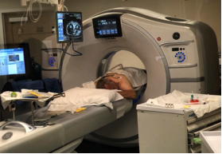
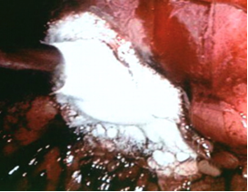

    body {font-family: 'Open Sans', sans-serif;}

### **Cryoablation (Percutaneous) of Renal Tumors**

This procedure is usually done in CT Radiology, in prone or lateral position under conscious sedation.  
When anesthesia is requested, we usually intubate and keep the patient motionless.  
This procedure is minimally invasive and involves a cryoprobe (most often a straight metallic shaft) inserted into a small tumor located on the posterior side of a kidney.  
The cryoprobe is guided to the tumor using imaging technology.   
The patient is usually positioned prone or lateral, minimally sedated, and most often, goes home the same day.  
  
**How cryoablation causes cell death**  
Cryoablation makes use of rapid cooling to cause cell death.  
Two sequential and synergistic mechanisms lead to cell death.  
Intra- and extracellular ice crystals are directly cytotoxic and lead to cell dehydration and rupture.  
When the frozen tissue is thawed, there is microvascular occlusion with cell hypoxia, resulting in indirect ischemic injury.  
  
After the patient is sedated and positioned prone (or lateral), a cryoprobe is inserted through the patient’s skin and into the target tissue.  
A liquid gas (argon), is used to rapidly cool the cryoprobe.  
An ice ball forms along the cryoprobe shaft and enlarges over time.  
Cell death is time- and temperature dependent, with the critical threshold for cell death being between −19.4°C and −40°C.  
The cryoprobe itself reaches −190°C.  
**  
The first freezing**  
The first freeze lasts 8–15 minutes, and the second freeze lasts 5–20 minutes.  
  
Temperature monitoring and imaging are used to determine when freezing is adequate.  
Following the procedure, cryoprobes are actively warmed with helium gas and are removed when they reach body temperature.  
  
**Indications:  
**Kidney tumors are smaller than 3 centimeters.  
Kidney tumor is located on the posterior side of the kidney.  
Ideal for patients in whom partial or complete nephrectomy is undesirable or contraindicated.**  
  
Advantages:  
**Surgical nephrectomy is avoided.The surgeon does not have to flip the kidney to gain access the posterior kidney tumor, as done during laparoscopy.  
May preserve renal function.  
Creatinine levels have been shown to increase only minimally following the procedure.  
Less pain and usually just requires light sedation.  
Less length of hospital stay, and procedure time.  
Patient can usually go home the same day and are able to perform regular activities within a couple of days.

****

****

  
  
**  
Anesthesia  
**Because the kidney often moves significantly during respiration, a cooperative patient, or one who is under general anesthesia, facilitates a smooth procedure.  
Most cases do not require anesthesia, but when anesthesia is requested, the patient is usually intubated and then placed in the prone position.  
**Muscle relaxation:** Yes, the interventional radiologist will request no movement.  
**Duration:** 2-4 hours  
**Position:** Prone or lateral or both.  
**IV Access:** 20G, avoid the hand.  
Many hospital policies do not permit contrast dye to be injected into a hand IV.  
**EBL:** Minimal. Sometimes the patient will be admitted overnight due to a hematoma.  
**Disadvantage of the procedure:** The minimal space available and ergonomics for the placement of an anesthesia machine in the CT room.  
  
**Bair Hugger:** Lower and upper body if possible.  
Yes, these patients are prone to hypothermia after with the freezing cryoablation.

**Possible Complications  
**Hematoma around the kidney that goes away by itselfInfection  
Hemorrhage (rare)  
Hypothermia  
Shoulder pain-rotator cuff issues in prone with arms extended up. **  
  
More Notes  
****Extra notes:  
  
More traditional** **cryoablation**Open and laparoscopic cryoablation have been the traditional method.  
Percutaneous ablation works well when the renal tumor is posterior.  
If the tumor is anterior, then it is difficult to reach it without going through the critical central structures of the kidney.  
  
More than 75 percent of patients who are diagnosed with kidney cancer have tumors  
that are 4 centimeters or less in size.  
The cryoablation procedure is typically associated with very little bleeding, fewer complications and faster recovery.  
Patients who have inherited conditions, such as Von Hippel-Lindau disease,  
often have multiple kidney cancers in one or both kidneys.  
  
Patients with kidney cancers who have poor kidney function, or only  
one kidney also are good candidates for renal cryoablation since the technique  
does not require the surgeon to control the blood supply to the kidney.  
  
Other techniques such as open and laparoscopic partial nephrectomy require the surgeon to temporarily block the blood supply to the kidney, which may negatively affect kidney function.  
  
Cryoablation is generally not recommended for treatment of tumors larger  
than 4centimeters in diameter.  
  

**Percutaneous Cryoablation of Renal Tumors: Patient Selection, Technique, and Post-procedural Imaging** by Brian C. Allen, MD, and Erick M. Remer, MD.  
http://pubs.rsna.org/doi/full/10.1148/rg.304095134  
**A Gentler Approach to Kidney Cancer, Percutaneous Cryoablation** New York (Apr 15, 2009), Joseph Del Pizzo, MD  
http://www.weillcornell.org/physician/josephdelpizzo/index.html  
  
**Freezing kidney cancer - interventional cryoablation**Published on March 10, 2009 at 1:41 PM  
http://www.news-medical.net/news/2009/03/10/46673.aspx