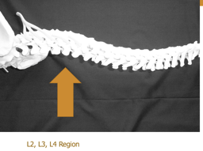
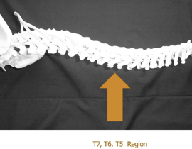

Curvatures of the Spinal Column    body {font-family: 'Open Sans', sans-serif;}

### Curvatures of the Spinal Column

**The influence of spinal column curvatures on the distribution of Local Anesthetics  
  
**Normal anatomic curvature influences the spread of hyperbaric solutions.  
  
There is a natural lordosis in the lumbar area. Lordosis is especially pronounced in obese women, making them more susceptible to a high subarachnoid block.  

****

  
There is also a natural thoracic kyphosis  

****

  
When medications are injected above L3 and the patient is placed in a supine position the medication will spread cephalad until it reaches the T4 curvature which normally limits its spread.  
  
**Caution should be exercised in kyphosis, kyphoscoliosis, and lordosis  
**Abnormal changes in the anatomy of the spine may result in a decrease in the volume of CSF and subsequently increase the height of subarachnoid block.  

Chestnut, David.(2014) Chestnut’s Obstetric Anesthesia Principles and Practice.  
  
Santos, Alan., Epstein, Jonathan.,(2015) Chaudhuri, Kallol Obstetric Anesthesia ; 2015.  
  
Anatomy of Human Spine  
(Mayfield Brain and Spine)  
http://www.mayfieldclinic.com/PE-AnatSpine.htm  
  
Spinal Cord Anatomy, Structure and Tracts (Ken Hub)  
https://www.kenhub.com/en/library/anatomy/the-spinal-cord  
  
**Gray's Anatomy for Students  
**By Richard Drake, A. Wayne Vogl, Adam W. M. Mitchell