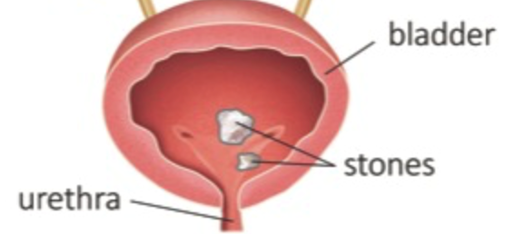

  Cystolitholapaxy section { margin-bottom: 20px; } h3, p { margin: 0px; padding: 0px; } img { width: 300px; height: auto; } .mb-10px { margin-bottom: 10px; }

### Transurethral Cystolitholapaxy

\- Cystolitholapaxy is a minimally invasive surgical procedure that removes bladder stones.

\- The urologist passes a cystoscope through the urethra and into the urinary bladder.

\- Once the stone is located, it may be snared with a basket device and removed whole from the urethra.

\- If the stone is large or the diameter of the urethra is narrow, a laser fragments it into multiple smaller pieces.

\- These pieces are then irrigated and removed from the bladder through the urethra.

  In most cases, a foley is left in the bladder for several days after the surgery to ensure proper drainage.

**Anesthesia:** General/ETT or LMA

**SAB:** Rare

Most urologists desire the patient intubated and paralyzed with laser procedures.

**Position:** Lithotomy, arms tucked

**Duration:** 30-90 minutes (depending on the size of the stone)

**EBL:** Minimal

**Possible complications:**

Bladder spasm/pain

The remaining stone fragments may require a second procedure.

Bladder perforation: very rare (0.1%)

Urethral or ureteral injury

Hematuria and infection

**Additional prostate procedure:**

Bladder stones may be associated with BPH (benign prostatic hyperplasia)

The surgeon may combine a prostate procedure in addition to the Cystolitholapaxy.

**Duration:** 30-60 minutes, depending on the size of the bladder stones.

**More notes:**

**Percutaneous suprapubic cystolitholapaxy:**

This surgical procedure is used in cases where transurethral cystolitholapaxy would not be suitable.

The surgical procedure requires two cuts to be made: one incision in the skin of the lower abdomen and another incision in the wall of the bladder.

The cystoscope is then inserted through the incisions, and the stones are broken up with ultrasound waves.

  

Percutaneous suprapubic cystolitholapaxy is the preferred surgical procedure when treating children with bladder stones.

The urethra is narrower in children, and it is more difficult to insert a cystoscope.

Cystolitholapaxy

Cleveland Clinic (accessed 11/2024)

[https://my.clevelandclinic.org/health/procedures/16497-cystolitholapaxy](https://my.clevelandclinic.org/health/procedures/16497-cystolitholapaxy)