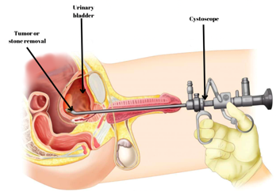
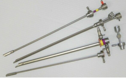

Cystoscopy (Cysto)    body {font-family: 'Open Sans', sans-serif;}

### Cystoscopy (Cysto)

Cystoscopy is a diagnostic procedure that allows direct visualization through a cystoscope of the urinary tract, the bladder, the urethra and the openings to the ureters.

****

\- The cystoscopy procedure alone is straightforward and can be performed with local anesthetic jelly in a doctor’s office.  
\- The rigid cystoscope has channels that allow the passage of instruments.  
\- This enables the urologist to perform associated procedures as mentioned below.**There are two main types of cystoscopes:** Flexible and rigid.  
Rigid scopes are below.

****

**Possible combined procedures with cystoscopy:  
**Cystolitholapaxy  
Bladder biopsy  
Transurethral resection of a bladder tumor (TURBT)  
Instillation of BCG (bacillus Calmette-Guérin)  
Bladder Botox injection  
Transurethral resection of the prostate (TURP)  
Bilateral Retrograde Pyelograms  
Placement, replacement, or removal of ureteral stents  
Stone Extractions followed by ureteral stent placement  
Ureteroscopy with Laser Lithotripsy followed by ureteral stent placement.  
\- A sterile liquid (water, saline, or glycine solution) will flow through the cystoscope to slowly stretch and fill the bladder, so the urologist can better view the bladder wall.  
\- However, the bladder must stay full until the exam is finished.  
\- When cystoscopy has been completed, fluid is drained from the bladder.  
\- Depending on the procedure’s nature, a Foley catheter may be left in place to drain the bladder continuously.**Anesthesia:  
General:** Usually an LMA and sometimes ETT.  
Spinal is rare but optional (T9- T10 level)  
Intubation and muscle relaxation are usually required for laser procedures.  
Ask the urologist if they prefer intubation/muscle relaxation prior to stone extractions procedures.  
**Refer to:** “Laser Ureteral or Kidney Stone and Stent Placement”  
  
**Duration:** 2-10 minutes for the Cysto alone; longer for accompanying procedures.**Position:** Supine and lithotomy, arms to the side.  
**EBL:** Minimal  
  
**Stimulation of the obturator nerve:  
**\- During the cystoscope insertion, the obturator nerve can sometimes be stimulated and cause a violent adductor leg contraction.  
\- This may cause an inadvertent bladder perforation (rare).  
\- General anesthesia with muscle relaxation or a spinal can prevent this.  
\- Ultrasound-Guided Obturator Nerve Block is rarely performed for this scenario.  
**  
Possible Complications:  
**Urinary tract infection  
Hematuria  
Dysuria  
Injury to the bladder or urethra  
Development of an iatrogenic urethral stricture  
  
**Perforation or a tear anywhere along the urinary tract:** Urethra, bladder or ureter  
**  
Perforation of the Bladder:  
**\- This is considered an emergency, and GETA must occur.  
\- If there is an LMA in place, try placing a gum bougie down the LMA, and it should pass into the trachea.  
\- Then deflate the LMA cuff, pull it out over the gum intubating bougie, and place an ETT over the bougie and through the vocal cords.  
\- Or, if you are sure you can intubate the airway with the patient in lithotomy, you can do that.  
\- Most anesthesia providers remove the LMA and immediately intubate.  
\- Depending on your cysto room and its proximity to an open OR suite, the patient might need to be moved from the cysto room to a larger OR suite for the subsequent exploratory laparotomy for surgical repair of the bladder.  
\- If the irrigation fluid fails to return or a lot less fluid is returning than what went in, the surgeon needs to consider a bladder perforation.  
\- Large perforations can lead to unexplained hemodynamic changes such as hyper- or hypotension, bradycardia due to a vagal response, or cardiac collapse.  
\- An awake patient under a SAB or epidural may feel suprapubic fullness and pain in the upper abdomen or referred pain from the diaphragm to the shoulders, nausea and diaphoresis.  
\- These patients should also be converted to a general/ETT.  
**  
Other:**  
**Instillation of BCG (bacillus Calmette-Guérin):**  
BCG is the TB vaccine, but also used for superficial bladder cancer via vesical and intradermal injection via cystoscopy.  
  
**Cystolitholapaxy:** Crush and remove bladder stones  
**Bladder biopsy:** For bladder tumor  
**Bladder Botox injection:** Prevent bladder spasms  
  

Cystoscopy  
StatPearls (accessed 04/2022)  
Joshua S. Engelsgjerd; Christopher M. Deibert.  
https://www.ncbi.nlm.nih.gov/books/NBK493180/  
Kaplan, Steven A., Alan W. Partin, and Anthony Atala. _Minimally Invasive Procedures in Urology_ . New York: Dekker, 2005.  
McAninch, Jack W., Tom F. Lue, and Donald R. Smith. _Smith and Tanagho's General Urology / Editors, Jack W. McAninch, Thomas F. Lue_ . New York: McGraw-Hill Professional, 2013.  
  
Intracavitary Bacillus Calmette-guerin in the Treatment of Superficial Bladder Tumors  
The Journal of Urology Vol. 116, Issue 2 1976 pp. 180-182  
A.Morales , D.Eidinger, A.W.Bruce  
  
Prevention of obturator nerve stimulation during transurethral surgery  
The Journal of Urology 1980 Feb;123(2):170-2.  
R R Augspurger, R E Donohue