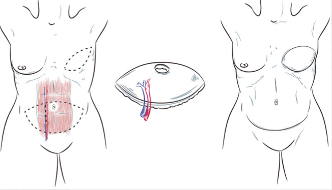

Deep Inferior Epigastric Perforator (DIEP) Flap     body {font-family: 'Open Sans', sans-serif;}

### Deep Inferior Epigastric Perforator (DIEP) Flap

It is quickly becoming the gold standard breast reconstruction and quickly replacing the TRAM Flap.  
The abdominal skin, fat, and deep inferior epigastric vessels that supply necessary blood to the breast are removed and replanted to create new breasts or just one. The internal mammary artery and vein are transected (supra-sternal, NOT sub-sternal like a CABG), and anastomosed to the remaining inferior epigastric vessels to feed and drain the transplanted tissue.  
The DIEP Flap is usually performed simultaneously with a mastectomy. While the general surgeon is midway through the mastectomy, the plastic surgeon makes a lower abdominal incision 2cm above the umbilicus. The plastic surgeon dissects the subcutaneous tissue/fat all the way down to the level of the rectus abdominal fascia. He/she then locates the Inferior Epigastric vessels and carefully dissects and preserves them while the abdominal tissue is removed.  
After the general surgeon is done with the mastectomy, the plastic surgeon performs a partial rib resection to reach the internal mammary artery and vein. Once they are both isolated, the plastic surgeon places the flap in the empty breast pocket and carefully reattaches the blood vessels of the flap’s perforator vessels to the internal mammary artery and vein, using a microscope.

**Anesthetic:** General/ETT. The patient is already intubated from the skin-sparing mastectomy.  
**Duration:** 5-7 hours  
**EBL:** 50mLs  
**IV Access:** 20G is acceptable  
**Position:** Supine with arms tucked. Make sure the head, heals and arms are adequately padded because it is a very long procedure.  
**Relaxation:** Yes, after the mastectomy is completed, for the plastic microscope anastomosis.  
**VasoPressors:** Surgeons will request no vasopressors since it is a micro vascular case, but I have seen many anesthesia providers sneak in some Neosynephrine when needed rather than hanging a Neo bag. It does not seem to hinder the procedure.   
**Doppler:** Yes, they will periodically check the vessels and rely on you to turn it on and off. The Doppler is usually hung on one of your IV poles.  
**Recommended BP:** Avoid hypertension so it does not stress the new grafts.  
**Fluids:** Don’t over hydrate; keep on the dry side. They don’t want the patient edematous.  
**Foley**: Yes  
**Temperature:** Fluid warmer and lower body warming blanket.  
**Face Protection:** Yes, a foam donut works. The surgical team likes to place their instruments over the facial area on the drapes covering the patient’s face. We have surgical eye protectors at our facility: an adhesive backing, thin foam, with vinyl covers for each eye. It looks like an adhesive Lone Ranger mask and it works great.  
**Indocyanine Green and Water:** Usually used. It is a green dye, mixed and injected IV to determine tissue perfusion. The surgeon may use a black light device that allows him/her to see the tissue glow brighter while it’s being perfused. The room lights are turned off while they are visualizing the screen, determining perfusion. The surgeon will tell you how much and when to give it. After you give it, quickly follow with a 10mL bolus of LR or NS.  
**ICU Bed:** Yes, they usually go the ICU with a Tissue Saturation O2 monitor.

**Complications:**  
Graft Failure  
Infection  
Venous congestion can occur despite patent primary venous anastomosis.  
Fat necrosis within the flap  
Bleeding

  
**More Notes**  
Many times these are done bilaterally, using the left and right IMAs after a bilateral mastectomy. Only abdominal skin and fat are removed, similar to a "tummy tuck".  
  
In the TRAM Flap procedure, the harvested flap’s blood vessels are not severed, therefore maintaining the tissue’s connection to the original (belly tissue) blood supply. They just tunnel the tissue along with its blood supply up to the empty breast pocket.

The DIEP is usually done with a skin-sparing mastectomy. It may also be nipple sparing. The breast envelope, to include the nipple, is saved. This is called Nipple Sparing Mastectomy or NSM.

Though DIEP can be performed many years post mastectomy, in many instances DIEP is performed immediately after a skin-sparing mastectomy.

**Benefits of DIEP Flap Reconstruction:**  
Minimizes loss of muscle function  
Minimizes risk of abdominal hernia  
Less post-operative pain  
Quicker recovery  
Flatter abdomen

Jaffe, Richard A. _Anesthesiologist's Manual of Surgical Procedures_. Philadelphia, Pa.: Lippincott Williams & Wilkins, 2009.  
  
"Johns Hopkins Medicine, Based in Baltimore, Maryland." _Johns Hopkins Medicine, Based in Baltimore, Maryland_. N.p., n.d. Web. 23 Jan. 2014.  
  
Macksey, Lynn Fitzgerald. _Surgical Procedures and Anesthetic Implications: A Handbook for Nursing Practice_. Sudbury, MA: Jones & Bartlett Learning, 2011.   
  
"Patient and Cancer Information." _Cancer Treatment and Cancer Research_. N.p., n.d. Web. 23 Jan. 2014.  
  
Scott-Conner, Carol E. H., and David L. Dawson. _Operative Anatomy_. Philadelphia: Wolters Kluwer Health/Lippincott Williams & Wilkins, 2009. 128-50.