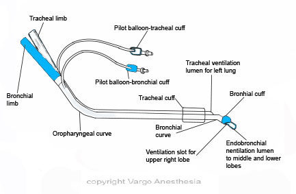
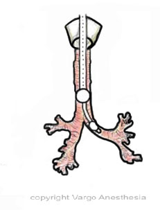
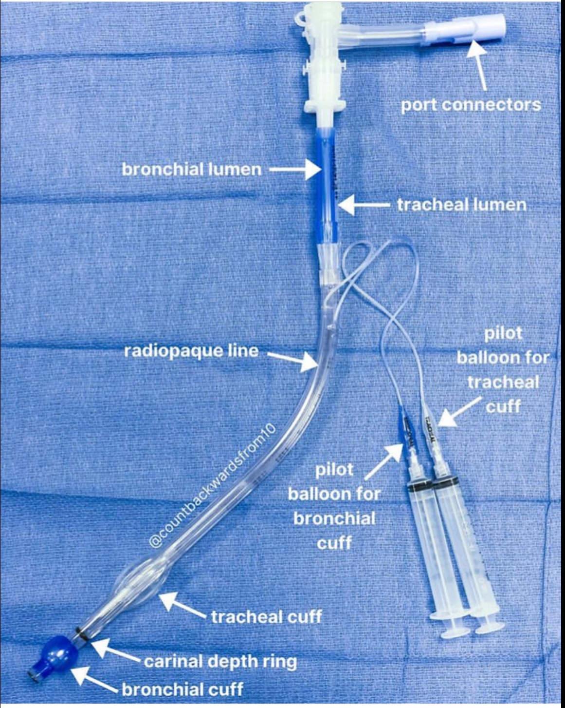
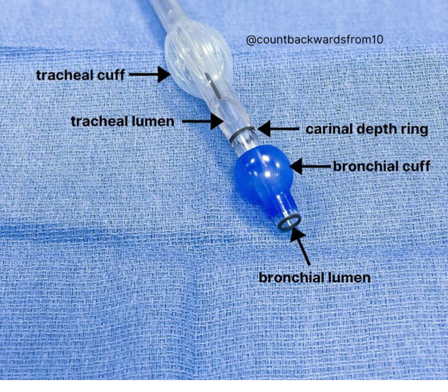
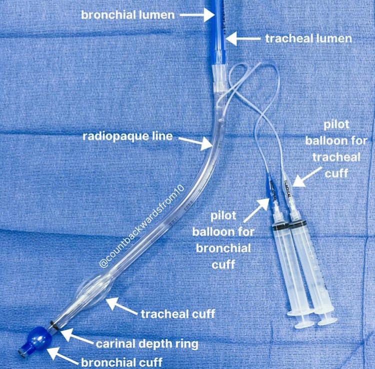

DLT Images    body {font-family: 'Open Sans', sans-serif;}

## DLT Images

  
  
  
  
  
Courtesy of Dr. David Convissar. IG: Countbackwardsfrom10  
  
  
Courtesy of Dr. David Convissar. IG: Countbackwardsfrom10  
  
  
Courtesy of Dr. David Convissar. IG: Countbackwardsfrom10  
  
**Left DLT vs Right:**  
When retrieving a DLT for your procedure, always choose a left DLT unless contraindicated.  
Left-sided DLTs are used more frequently as they are significantly easier to place without obstructing the upper lobe bronchus.  
A right DLT includes an orifice along the bronchial tube to align with and ventilate the RUL.