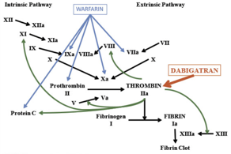

Dabigatran (Pradaxa, Pradax, Prazaxa)    body {font-family: 'Open Sans', sans-serif;}

### Dabigatran (Pradaxa, Pradax, Prazaxa)

**Class:** DTI - Direct Thrombin Inhibitor - Univalent  
  
**Dabigatran (Pradaxa):** The only oral direct thrombin inhibitor available for clinical use.  
The first TSOAC (target-specific oral anticoagulant) approved for use in the United States.  
  
Also, known as a reversible oral activated factor Xa inhibitor.  
  
**Dabigatran is a Prodrug and a Univalent DTI  
**A prodrug is an inactive form of a drug, but once administered, it undergoes a conversion by metabolic processes to become the active, pharmacological agent.  
  
**Univalent DTIs** interact with thrombin only at one active site.  

****

  
**Other DTI’s**  
Argatroban  
Efegatran - not covered in this app  
Inogatran - not covered in this app  
Melagatran - not covered in this app  
Ximelagatran - not covered in this app  
  
**Indications: Prevent strokes in those patient’s with:**  
Atrial fibrillation  
Deep vein thrombosis  
Pulmonary embolism  
  
Administered in in patients who have been treated for 5–10 days with parenteral anticoagulant (usually low molecular weight heparin).  
  
**Heart Valves:** Dabigatran is not indicated for A-fib caused by heart valve issues.  
Avoided in patients with mechanical prosthetic heart valve due to the increased risk of thromboembolic events (e.g. valve thrombosis, stroke, and myocardial infarction) and major bleeding associated with dabigatran in this population.  
  
Mechanism of action: Dabigatran binds to the active site of thrombin and inactivates both fibrin-bound and unbound thrombin, unlike heparin that binds to the unbound thrombin only. Inhibiting thrombin prevents the conversion of fibrinogen to fibrin and subsequent cross linking of fibrin monomers, platelet activation and amplification of coagulation activation.  

****

  
Note: Normally thrombin can catalyze the conversion of fibrinogen to fibrin and activates procoagulant factors V, VIII, XI, and XIII. The inhibition prevents the development of a thrombus.  
  
**Monitor:** Because of reliability, routine anticoagulation monitoring is unnecessary.  
  
**Lab Monitoring:** There is no therapeutic drug monitoring widely available for DTIs, in contrast with warfarin (INR) and heparin (aPTT).  
  
**Lab results may vary by reagent and instrumentation**

table.tableizer-table { font-size: 12px; border: 1px solid #CCC; font-family: Arial, Helvetica, sans-serif; } .tableizer-table td { padding: 4px; margin: 3px; border: 1px solid #CCC; } .tableizer-table th { background-color: #104E8B; color: #FFF; font-weight: bold; }

| Lab Test | Dabigatran |
| --- | --- |
| aPTT | ↑ ↑ no correlation |
| PT | ↑ no correlation |
| INR | ↑ no correlation |
| TT | ↑ reliable |
| ECT | ↑ ↑ reliable |
| Anti-Xa | No effect |

Hillarp AJ, Throm Haenost, 2011;9 133-139 TT (Thromb)  
Funk DM, Hematology 2012l 460-465. ECT (Ecarin Clotting Time)  
Frost et al, Br Clin Pharmacol 2012; 75: 476  
Garcia D et al. J Thromb 2013;11:245-52

**Thrombin Time (TT)** is the most reliable and extremely sensitive to the effects of dabigatran and can be prolonged even by trivial amounts of the drug.  
  
**Ecarin clotting time** , although not in general clinical use, would be the most appropriate monitoring test.  
**PT:** Should not be used-relatively insensitive to dabigatran  
**Elevated PTT and INR:** May be increased but NOT linear but cannot be used to assess drug levels  
  
**Normal PTT:** means there is minimal drug or no drug effect.  
  
**TEGS:** Studies on TEGs and Dabigatran levels are lacking.  
  
**Dosing:** Available in capsules of 75 and 150 mg under the brand name Pradaxa and the recommended dose in adults is 150 mg twice daily.  
  
**Time to peak:** 1-2 hours and trough at 12 hours  
Steady state is achieved in 3 days.  
  
**Plasma T1/2:** 12-14 hours (literature varies), five half-lives will have elapsed by day 2.5 to 3.5 after the last dose.  
  
**Renal:** _If the creatinine clearance is <30 mL/min, the half-life is >24 hr_  
**Metabolism:** 80% Renal excretion; contraindicated in severe impairment.  
  
**Drug Interactions:** Few  
  
**Dabigatran** **vs Warfarin**  
Clinicians are rapidly prescribing this agent as a replacement for warfarin therapy.  
  
In some cases, Pradaxa is an alternative to warfarin for Atrial Fib, since it does not have to be monitored by blood tests, but offers similar results in terms of efficacy.  
  
**Dabigatran (Pradaxa) and Neuraxial/Regional Blocks**

table.tableizer-table { font-size: 12px; border: 1px solid #CCC; font-family: Arial, Helvetica, sans-serif; } .tableizer-table td { padding: 4px; margin: 3px; border: 1px solid #CCC; } .tableizer-table th { background-color: #104E8B; color: #FFF; font-weight: bold; }

| Minimal Time between  
last dose and neuraxial procedure | Can it be given with  
epidural catheter in place? | Restart after  
neuraxial procedure | Restart after  
catheter removal |
| --- | --- | --- | --- |
| 72 hours if CrCl ≥ 80 mL/min  
96 hours if CrCl is 50-79 mL/min  
120 hours if CrCl is 30-49 mL/min  
Avoid when CrCl < 30 mL/min  
120 hours when kidney function  
has not been determined. | Avoid in the presence  
of indwelling catheter. | 6 hours  
if NO indwelling catheter  
was inserted. | 6 hours |

**Restart medication after procedure:** ASRA recommends 6 hours  
**Remove catheter after last administration:** ASRA recommends 5 days  
  
**Antidotes:** 5 grams of idarucizumab ( _Praxbind_ ) IV –“See Dabigatran Reversal”  

Reversal of the anticoagulant effects of the novel oral anticoagulants for management of bleeding, emergency surgery or overdose for (Dabigatran, Rivaroxaban and Apixaban) by Dr R. Riat  
Consulted with Members of the Thrombosis Committee and reviewed by Hematology Department  
11/2013  
  
Arthur W. Bracey ( _2015_ ) Perioperative Management of Antithrombotic and Antiplatelet Therapy. Texas Heart Institute Journal: June 2015, Vol. 42, No. 3, pp. 239-242.  
  
Di Nisio M, Middeldorp S, Büller H (2005). "Direct thrombin inhibitors.". N Engl J Med. **353** (10): 1028–40.  
  
LiverTox- Clinical and Research Information on Drug- Induced Liver Injury  
https://livertox.nlm.nih.gov//DabigatranEtexilate.htm  
  
“Dabigatran, rivaroxaban, apixaban, argatroban and fondaparinux and their effects on coagulation POC and platelet function tests.”  
Eller T, Busse J, Dittrich M, Flieder T, Alban S, Knabbe C, Birschmann  
Clin Chem Lab Med. 2014 Jun;52(6):835-44.  
  
Trevor Baglin, David Keeling and Steve Kitchen. “Effects on routine coagulation screens and assessment of anticoagulant intensity in patients taking oral dabigatran or rivaroxaban: Guidance from the British Committee for Standards in Hematology.”  
British Journal of Haematology (BJH), 2012.  
  
Arthur W. Bracey ( _2015_ ) Perioperative Management of Antithrombotic and Antiplatelet Therapy. Texas Heart Institute Journal: June 2015, Vol. 42, No. 3, pp. 239-242.  
  
Guidelines for Neuraxial Anesthesia and Anticoagulation  
Developed by Anticoagulation Task Force and Anesthesia Development Team. P&T Approved February 2014. Last update July 2015.  
https://kr.ihc.com/ext/Dcmnt?ncid=520499512&tfrm=default  
  
Regional Guidelines by the American Association of Regional Anesthesia (ASRA)  
ASRA.com  
  
Anticoagulation 3rd Edition  
_Regional Anesthesia and Pain Medicine_ :  
January/February 2010 - Volume 35 - Issue 1 - pp 64-101  
doi: 10.1097/AAP.0b013e3181c15c70  
Asra Practice Advisory  
  
Rxlist.com  
http://www.rxlist.com/pradaxa-drug/clinical-pharmacology.htm  
  
British Journal of Anaesthesia 111 (S1): i96–i113 (2013) doi:10.1093/bja/aet401  
http://bja.oxfordjournals.org/content/111/suppl\_1/i96.full.pdf+html  
  
Regional anaesthesia in the patient receiving antithrombotic and antiplatelet therapy  
http://bja.oxfordjournals.org/content/107/suppl\_1/i96.full#ref-4  
T.T. Horlocker  
Department of Anesthesiology, Mayo Clinic, Rochester, MN 55905, USA  
  
Horlocker TT, Wedel DJ, Benzon H, et al. Regional anesthesia in the anticoagulated patient: defining the risks (the second ASRA Consensus Conference on Neuraxial Anesthesia and Anticoagulation). Reg Anesth Pain Med 2003;28:172-97