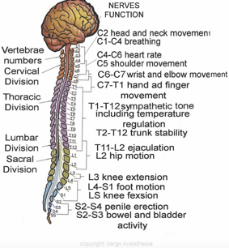

Dermatome Levels – Easy Review for OB    body {font-family: 'Open Sans', sans-serif;}

### Dermatome Levels – Easy Review for OB

  
**_Daniel D. Moos, CRNA_**

Knowledge of key dermatome levels assists the anesthesia provider in assessing the level of neuraxial blockade.  
**  
Alcohol wipe vs Blunt Needle:  
An alcohol wipe  
**You are testing the patient’s ability to differentiate differences in skin temperature discernment.  
It is useful to assess the level of sympathectomy by measuring the patients’ ability to perceive skin temperature sensation. It gives you the level of the sympathetic blockade.  
_Always know that the sympathetic level is generally 2-6 levels higher than the sensory level._  
  
**A blunt needle  
**Useful in the assessment of the sensory level.  
It should be sharp enough to cause a “pin prick” sensation but not so sharp as to break the patients skin. The use of the spinal needle stylet can be used. Pinching the patient can also be used. The jagged edges from breaking a tongue depressor in half is also useful.  
_Always know that the sensory level is generally 2-6 levels LOWER than the sympathetic level(alcohol swab) and 2 levels HIGHER than the motor level.  
  
_**Spinal Cord Segment:** The segment of the spinal cord that gives rise to paired spinal nerves and original nerve roots.  
  
**Dermatome:** The area of the skin supplied by certain spinal nerves and the corresponding **spinal cord segment.  
  
**We use the dermatomes to indirectly assess the distribution of the local anesthetic within the intrathecal space by the loss of afferent sensory functions via temperature, pinprick and touch. This permits us to assess the extent of the surgical anesthesia.

table.tableizer-table { font-size: 12px; border: 1px solid #CCC; font-family: Arial, Helvetica, sans-serif; } .tableizer-table td { padding: 4px; margin: 3px; border: 1px solid #CCC; } .tableizer-table th { background-color: #104E8B; color: #FFF; font-weight: bold; }

| For OB |   |
| --- | --- |
| C-Section | T4 (nipple level) down to S2-S4 |
| Uterine and vaginal delivery | T10 (umbilicus) down to S2-S4 |
| Perineal and anal pain | S2-S5 -Saddle block |

Note: We don’t really say “down to S4”. We concentrate on height!  
For C-section we just say “T4 to cover the uterus.”

****

  
  
  

****

**Posterior Region  
C7:** Most prominent cervical spinous process  
**T7:** Inferior border of the scapula  
**L4:** Iliac Crest (Tuffier’s Line)  
**S2:** Posterior superior iliac spine  
  
**Anterior Region  
C4:** Clavicle  
**T4:** Nipples  
**T6:** Xiphoid  
**T8** : Lower border of ribcage  
**T10** : Umbilicus  
**L1** : Inguinal Ligament  
**L2-L3:** Knee and below  
**S2-S5** perineal  
  
The table below will help determine if the level of blockade achieves the minimum level required for a proposed surgical procedure. When reviewing the required sensory levels, it seems odd that the sensory level is higher than where the surgical procedure actually takes place. For example, why is the level for lower extremity surgery with a tourniquet four levels higher than a surgical procedure without a tourniquet? Especially when the dermatome map indicates that sensation from the hip down entails the dermatome levels of L1-S1! The answer lies in the function of the afferent autonomic nerves. Afferent autonomic nerves innervate visceral sensations and viscerosomatic reflexes at the spinal cord.

table.tableizer-table { font-size: 12px; border: 1px solid #CCC; font-family: Arial, Helvetica, sans-serif; } .tableizer-table td { padding: 4px; margin: 3px; border: 1px solid #CCC; } .tableizer-table th { background-color: #104E8B; color: #FFF; font-weight: bold; }

| Operative Site | Level |
| --- | --- |
| Intra-Abdominal (not lower) | T4 |
| Lower Intra-Abdominal | T6 |
| Lower Extremities (with tourniquet)  
(testicular and ovarian) | T8 |
| Hip, vaginal, uterine, bladder and prostate | T10 |
| Lower extremity (without tourniquet) | T12 |

  
  

The table below will help correlate surface anatomy, sensory dermatome levels, and anticipated systemic effects.

table.tableizer-table { font-size: 12px; border: 1px solid #CCC; font-family: Arial, Helvetica, sans-serif; } .tableizer-table td { padding: 4px; margin: 3px; border: 1px solid #CCC; } .tableizer-table th { background-color: #104E8B; color: #FFF; font-weight: bold; }

| Surface Anatomical Area | Dermatome Level | Systemic Effects |
| --- | --- | --- |
| 5th finger (pinky) | C8 | Blockade of all cardioaccelerator fibers (T1-T4) |
| Inner aspect of arm and forearm | T1-T2 | Some degree of cardioaccelerator fibers |
| Apex of axilla | T3 | Possible cardioaccelerator fibers blockade |
| Nipple | T4-5 | Possible cardioaccelerator fibers blockade |
| Bottom of xiphoid | T7 | Possible splanchnic blockade (T5-L1) |
| Umbilicus | T10 | SNS blockade |
| Inguinal ligament area | T12 | SNS blockade limited to the legs |
| Lateral Foot | S1 |  |