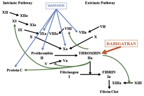
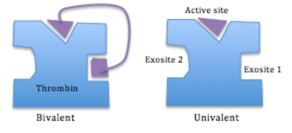

Direct Thrombin IIa Inhibitors (DTIs)    body {font-family: 'Open Sans', sans-serif;}

### Direct Thrombin IIa Inhibitors (DTIs)

**Bivalrudin (Angiomax)** is a popular heparin alternate for patient with HIT.  
**Dabigatran** is popular because it has an antidote.  
  
Can be univalent or bivalent-meaning the site it binds to Thrombin.  
  
**Mechanism of Action**  
These drugs bind to thrombin and inhibits the function of activated thrombin (Factor II).  
Blocks the thrombogenic activity of thrombin.  
As a result, all thrombin-dependent coagulation assays are affected.  
  
They can bind to both circulating and fibrinogen bound thrombin and thus both prevent and dissolves clots and thrombi.  
  
Heparins does NOT bind to both circulating and clot-bound thrombin.

**See below:** Dabigatran-Thrombin IIa inhibitor.  

****

  
**Note:** Thrombin is the principal enzyme of hemostasis. It catalyzes the conversion of fibrinogen to fibrin and activates procoagulant factors V, VIII, XI, and XIII, activation  
of protein C; and platelet aggregation.  
  
Inhibiting thrombin (Factor II) prevents the conversion of fibrinogen to fibrin and subsequent cross linking of fibrin monomers, platelet activation and amplification of coagulation.  
  
**Bivalent: hiruden** (blocks thrombin at 2 sites)  
Desiruden (Revask, Iprivask, Hirudin)  
Bivalrudin (Angiomax)  
Lepirudin (Refludan)  
  
**Univalent (** interact with thrombin only at one active site)Argabatran (Acova, Argatra)  
Dibigatran (Pradaxa, Pradax, Prazaxa)  
Elegatran  

****

  
**Other:  
**Antithrombin III  
DefibrotideRamatroban  
REG1  
**  
Lab Monitoring  
****Thrombin Time (TT)** is the most reliable  
**Ecarin clotting time** , although not in general clinical use, would be the most appropriate monitoring test  
**INR and PT:** May be prolonged in a nonlinear fashion.  
  
Normal **aPTT** indicates no effect.  
**aPTT:** Commonly monitored with IV administration for titration with HIT patients.  
**ACT:** Commonly monitored in selected cardiac procedures (PCIs).  
  
**Antidote: None  
Dibigatran antidote:** idarucizumab (Praxbind) IV  
  
**Reversal  
**Hemodialysis - helps  
Desmopressin  
Tranexamic acid - little literature  
Blood products as needed.  

Laboratory Monitoring of Direct Thrombin Inhibitors  
http://www.pathology.vcu.edu/media/pathology/clinical/coag/DTI.pdf  
  
Samama MM, Gerotziafas GT: Comparative pharmacokinetics of LMWHs. Semin Thromb Hemost. 2000;26 Suppl 1:31-8.  
  
LiverTox, Clinical and Research Information on Drug Induced Liver Injury  
Desiruden  
https://livertox.nih.gov/Desirudin.htm  
  
Warkentin TE. Bivalent direct thrombin inhibitors: hirudin and bivalirudin. _Best Pract Res Clin Haematol_ . 2004;17:105–125.  
  
Direct Thrombin Inhibitor Trialists’ Collaborative Group. Direct thrombin inhibitors in acute coronary syndromes: principal results of a meta-analysis based on individual patients' data. _Lancet_ . 2002;359:294–302.