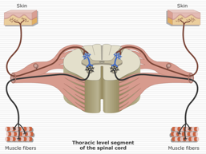
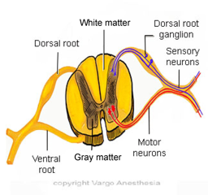

Dorsal and Ventral Roots - Simplified    body {font-family: 'Open Sans', sans-serif;}

### Dorsal and Ventral Roots - Simplified

_This is the location where spinal and epidurals work.  
  
_Nerves enter and exit the spinal cord through 31 sets of nerve roots.  
They are part of the peripheral nervous system (PNS).The image below is typical of the 31 spinal nerves (one dermatome level).  
**Each level has:  
**2 dorsal (posterior) roots  
2 ventral (anterior) roots  
  
**Dorsal roots are for sensory input form the periphery to the spinal cord  
**These have sensory neurons that transmit sensation (pain, temperature etc.) to the spinal cord. When the proper dorsal roots are blocked, the parturient feels NO pain with delivery.  
  
**Ventral roots are for motor output  
**The motor neurons travel from the spinal cord through the ventral root and out to the muscles. If this nerve root is blocked (with a higher concentration of a local anesthetic), the patient cannot voluntarily contract their muscles at that dermatome level. Lower concentrations tend to spare the motor blockade. Sparing a motor blockade permits the mother to push during delivery – this is the desired outcome.  
  
**_NOTE: Mnemonic = MOVE. MOtor, VEntral._**  

****

  

****

  
**Dorsal Root Ganglia  
**A small bulge is located on each dorsal root. Inside that bulge are cell bodies of the sensory neurons.  
  
**More Notes  
****Dorsal (posterior) root** \= pain and sensory.  
When the dorsal root is blocked, all sensation – somatic pain, visceral pain and temperature sensation – are blocked.  
  
**Dorsal root  
**Dorsal roots are larger than the ventral roots.  
**Dorsal roots** \- somatic and visceral pain  
  
**Somatic pain** \= results from activation of pain receptors in either the body surface or musculoskeletal tissues. A surgical incision is somatic pain.  
  
**Visceral pain** \= **results from** internal organ or stretching painViscera refers to the internal areas of the body that are enclosed in a cavity.  
  
Even though the dorsal root is larger, it is blocked more easily than the smaller anterior root.  
  
This is due to the organization of the dorsal root into bundles which expose a larger surface area to local anesthetic solutions. Thus, sensory nerves are blocked more easily than are motor nerves.This explains why the motor function of the lower extremities is the last to be blocked during spinal and epidural anesthesia.  
  
**Ventral (anterior) root** \= motor  
Ventral root is smaller than the dorsal root  
Ventral root does not block as quickly as the dorsal root.  
Therefore, the motor nerves are the last blocked.  
Sensory afferents can be blocked, eliminating pain, even when motor efferents are partially intact, permitting motor function.  

Anatomy of Human Spine  
(Mayfield Brain and Spine)  
http://www.mayfieldclinic.com/PE-AnatSpine.htm  
  
Spinal Cord Anatomy, Structure and Tracts (Ken Hub)  
https://www.kenhub.com/en/library/anatomy/the-spinal-cord  
  
Chestnut, David.(2014) Chestnut’s Obstetric Anesthesia Principles and Practice.  
  
Santos, Alan., Epstein, Jonathan.,(2015) Chaudhuri, Kallol Obstetric Anesthesia ; 2015.  
  
**Gray's Anatomy for Students  
**By Richard Drake, A. Wayne Vogl, Adam W. M. Mit