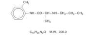

EMLA    body {font-family: 'Open Sans', sans-serif;}

### EMLA (Eutectic Mixture of Local Anesthetics)

**Ingredients:**  
(2.5%) 25mg/mL lidocaine and (2.5%) 25mg/ml of prilocaine in a cream or patch form.  
_Eutectic means equal proportions_  
  
**Availability** Oily cream  
  
**Patch:** 2-cm 2 patch with the central portion of 10cm containing the EMLA (25 mg of both local anesthetics).  
  
EMLA contains 2 amide-type local anesthetics, lidocaine and prilocaine.  
It is used on normal, unbroken skin or on the outer genital area to prevent pain before certain procedures such as inserting a needle, skin grafts, or skin laser surgery.  
It works by temporarily numbing the skin and surrounding area.  
Do not use this product in the ears.  
  
EMLA alone cannot completely numb the area being treated, it may be used to numb the area before a lidocaine injection is given to provide enough pain relief for certain procedures (e.g., IV start, removal of genital warts).The administration of EMLA cream is commonly administered prior to lidocaine infiltration providing significant relief of discomfort associated with local anesthetic infiltration.  
****  
**Occlusive dressing:  
**EMLA cream should be applied under an occlusive dressing.  
  
**Indications:  
**To provide dermal analgesia for clinical procedures such as split skin graft harvesting or venipuncture.  
  
**When to apply:  
**Apply 1 hour before venipuncture  
Apply 2 hours before split thickness skin grafts.  
  
**Duration:**  
Satisfactory dermal analgesia is achieved 1 hour after application, reaches maximum at 2 to 3 hours, and persists for 1 to 2 hours after removal.  
  
**EMLA Pediatric Dosing**

table.tableizer-table { font-size: 12px; border: 1px solid #CCC; font-family: Arial, Helvetica, sans-serif; } .tableizer-table td { padding: 4px; margin: 3px; border: 1px solid #CCC; } .tableizer-table th { background-color: #104E8B; color: #FFF; font-weight: bold; }

| Age/Weight | Max Dose |
| --- | --- |
| 0-3 months, < 5 kg | 1 gram |
| 3-12 months, > 5 kg | 2 grams |
| 1-6 years, > 10 kg | 10 grams |
| 7-12 years, > 20 kg | 20 grams |

_EMLA is less effective in patients < 7 years of age._  
  
**Methemoglobinemia:** Can be associated with prilocaine, by not usually when applied topically at lower doses.  
  
**Symptoms of methemoglobinemia:  
**Patient exhibits a cyanotic appearance that does not respond to the administration of 100% oxygen.  
When methemoglobin levels are low, cyanosis can become apparent, but symptoms of nausea, sedation, seizures, and even coma may result when levels are very high (Wilburn-Goo, 1999).  
The clinical sign of cyanosis is observed as blood concentrations of methemoglobin reach 10% to 20%, whereas dyspnea and tachycardia emerge as methemoglobinemia concentrations reach 35% to 40%.  
Most reports of methemoglobinemia with prilocaine and benzocaine are associated with excessive doses (Moore, 1999).  
  
**Metabolism:  
**It is not known if lidocaine or prilocaine are metabolized in the skin.  
Lidocaine is metabolized rapidly by the liver to numerous metabolites including monoethylglycinexylidide (MEGX) and glycinexylidide (GX), both of which have pharmacologic activity similar to, but less potent than that of lidocaine.  
The metabolite, 2,6-xylidine, has unknown pharmacologic activity.  
  
**Half-life:  
**Prilocaine's half-life also may be increased in hepatic or renal dysfunction since both systems are involved in prilocaine metabolism.  
  
**EMLA is 2 amides:**  
EMLA Cream (lidocaine 2.5% and prilocaine 2.5%) is contraindicated in patients with a known history of sensitivity to local anesthetics of the amide type or to any other component of the product.  
  
**pH of EMLA:** 9.4; a high percentage is in the un-ionized base form.  
  
**Diffusion:  
**The high pH and percentage of non-ionized form of cream facilitates the diffusion across the epidermis. It will penetrate the epidermis 5 mm to the A-delta and C-fibers in the dermis.  
  
**Mechanism of action:**  
EMLA cream applied to intact skin under an occlusive dressing provides dermal analgesia by the release of lidocaine and prilocaine from the cream into the epidermal and dermal layers of the skin and by the accumulation of lidocaine and prilocaine in the vicinity of dermal pain receptors and nerve endings.  
  
Lidocaine and prilocaine are amide-type local anesthetic agents. Both lidocaine and prilocaine stabilize neuronal membranes by inhibiting the ionic fluxes required for the initiation and conduction of impulses, thereby effecting local anesthetic action.  
  
**Systemic toxicity:  
**A small potential exists for small kids patients less than 3 years of age.  
  
**Blanching of the skin:  
**The prilocaine in the EMLA can cause a biphasic vascular effect and result with initial blanching of the skin followed by vasodilation.  

EMLA Package Insert  
http://www.akorn.com/documents/catalog/sell\_sheets/63323-289-55.pdf