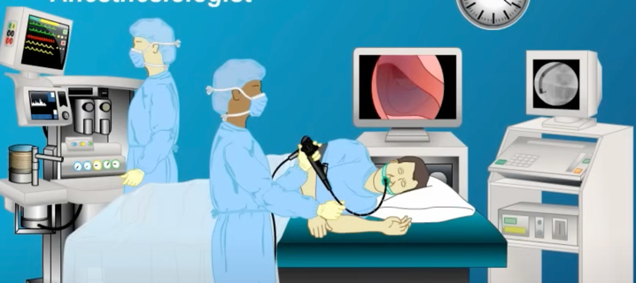
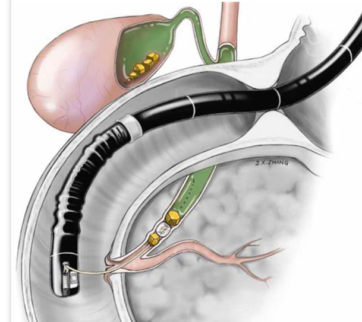
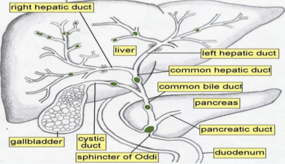
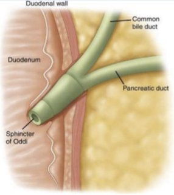

  ERCP (Endoscopic Retrograde Cholangiopancreatography) section { margin-bottom: 20px; } table { border-collapse: collapse; } table, tr, th, td { border: 1px solid black; } h3, p, ol.custom-counter, li { margin: 0px; padding: 0px; } .text-red { color: red; } .text-black { color: black; } ul.custom-dash { list-style: none; padding-left: 0; margin: 0; } ul.custom-dash > li { display: flex; align-items: flex-start; } ul.custom-dash > li::before { content: "–"; margin-right: 0.5em; flex-shrink: 0; line-height: 1; } ul.custom-dash > li > \*:not(::before) { flex: 1; } ul.custom-dash > li.no-dash::before { content: ""; width: 1em; margin-right: 0.5em; flex-shrink: 0; } /\* Change the ol style \*/ ol.custom-counter { list-style: none; counter-reset: custom; padding-left: 0; } ol.custom-counter li { counter-increment: custom; margin-bottom: 5px; } ol.custom-counter li::before { content: counter(custom) ") "; font-weight: bold; } /\* This is just for this file \*/ ul.custom-bullet-arrow { list-style: none; padding-left: 0; margin: 0; } ul.custom-bullet-arrow > li { display: flex; align-items: flex-start; } ul.custom-bullet-arrow > li::before { content: "↑"; margin-right: 0.5em; flex-shrink: 0; } ul.custom-bullet-arrow > li.no-arrow::before { content: ""; width: 0.5em; margin-right: 0.5em; flex-shrink: 0; } ul.custom-bullet\_arrow ul { list-style-type: disc; padding-left: 1.5em; margin-top: 0.5em; } img.resized { width: 200px; height: auto; } .mb-10px { margin-bottom: 10px; } .mb-20px { margin-bottom: 20px; } .reference-notes { font-size: 11px; } .text-indent-45px { text-indent: 45px; } img { max-width: 100%; height: auto; }

### ERCP (Endoscopic Retrograde Cholangiopancreatography) - Adults

ERCP is a combined endoscopic and fluoroscopic procedure in which an endoscope is inserted orally, advanced from the esophagus into the second part of the duodenum, thus allowing other tools to be inserted into the biliary and pancreatic ducts via the major duodenal papilla.

Contrast material may be injected into these ducts, allowing for radiologic visualization and therapeutic intervention when indicated (you will need a lead apron).

From the outside, this procedure looks like an EGD in the lateral/prone position with the patient's head turned to the right.

  

**Indication**

-   Cholangiopancreatoscopy, biopsy, or brush cytology.
-   Intraductal ultrasound
-   Sphincterotomy
-   Stent placement
-   Stone removal
-   Obstructive jaundice
-   Biliary or pancreatic ductal system
-   Disease treatment or tissue sampling
-   Suspicion of pancreatic cancer
-   Pancreatitis of unknown cause
-   Manometry for the sphincter of Oddi
-   Biliary stenting for strictures and leakage, drainage of pancreatic pseudocysts
-   Balloon dilation of the duodenal papilla and ductal strictures.
-   Sphincterotomy for sphincter of Oddi dysfunction or stenosis

**These patients can be septic and very sick.**

You may need an aggressive pressor-norepinephrine.

_**Refer to:** "Acute Cholangitis" in the Coexisting Disease App._

**Pre-op: Assess the patient's cervical ROM.**

-   With the pre-op assessment, check the patient's cervical ROM from left to right, especially right lateral rotation.
-   The patient's head will be turned 90 degrees towards their right shoulder when wedged in the lateral/ prone position.
-   Severe cervical damage can be associated with patients of limited ROM.

**Anesthetic:**

-   General/ETT, rarely a MAC
-   **MAC warning:** Response time for intubation is delayed when losing an airway in the prone position.
-   Have succinylcholine and intubation equipment readily available for all MAC procedures.

-   Ask the gastroenterologist which side of the mouth to tape the ETT.
-   Many doctors prefer us to tape the ETT on the left side of the patient's mouth.

**Position:** Lateral/prone with the patient's head to their right and positioning wedge or pillows to elevate the right side. Arms to the side.

Make sure the patient is not lying on any cords.

**Duration:** 30 minutes to 2 hours.

It depends on how quickly the doctor can locate and penetrate the duodenal papilla with the scope.

**IV Access:** 20 G is acceptable

**Glucagon:** Have available.

Remember, any opioid can cause a spasm of the Sphincter of Oddi.

Morphine is commonly known for causing most spasms.

**Muscle Relaxation:** Usually, a low dose of rocuronium.

Muscle relaxants are not really required as some procedures are performed via MAC.

**EBL:** Minimal

**Possible Complications:**

-   Pancreatitis (inflammation of the pancreas) is the most frequent complication, occurring in about 3 to 5 percent of people undergoing ERCP.
-   Many gastroenterologists order an Indomethacin suppository.
-   Infection of the bile ducts (cholangitis) is rare.
-   Intestinal Perforation
-   Aspiration

**Anatomy review at the bottom of this page:**

-   The main pancreatic duct connects to the common bile duct and drains bile at the ampulla of Vater (hepato-pancreatic ampulla) into the duodenum to assist the digestion of fat.
-   The ampulla of Vater is controlled by the sphincter of Oddi.
-   The major duodenal papilla is the opening of the ampulla of Vater into the second part of the duodenum.
-   The common bile duct and the pancreatic duct may remain separate or merge at the end of the papilla, or they may form a common duct.

  
  

Endoscopic Retrograde Cholangiopancreatography

StatPearls Jan 2025

Accessed 9/2025

Marcelle Meseeha and Maximos Attia

Jaffe, Richard A. _Anesthesiologist's Manual of Surgical Procedures._

Philadelphia, Pa.: Lippincott Williams & Wilkins, 2009.

Macksey, Lynn Fitzgerald. _Surgical Procedures and Anesthetic Implications: A Handbook for Nursing_

_Practice._

Sudbury, MA: Jones & Bartlett Learning, 2011

Odze, Robert D., and John R. Goldblum. _Surgical Pathology of the GI Tract, Liver, Biliary Tract, and_

_Pancreas._

Philadelphia, PA: Saunders/Elsevier, 2009.