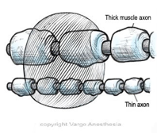
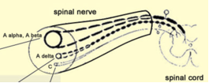

Local Anesthetic on Specific Nerve Fibers    body {font-family: 'Open Sans', sans-serif;}

### Local Anesthetic on Specific Nerve Fibers

In general, inside a nerve are a variety of nerve fibers bundled within membranes. With spinals and epidurals, our target is the nerve roots exiting the spinal cord.  
  
**There are three classes of nerve fibers based upon diameter, function and degree of myelination:  
  
****A Fibers** (Myelinated somatic nerves)A-alpha - motor neurons; efferent to skeletal muscle  
A-beta - touch, pressure, proprioception neurons; afferent from skin  
A-gamma - motor neurons; efferent to muscle spindles  
A-delta - pain (sharp and fast) and temperature; afferent from skin  
  
**B Fibers** (Myelinated preganglionic autonomic nerves and efferent to vascular smooth muscle)  
Cause vasodilation and increased skin temperature to the affected area  
  
**C Fibers** (Lightly myelinated postganglionic autonomic nerves)Responsible for pain (dull and slow) and temperature; afferent from skin_Note: some literature states that the C-Fibers are unmyelinated - like the table below.  
  
_As a local anesthetic diffuses through the nerve root, it will affect a variety of nerve fibers in a certain order. The order in sequence may depend on the size, myelinated or not, and location of the specific fibers within the nerve root. Sympathetic > Sensory > Motor  
  
**B Fibers and Hypotension with Neuraxial Anesthesia (sympathetic tone)  
**We can figure out what nerve fibers are blocked by assessing the patient’s symptoms.Let’s use a spinal as an example. The first symptom we usually see is a drop in blood pressure.  
This is because the **B Fibers** within the nerve roots tend to be blocked **first** !  
  
The B Fibers are EFFERENT myelinated preganglionic **sympathetic** fibers that affect the vascular smooth muscles of those blood vessels innervated from the affected nerve roots. This means the blood vessels innervated by the B fibers that run off that specific blocked nerve roots (segmental) will lose vascular tone and dilate!  
  
Now imagine a high spinal where there are several more nerve roots affected? You will see a more dramatic BP drop among other symptoms.  
  
**B Fibers and Interscalene Block  
**Have you ever noticed after an interscalene block, the first symptom you see is vasodilation and skin warmth on the patient’s blocked extremity? This is also because the B Fibers were blocked first.Now as the local anesthetic spreads through the nerve root, it will affect more types of nerve fibers.  
  
**C-Fibers** The C fibers are usually next that contribute to the loss of DULL pain and temperature sensation.  
  
**A-Delta Fibers  
**Next are the A-delta fibers that contribute to the loss of SHARP pain and temperature sensation and so forth.  
As the remaining nerve fibers are blocked (ex. spinal) the patient will lose proprioception (no idea where their limbs are; loss of touch, pressure sensation and possibly motor function.  
  
**A-Alpha and Motor Paralysis**  
Last but not least are the A-alpha nerve fibers that are responsible for motor function.The nerves responsible for motor function are more difficult to block. This is why the motor function is the last to go. If you look at the chart below, the A-alpha nerves are the largest.  
  
Where do local anesthetics exert their pharmacological actions? Answer-Nerve membrane at the nodes of ranvier  
  
**Remember, to completely halt nerve conduction -** 3 nodes of ranvier for myelinated fibers must be blocked.  
  
If the volume of local anesthetic is constant, the smaller nerves with the shorter inner nodal distance will easily be blocked first, as compared to the larger motor nerves that have a greater inner nodal distance. See image below.

****

In general, small myelinated fibers are more susceptible to blockade than larger unmyelinated fibers.  
  
**Nerve Fibers  
  
**

table.tableizer-table { font-size: 12px; border: 1px solid #CCC; font-family: Arial, Helvetica, sans-serif; } .tableizer-table td { padding: 4px; margin: 3px; border: 1px solid #CCC; } .tableizer-table th { background-color: #104E8B; color: #FFF; font-weight: bold; }

| Fiber Type | Size (microns) | Function |
| --- | --- | --- |
| B | 0.25 | EFFERENT myelinated preganglionic sympathetic fibers to vascular smooth muscle-vasodilation and increased skin temperature |
| C (unmyelinated) | 0.5 | Lightly myelinated postganglionic autonomic nerves, loss of dull and slow pain and temperature sensation; afferent from skin. |
| A-delta | 0.5 | Loss of sharp and fast pain, temperature sensation, afferent from skin |
| A-gamma | 0.75 | Motor neurons, efferent to muscle spindle and muscle tone |
| A-beta | 0.75 | touch, pressure, proprioception neurons (no idea where the effected limbs are) afferent from skin |
| A-alpha | 1 | Somatic Motor, proprioception-last to be blocked. Located at the core of the nerve bundle |

**Note:** Some literature states the C-fibers are unmyelinated. The others are all myelinated  
  
Below is a micrograph of a cross section through an area that is rich with nerve bundles.

****

  

****

Chestnut, David.(2014) Chestnut’s Obstetric Anesthesia Principles and Practice.  
  
Santos, Alan., Epstein, Jonathan.,(2015) Chaudhuri, Kallol Obstetric Anesthesia ; 2015.  
  
Local Anesthetic and Regional Flashcards, CH 9.  
https://quizlet.com/33160247/chapter-9-local-anesthetics-and-regional-flash-cards  
  
Reese, Charles, AANA Convention, Neuraxial Regional Anesthesia-Epidural Workshop