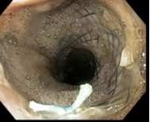
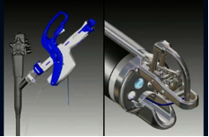

Endoscopic Esophageal Fistula Repair (Adult)    body {font-family: 'Open Sans', sans-serif;}

### Endoscopic Esophageal Fistula Repair (Adult)

Endoscopic esophageal fistula repair using the “Apollo OverStitch® suturing device.”  
  
Esophageal stenting is commonly used to treat esophageal diseases, such as leaks, fistula and malignant strictures. However, stent migration rate is as high as 26.9%. Several techniques have been used to fix stents in place.  
However, fixation ability is limited as a result of mucosal layer anchoring.  
The endoscopic suturing device with Overstitch provides a strategy to fix esophageal stents in place.

****

****

  
Pathological connections between the esophagus and the trachea or major bronchi are termed TEF for tracheoesophageal fistula, and BEF for bronchoesophageal fistula.  
This usually present in newborns and not being discussed here.  
We are addressing the more common Esophageal pathology today of a simple Esophageal fistula, one in which there is NO communication between the breathing anatomy and the esophagus.  
  
**Endoscopic methods of repairing a esophageal fistula (anesthesia is the same):  
Clips:** Limited by fibrosis, fistula size, and durability.  
**Stent-** Most common  
  
**Injectable agents:**Fibrin glue (prepared from platelet-rich plasma or by mixing concentrated fibrinogen solutions with thrombin) produces an acellular clot  
Cyanoacrylates  
**  
Endoscopic suturing**  
**  
Possible causes of esophageal fistulas:**  
**Esophageal cancer:** A possible consequence chemotherapy and radiation.  
**Traumatic instrumentation of the esophagus** during procedures such as endoscopy or trans esophageal electrocardiogram (TEE).Crohn disease and diverticular disease may result in a fistula.  
  
**Patient status:**  
Most of these patients appear malnourished and dehydrated.  
Foods or liquids are not tolerated well, coughing and aspiration are frequent, especially in patients with a concurrent hiatal hernia.  
**Dysphagia** (difficulty swallowing) often results in patients missing prescribed medications; thus, the conditions for which the medications were prescribed (e.g., hypertension, diabetes) are inadequately treated, resulting in exacerbation of the medical comorbidity.  
**Inability to lie flat** results from a fear of aspiration, gagging, coughing or retching.  
This complicates upper gastrointestinal endoscopy and other procedures requiring supine positioning.  
  
**Surgical procedure  
**Fistulas must be treated in order to avoid sepsis.  
Leakage of stomach contents into the respiratory tract may result in chemical pneumonitis as seen in Mendelson syndrome.  
In order to make sure the stent doesn’t migrate from the ideal location, the surgeon may secure it with sutures using the Apollo OverStitch suturing device.  
**Pre-Op:**  
**IV:** 20 gauge IV catheter is acceptable.  
**Pre-op hydration** should be titrated to a produce normovolemia. 500 ml is common.  
Pretreat with glycopyrrolate.  
**Local anesthetic spray:** To anesthetize the hypopharynx prior to induction  
**Monitor:** Standard ASA monitors, supplemented as required.  
  
**Anesthesia:** General endotracheal  
Rapid sequence induction; aspiration precautions  
Little or no opioid is required  
**Duration:** 45-75 minutes  
**Hydration:** Adequate, maintain normovolemia; the patient may be dehydrated.  
**Position:** Left lateral  
  
**Surgical procedure:** The treatment for esophageal fistula is almost always an esophageal stent.  
The procedure begins with an esophagoscopy to verify that there is no contamination or ulcer in the fistula.  
The fistula is then closed, usually employing a clip.  
A stent is usually inserted. In a procedure similar to that with which a vascular stent is deployed, it is inserted in a collapsed state and when positioning is satisfactory, the stent is opened.  
In order to prevent displacement of the stent from the desired position, a fixation method such as the Apollo Over-Suture® device is used.  
**Emergence:** Deep extubation in semi-fowlers position is common.

The CSS Cleaner is a brilliant free online tool to take care of your dirty markup.  
  

Esophageal stent fixation with endoscopic suturing device improves clinical outcomes and reduces complications in patients with locally advanced esophageal cancer prior to neoadjuvant therapy: a large multicenter experience.   
Surgical. Endoscopy.2017; 31: 1414–9.  
Siddiqui AA, Tang J, Kowalski TE  _et al_ .   
  
Esophagojejunal anastomotic dehiscence successfully repaired by endoluminal suture and stent positioning: report of a mini‐invasive approach.  
Digestive. Endosopy. 2018;30:535–6.  
Granata A, Amata M, Traina M.   
  
Esophageal stent fixation with endoscopic suturing device (with video).   
Gastrointestinal. Endoscopy. 2012;  **76** : 1251–5.  
Kantsevoy SV, Bitner M.   
  
Endoscopic suturing for the prevention of stent migration in benign upper gastrointestinal conditions: a comparative multicenter study.   
Endoscopy 2016; 48: 802–8  
Ngamruengphong S, Sharaiha R, Sethi A  _et al_ .    
Endoscopic suturing device with Overstitch for esophageal stent fixation  
Wiley Online Library (accessed 05/2020)  
Xuan Li . Weifeng Zhang , Guoxin Zhang