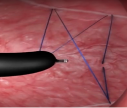
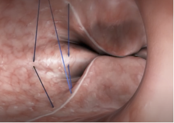
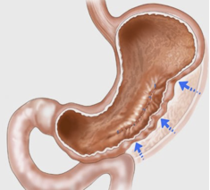

Endoscopic Sleeve Gastroplasty (ESG)    body {font-family: 'Open Sans', sans-serif;}

### Endoscopic Sleeve Gastroplasty (ESG)

Also called the “accordion procedure.”A noninvasive gastric sleeve procedure, now being performed endoscopically.  
The surgeon uses an endoscopic suturing device to reduce the size of the gastric reservoir.  
The surgeon narrows the stomach using about 12 sutures to shrink or constrict the walls of the stomach, thereby reducing the size of the stomach.  
Upon 5-year follow-up, there was an average 15% total body weight loss.   
  
**Difference between original laparoscopic and new endoscopic technique:**  
**Laparoscopic:** Curvature of the stomach is removed (around 75%) to create a straight sleeve.  
**Gastric bypass:** 70-80% of stomach is removed.  
**ESG:** Stomach is still intact. It is still in place, only sutured to create a sleeve.  
To reduce the endoluminal gastric volume, a cap-based flexible endoscopic suturing system (OverStitch®; Apollo Endosurgery, Inc., Austin, TX, USA) is used.  
  
**Surgical procedure:  
**Initially, the anterior and posterior aspects of the stomach are marked as a guide for the placement of sutures.  
A running suture pattern is applied to the anterior and posterior aspects of the stomach (see illustration below).  
The sutures are then tightened to bring the walls together.  
The process is repeated from one end of the stomach to the other decreasing the volume and length of the stomach.

****

****

****

**Anesthesia and ESG  
Anesthesia concern:  
**Refractory PONV  
PneumoperitoneumMaximize analgesics, antiemetics and minimize narcotics.  
Consider gabapentin and Tylenol preoperatively.Discuss with the patient about PONV.**Pre-op:** Consider ondansetron (Zofran®), famotidine (Pepcid®) and scopolamine patch  
Aprepitant (Emend®) 3 hours prior to induction.  
**  
Anesthesia: GETA  
**TIVA may be recommended to decrease PONV. Ketamine, and Propofol are used. Opioids are avoided.  
Half MAC with TIVA is more commonly used.  
**Dexmedetomine (Precedex** ®) may be administered for smooth emergence.**Muscle relaxation:** Check with surgeon. The patient may experience intraoperative hiccups.  
**Narcotics:** Low dose fentanyl (maximum dose 100 mcg) and hydromorphone (Dilaudid®) are acceptable.  
**Position** is supine or slight left lateral  
**Duration** varies from 30 minutes to 2 hours (depends on surgeon experience)  
**IV:** 18 or 20g catheter.  
**IV hydration** is titrated to maintain normovolemia  
**Monitors:** routine monitoring  
**Emergence:** Consider deep extubation to avoid coughing.  
**  
Antiemetics:**  
Dexamethasone (Decadron®) 4-8 mg  
Ondansetron (Zofran®) 4-8 mg  
Diphenhydramine (Benadryl®) is optional  
Promethazine (Phenergan®) is optional  
Haloperidol (Haldol®) is optional  
Some anesthesia providers will repeat ondansetron postoperatively .  
Metoclopramide (Reglan®) must be avoided.  
**Intraoperative pneumoperitoneum:** May need to be reduced intraoperatively by abdominal needle aspiration to avoid nausea.  
Ketorolac (Toradol®) and acetaminophen (Tylenol®) are used for analgesia.  
**Post op:** Patients stay in PACU for 4 to 6 then an oral fluid challenge is administered.  
A liquid diet is prescribed for 2 weeks to allow healing.  
  
**Documented post-op complications  
**PONV  
Perigastric inflammatory collection  
Pulmonary embolism  
Small pneumothoraxSuture rear requiring a surgical repair  
**  
Advantage of ESG over gastric sleeve:**  
Lower risk of complications  
Less postoperative pain  
No abdominal incisions/scars  
Less expensive  
Depending on the patient and surgeon experience, may be scheduled as an outpatient procedure.  
Patients can be discharged the same day whether it is done as an outpatient procedure or not.  
Faster recovery; may return to work in 2-3 days.  
  

Endoscopic sleeve gastroplasty: a potential endoscopic alternative to surgical sleeve gastrectomy for treatment of obesity.  
Gastrointestinal Endoscopy 2013;78:530-535.  
Abu Dayyeh BK, Rajan E, Gostout CJ.  
  
Role of Endoscopic Gastroplasty Techniques in the Management of Obesity  
Clinical Endoscopy 2017; 50(1): 21-25.  
Yunho Jung  
  
Gastric sleeve weight loss alternative, Endoscopic sleeve gastroplasty.  
Kedia (accessed 05/202)  
Prashant Kedia, MD  
https://www.kediamd.com/gastric-sleeve-weight-loss-surgery-alternative-endoscopic-sleeve-gastroplasty/  
  
Sustainable weight loss seen 5 years after endoscopic sleeve gastroplasty  
Clinical Endocrinology News (accessed 05/2020)  
https://www.mdedge.com/endocrinology/article/201065/obesity/sustainable-weight-loss-seen-5-years-after-endoscopic-sleeve