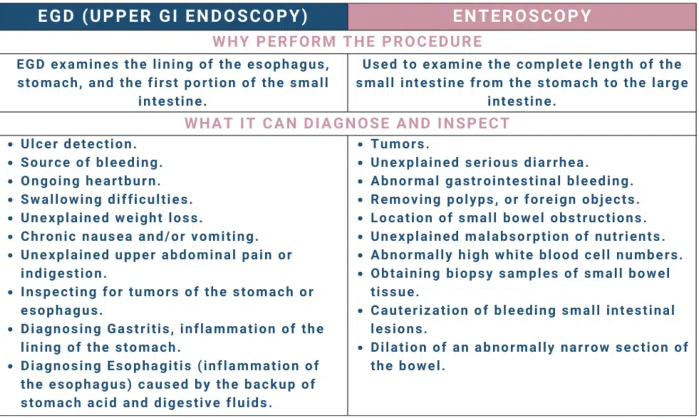

Enteroscopy    body {font-family: 'Open Sans', sans-serif;}

### Enteroscopy

An enteroscopy is like an EGD, except it allows for a deeper examination of the entire small intestine (duodenum, jejunum, and ilium). An EGD involves a different scope and only advances a little past the stomach to the duodenum. **Anesthesia:** The same as an EGD, except the procedure may take a little longer.  

****

EGD vs Endoscopy vs Enteroscopy: Are They All The Same Procedures?  
Patient Portal (accessed 4/27/2027)  
https://tinyurl.com/nhenmzcn