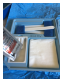
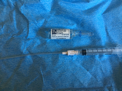
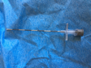
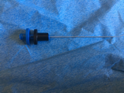
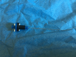
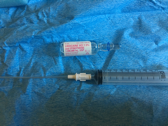
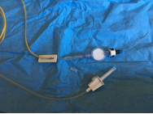

Epidural Insertion Step by Step with Images    body {font-family: 'Open Sans', sans-serif;}

### Epidural Insertion Step by Step with Images

_Dr. Alyson Eastep, CRNA Summerton, SC_

Clean the patient’s back with Betadine or chlorhexidine gluconate.

****

  
Place the drape on the patient’s back

****

  
Draw up Lidocaine For Skin Wheal

****

  
Wipe off excess Betadine and administer Skin wheal with deeper tissue infiltration as well.  
Insert Epidural needle with stylet in place

****

  
Once you feel that the needle tip is in ligamentous tissue, remove stylet and attach the saline lubricated glass syringe filled with air, saline, or a combination of both.

****

  
Once a loss of resistance is achieved (in epidural space), remove the glass syringe.  
Notice the epidural needle cm marking at the skin level and remember it!    
  
Remove tuohy needle while simultaneously advancing the catheter even more.  
If your epidural needle was at 6 cm, and you advanced the catheter 3 cm, then the catheter should be inserted to a depth of 9cm at the skin.  
  
Attach a luer-lock connector by inserting your end of the catheter into the hub until it stops.

****

  
Squeeze black and blue pieces together and attach Snaplock securement clip (pictured in white) to prevent the black and blue pieces from becoming disconnected.

****

  
Administer Test Dose

****

  
After negative test dose, attach the primed epidural pump tubing to the filter, then connect filter to the connector on the epidural catheter and begin infusion.

****