Epidural Catheter Placement Quiz    body {font-family: 'Open Sans', sans-serif;}

### Epidural Catheter Placement Quiz

**_Dr. Alyson Eastep, CRNA Summerton, SC_****Important points:** During epidural catheter insertion, you cannot visibly see the epidural catheter cm mark at the the level of the patient’s skin because it is tunneled through the epidural needle.  
  
While removing the epidural needle, the catheter simultaneously advanced even more (deeper) for the prevention of the catheter coming out while removing the epidural Tuohy needle.  
**Meaning:** the catheter may be in more after it was originally inserted 3-4 cm in the epidural space and will need PULLED BACK to the proper cm reference mark that you originally calculated.  
  
**Below: Epidural catheter with markings above an epidural needle**

**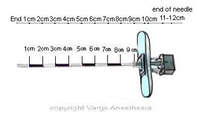**

  

**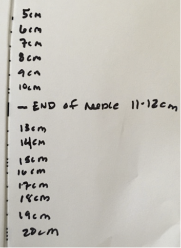**

  
**Example:** You insert the epidural needle and lose resistance at the **6 cm mark** (at the skin level) on the epidural needle. (Remember- you lose resistance when you pass through the Ligamentum flavum and enter the epidural space.) Then you advance the epidural catheter 3-4 cm.  
  
**Question:** What should the cm mark be at the skin level after the catheter is advanced **4 cm** ?  
**Answer:** 10 cm so now you may have to pull the catheter back a little to the 10 cm mark.  
  
**Now let's see how good you are below:  
  
Problem #1:  
**You achieved Loss Of Resistance (LOR) at **5cm** and the catheter was threaded **4cm.  
Which catheter is at correct cm mark? (from L to R)?

**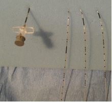**

  
****Answer:** The middle catheter!Mathematically you know it is epidural catheter should be at the 9 cm mark. You can see the Touhy needle is at the 5 cm mark and the second (middle) epidural catheter is very close to the 9cm mark. The other two catheters are not even close.  
  
Let’s make it harder where you cannot figure it out mathematically!  
Answers at the bottom of the page.  
  
**Problem #2:**  
The catheter was advanced 3 cm into the epidural space after the LOR.  
**Which catheter is correctly placed?**

**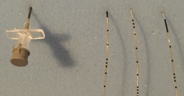**

  
  
**Problem #3:**  
The catheter was threaded 3 cm into the epidural space.

**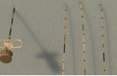**

  
  
**Problem #4:**  
The catheter was threaded 4 cm into the epidural space.

**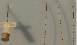**

  
  
**Problem #5:**  
Catheter inserted 4 cm. LOR at 4cm Catheter should be 8cm at skin.

**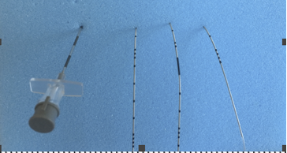**

  
  
**Problem #6:**  
Catheter inserted 3cm. LOR at 5cm. Catheter should be 8cm at skin.

**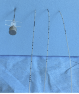**

  
  
**Problem #7:**  
Catheter inserted 3cm. LOR at 3cm. Catheter marking at skin 6cm.

**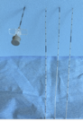**

  
  
**Problem #8:**  
Catheter inserted 5cm. LOR at 6cm. Catheter should be 11cm at skin.

**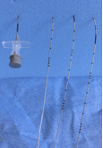**

  
  
**Problem #9:**  
Catheter inserted 4cm. LOR at 8cm. Catheter should read 12cm at skin.

**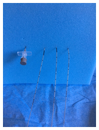**

  
  
**Problem #10:**  
Catheter inserted 5cm. LOR at 4cm. Catheter marking at skin should be 9cm.

****

  
  
**Answers 1-10  
1** Middle catheter**2** Third catheter**3** First catheter**4** First catheter  
**5** Middle catheter**6** First catheter**7** Last catheter**8** Middle catheter  
**9** Last catheter  
**10** Last catheter